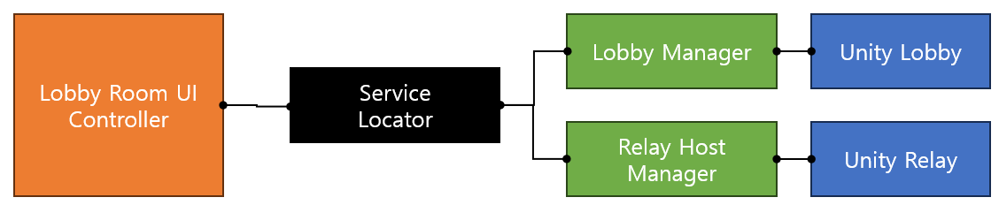
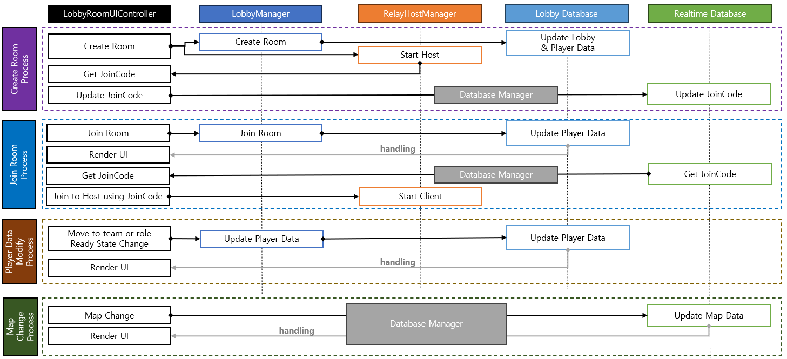
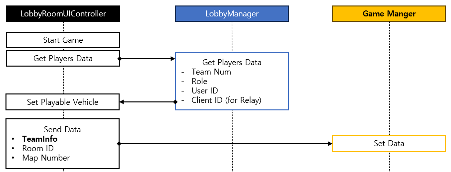

# Lobby & Relay

> 본 문서는 프로젝트에서 구현한 Lobby 와 Relay 를 어떻게 연결하였는지에 대한 문서 입니다.
> 설계 내용이 완전 뒤집어진 케이스기 때문에 구조가 복잡하고 문제가 많으니 참고 바랍니다.

## Lobby

- 로비는? 
  - 같은 네트워크 상에서 게임을 접근하기 위한 대기 장소
  - 실제 대규모 게임에서는 Lobby 를 별도의 서버에서 구동하기도 함 (DB 연동이 아주 많은 구간)
- 기본 Lobby 컨셉 : [LobbyConcept.md](./LobbyConcept.md)

## Relay 

- 릴레이란?
  - 서로 다른 네트워크에 존재하는 Host 를 연결해 주기 위한 대리자 역할. 

# Class 연결 구조

## SDKs

- Unity 에서 제공하는 SDK.
- Unity Backend 서비스와 Rest API 를 이용한 통신을 C# OOP 기반 코드로 간단히 사용할 수 있게 도와줌.

## Managers
- Unity Lobby SDK / Unity Relay SDK 를 Wrapping 하는 Manager 역할의 Class 존재
- 해당 Class 는 실제 사용해야 하는 API 로 재구현.

### LobbyManager

- 파일 위치
  - 인터페이스: [ILobbyManager](/Assets/Scripts/Interfaces/Managers/ILobbyManager.cs)
  - 구현 클래스: [LobbyManager](/Assets/Scripts/Managers/LobbyManager.cs)
- 주요 기능
  - 방 리스트 획득 및 갱신
  - 방 참여 및 빠른 참여
  - 방 생성 및 관련 데이터 획득
  - 각종 데이터 관리
  - Heartbeat ; 방 생성 후 주기적으로 Heartbeat 를 보내지 않으면 방이 삭제됨.
- 데이터
  - 로비 데이터
    - 로비 자체 데이터: 방 제목, 방 ID 등 
    - 로비 내 참여중인 플레이어 데이터: ID 등
  - LobbyEventCallbacks
    - 서버에서 발생된 데이터 변화를 감지용 델리게이트 
- 구현 특이사항
  - 데이터 변경 감지시 lobby 데이터 전체를 Update 진행
    - 트리거: 플레이어가 들어오거나, 나가거나, 데이터 자체가 변경되었을 때
    - 핸들러: Lobby 데이터를 받아와 Manager 내 관리용 데이터에 업데이트 진행
    - 특이사항: RestAPI 로 동작하기 때문에 실패 가능성이 있음 -> Retry Logic 적용

### RelayHostManager

- 파일 위치
  - 인터페이스: [IRelayHostManager](/Assets/Scripts/Interfaces/Managers/IRelayHostManager.cs)
  - 구현 클래스: [RelayHostManager](/Assets/Scripts/Managers/RelayHostManager.cs)
- 주요 기능
  - 호스트(서버) 생성 
  - 클라이언트로서 호스트(서버)에 참여
  - Relay 연결 취소
  - 연결 취소에 대한 Handler
- 데이터
  - JoinCode: Firebase Realtime Database 를 통해 DB 에서 관리됨.
    - `root/rooms/{roomId}/joinCode/{joinCode}` 
- 구현 특이사항
  - Relay 연결이 끊어진 대상자가 발생시 관련 Handler 추가
    - 대상자가 호스트(서버) 인 경우와 그렇지 않은 경우에 대한 분기 처리 진행.

# Lobby Room Controller Class

- `Lobby Room UI Controller` 를 중심으로 동작
  - Controller ; Room 내 전체 내용 제어 
  - Team UI ; 팀 표기 및 이동 관련
  - Role UI : Role 표기 및 이동 관련

## Lobby Room UI Controller

> 데이터 조작을 위한 Controller 와 UI Rendering 이 같이 있는 클래스.
> 본래 두 가지를 나눠 MVC 패턴으로 하면 좋았지만, 시간이 없어 혼용된 클래스 구조를 갖게 됨.

- 파일 위치: [LobbyRoomUIController](/Assets/Scripts/UI/LobbyRoom/LobbyRoomUIController.cs)
- 주요 기능
  - 맵 선택
  - 게임 시작을 포함한 각종 버튼 조작
  - 게임 시작을 위한 플레이어 팀 구성 데이터 생성
  - Relay Host 생성 및 Client 연결
  - 게임 시작을 위한 상태 체크
- 데이터
  - Lobby 및 Relay 데이터
  - Team 구성 데이터

### 구현 특이사항
- **게임 시작 전**

  - Relay 와 Lobby 간 데이터 연계
    - 실질적으로 Relay 의 JoinCode 와 Player 의 Client ID 정보가 가장 중요.
    - 방 생성시 `Relay -> StartHost` 를 통한 Relay Host 생성 및 JoinCode 발행
      - JoinCode 는 Realtime DB 에 Update
      - 방장의 Client ID 가 Lobby 의 Player 데이터에 쓰임: Lobby Backend DB 에도 쓰임. 
  - Map 선택 동기화
      - Firebase Realtime Database 연동을 이용한 동기화.
      - DB Path: `root/rooms/{roomId}/mapNumber/{mapNumber}`
      - 해당 데이터 변경에 대한 Handler 구현.
- **게임 시작 후**; `게임 시작 버튼 클릭 시`, `방장만 가능한 기능`

  - Lobby 로 부터 최신 Player 데이터를 품고 있는 Lobby 데이터를 받아 TeamInfo 작성
  - Playable Vehicle 선택 `(현재는 1개뿐이라 Hardcoding 되어 있음)`
  - TeamInfo, Room ID, Selected Map Number 데이터를 GameManager 에게 전송 후 `네트워크 씬 로드`. 
- **기타**
  - **UI 제어와 데이터 제어부를 나누지 않아 발생한 이슈**
    - 모든 데이터 동기화를 DB 와의 연동으로만 해야 했음.
      - 여기서 DB 연동은 Realtime Database 와 Lobby Backend DB 둘다 포함
      - 그냥 Manager 나 Class 에서만 관리하면 **당연하지만** 다른 클라이언트는 데이터를 알 수 없음.
    - 따라서, NGO 에서 제공하는 여러 동기화를 사용하지 못 함. 
      - Lobby 단계에서 DB 가 아닌 동기화가 맞는 지는 의문. 
  - **Lobby 의 방장 Migration 에 의한 Relay Migration 동작**
    - 계기
      - Unity Lobby 기능 자체가 방장이 나가면 플레이어내 다른이를 방장으로 내세움.
      - 방장이 나가면 Relay 는 그대로 폭파만 됨.
      - 이로 인해 Lobby 상태와 Relay 상태간 동기화가 이뤄지지 않음.
    - 함수명 및 위치: [HostMigrationProcessHandler](/Assets/Scripts/UI/LobbyRoom/LobbyRoomUIController.cs#L413C24-L413C51)
      - 해당 함수는 `RelayHostManager` 내 `HostDisconnectionHandler`관련 `Delegate` 에 등록되어 있음.
        - 참조: [RelayHostManager](/Assets/Scripts/Managers/RelayHostManager.cs#L125C17-L125C46) 
      - 따라서, 동일 네트워크 상 클라이언트가 나갈 경우 이를 감지해서 해당 함수가 실행됨
      - `DisconnectHandler` 의 주체에 따라 Host 가 나갔을 경우와 Client 가 나갔을 경우가 분기되어 있음.
        - 기존 방장이 나가서 자신이 새로운 방장이 되었는지 여부를 업데이트 받음 (From Lobby Backend DB) 
          - 새로운 방장이 되었을 경우, `RelayHostManager` 에게 `StartHost` 를 요청 및 `Join Code` 를 갱신함.
          - 본인이 방장이 아닐 경우, `Start Host` 완료까지 대기 후 새로운 `Join Code`를 받아 `Start Client` 
 
## Lobby Room Team UI
- 파일 위치: [LobbyRoomTeamUI](/Assets/Scripts/UI/LobbyRoom/LobbyRoomTeamUI.cs)
- 주요 기능: 플레이어의 팀으로의 이동 제어

## Lobby Room Role UI
- 파일 위치: [LobbyRoomRoleUI](/Assets/Scripts/UI/LobbyRoom/LobbyRoomRoleUI.cs)
- 주요 기능
  - 플레이어의 역할로의 이동 제어
  - 플레이어 데이터 변동에 따른 Rendering Handler
- 데이터: UI 표기 데이터 

