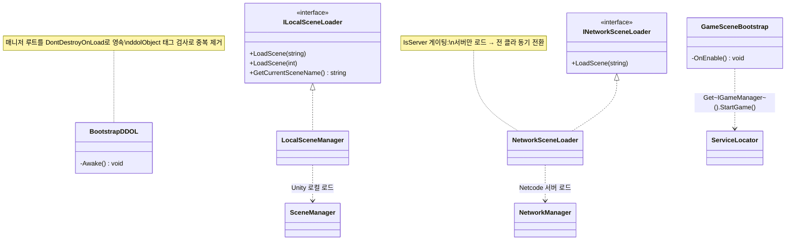

# 부트스트랩 & 씬 전환 (Bootstrap & Scene Transition)

> 앱 전체 수명 동안 살아남는 **매니저 루트**(`BootstrapDDOL`)와, 씬 로드 순간 게임을 깨우는 **씬 진입 트리거**(`GameSceneBootstrap`), 그리고 전환 성격에 따라 갈라지는 **두 종류의 씬로더**(로컬/네트워크)로 구성된다.
> "누가 살아남고, 언제 시작하며, 어떻게 넘어가는가"를 각각 분리해 다루는 것이 목적이다.
>
> 관련 문서: [`ServiceLocator.md`](./ServiceLocator.md) · [`ManagerLifecycle.md`](./ManagerLifecycle.md) · [`GameStateMachine.md`](./GameStateMachine.md)

---

## 1. 개요

씬을 여러 번 넘나드는 게임에서 초기화·전환은 세 가지 다른 질문으로 쪼개진다.

- **영속 축 (누가 살아남는가)** — [`ServiceLocator`](./ServiceLocator.md)에 등록되는 매니저들은 씬이 바뀌어도 유지돼야 한다. 동시에, 씬을 다시 들어왔을 때 매니저가 *중복 생성*되면 안 된다.
- **기동 축 (언제 시작하는가)** — 인게임 씬이 준비된 바로 그 순간 게임 상태머신을 깨워야 한다. 매니저 로딩과 게임 시작은 다른 타이밍이다.
- **전환 축 (어떻게 넘어가는가)** — 어떤 전환은 각 기기가 알아서(로그인·로비 UI), 어떤 전환은 서버가 전원을 함께 데려가야 한다(인게임 입장). 성격이 다르다.

이 시스템은 세 축을 각각 `BootstrapDDOL`(영속) / `GameSceneBootstrap`(기동) / `ILocalSceneLoader`·`INetworkSceneLoader`(전환)로 분리해 담당시킨다.

## 2. 설계 목표

| 목표 | 해결 방식 |
| --- | --- |
| 매니저를 앱 수명 내내 유지 | `BootstrapDDOL`이 루트로 분리 후 `DontDestroyOnLoad` |
| 매니저 중복 생성 방지 | `ddolObject` 태그 개수 검사 → 2개 이상이면 자신 파괴 |
| 씬 준비 시점에 게임 기동 | `GameSceneBootstrap.OnEnable`에서 `StartGame()` 호출 |
| 전환 성격 분리(로컬 vs 네트워크) | 두 인터페이스로 씬로더 이원화, 호출부가 목적에 맞게 선택 |
| 네트워크 전환의 권위 보장 | `NetworkSceneLoader`는 `if (!IsServer) return`으로 서버만 로드 |

## 3. 구성 요소

| 요소 | 역할 | 성격 |
| --- | --- | --- |
| `BootstrapDDOL` | 매니저 루트를 씬 전환에도 유지 + 중복 제거 | MonoBehaviour |
| `GameSceneBootstrap` | 인게임 씬 진입 시 `StartGame()` 트리거 | MonoBehaviour |
| `ILocalSceneLoader` | 단일 기기 씬 전환 계약 (`LoadScene`, `GetCurrentSceneName`) | interface |
| `INetworkSceneLoader` | 네트워크 동기 씬 전환 계약 (`LoadScene`) | interface |
| `LocalSceneManager` | Unity `SceneManager` 래핑 (로컬 전환) | Manager 구현체 |
| `NetworkSceneLoader` | Netcode `SceneManager` 래핑 (서버 권위 전환) | NetworkManager 구현체 |

## 4. 핵심 흐름

### 4-1. 영속 매니저 루트 — 분리 → 중복검사 → 유지

```
BootstrapDDOL.Awake()
   ├─ transform.SetParent(null)                     // 루트로 분리 (DontDestroyOnLoad 전제)
   ├─ FindGameObjectsWithTag("ddolObject")
   │     └─ 2개 이상? → Destroy(self) → return      // 씬 재진입 시 중복 매니저 제거
   └─ DontDestroyOnLoad(gameObject)                 // 씬이 바뀌어도 생존
```

> 매니저 세트를 담은 루트 오브젝트가 앱 내내 하나만 살아남는다. 이 루트 밑의 매니저들이 [`ServiceLocator`](./ServiceLocator.md)에 등록되므로, 서비스 레지스트리도 함께 영속한다.

### 4-2. 씬 진입 트리거 — 준비되면 게임을 깨운다

```csharp
public class GameSceneBootstrap : MonoBehaviour
{
    private void OnEnable() => ServiceLocator.Get<IGameManager>().StartGame();
}
```

> 인게임 씬에 놓인 이 컴포넌트가 활성화되는 순간이 "씬 준비 완료" 신호다. 매니저 로딩(영속 축)과 게임 기동(기동 축)의 타이밍을 깔끔히 분리했다. 이후 흐름은 [`GameStateMachine`](./GameStateMachine.md)이 이어받는다.

### 4-3. 전환 이원화 — 목적에 맞는 로더를 고른다

```
[로컬 전환 : 각 기기 독립]                    [네트워크 전환 : 서버가 전원 인솔]
Login ─► LobbyList ─► LobbyRoom               LobbyRoom ─► InGame     (서버 주도, 전원 동시 로드)
InGame ─► Result                              (진입 실패) InGame ─► LobbyRoom
   └ ILocalSceneLoader.LoadScene(...)              └ INetworkSceneLoader.LoadScene(...)
```

```csharp
// 로컬: 결과 화면은 각자 본다
ServiceLocator.Get<ILocalSceneLoader>().LoadScene("Result");
// 네트워크: 인게임 입장은 서버가 전원을 데려간다
ServiceLocator.Get<INetworkSceneLoader>().LoadScene("InGame");
```

> "어떤 종류의 전환인가"를 *어떤 인터페이스를 Get 하는가*로 표현한다. 호출부만 봐도 로컬/네트워크 의도가 드러난다.

## 5. 클래스 구조 (Mermaid)



## 6. 코드 하이라이트

### 6-1. 영속 + 중복 방지를 한 Awake에

```csharp
private void Awake()
{
    transform.SetParent(null);                                       // ① 루트로 분리
    var candidates = GameObject.FindGameObjectsWithTag("ddolObject");
    if (candidates.Length > 1) { Destroy(gameObject); return; }      // ② 중복이면 자결
    DontDestroyOnLoad(gameObject);                                   // ③ 유지
}
```

> 씬을 다시 들어와 두 번째 부트스트랩이 생겨도, 태그 개수 검사가 새로 온 쪽을 스스로 파괴시킨다. 매니저 싱글턴성을 씬 재진입까지 지켜준다.

### 6-2. 로컬 로더 — Unity SceneManager 얇은 래핑

```csharp
public void LoadScene(string sceneName) => SceneManager.LoadScene(sceneName);
public string GetCurrentSceneName()     => SceneManager.GetActiveScene().name;
```

> 얇게 감싸는 대신 *인터페이스 뒤에 숨겨서*, 호출부가 `UnityEngine.SceneManagement`에 직접 의존하지 않게 했다. 로컬 전환이라는 의도가 타입으로 표현된다.

### 6-3. 네트워크 로더 — 서버만 로드해 전원을 동기 전환

```csharp
public void LoadScene(string sceneName)
{
    if (!IsServer) return;                                                    // 서버만
    NetworkManager.Singleton.SceneManager.LoadScene(sceneName, LoadSceneMode.Single);
}
```

> 서버가 로드하면 Netcode가 전 클라이언트를 같은 씬으로 데려간다. 클라가 제멋대로 씬을 바꾸는 상황을 `IsServer` 한 줄로 차단.

## 7. 기술 포인트

- **세 관심사의 분리** — "영속(누가 사는가)·기동(언제 시작하나)·전환(어떻게 넘어가나)"을 각기 다른 컴포넌트에 맡겨, 하나를 바꿔도 나머지가 흔들리지 않는다.
- **태그 기반 싱글턴 가드** — `DontDestroyOnLoad` 오브젝트가 씬 재진입 시 중복되는 고전적 함정을, 정적 싱글턴 필드가 아니라 태그 개수 검사로 방어. 매니저 루트에 특화된 실용적 접근.
- **전환 성격의 타입화** — 로컬/네트워크 전환을 두 인터페이스로 갈라, "이 전환이 전원 동기인가?"라는 의도를 호출 코드에서 바로 읽게 했다. [`ServiceLocator`](./ServiceLocator.md) 위에서 자연스럽게 선택된다.
- **씬 로직의 은닉** — 호출부는 `UnityEngine.SceneManagement`/`Netcode` API를 직접 만지지 않는다. 로더 교체·모킹·로깅 삽입 지점이 한 곳으로 모인다.

## 8. 확장 포인트 / 한계

- **문자열 씬 이름 의존** — `LoadScene("LobbyRoom")`처럼 씬 이름이 문자열 리터럴로 흩어져 있어, 오타·씬 리네임에 취약하다. enum/상수 테이블로 씬 키를 중앙화하면 안전해진다.
- **로딩 연출 부재(동기 로드)** — 로컬 로더가 `SceneManager.LoadScene`(동기)을 그대로 쓴다. 무거운 씬에서 프레임이 멈출 수 있어, 진행률·로딩 화면이 필요하면 `LoadSceneAsync`로 확장할 여지가 있다.
- **중복 가드가 태그 규약에 의존** — `ddolObject` 태그를 붙이는 것이 규약으로만 강제된다. 태그를 빠뜨리거나 다른 오브젝트가 같은 태그를 쓰면 가드가 오작동한다.
- **기동 트리거의 단일 진입 전제** — `GameSceneBootstrap`은 씬당 하나가 활성화되며 한 번 `StartGame`을 부르는 것을 전제한다. 씬 재활성/재진입 시 중복 호출 방지는 별도로 고려해야 한다.
- **네트워크 로더의 실패 처리 미비** — 서버 씬 로드 실패(연결 끊김 등) 시 복구 흐름은 이 계층에 없다. 로드 결과 콜백을 받아 실패를 상위(상태머신)로 전달하는 확장이 필요하다.
