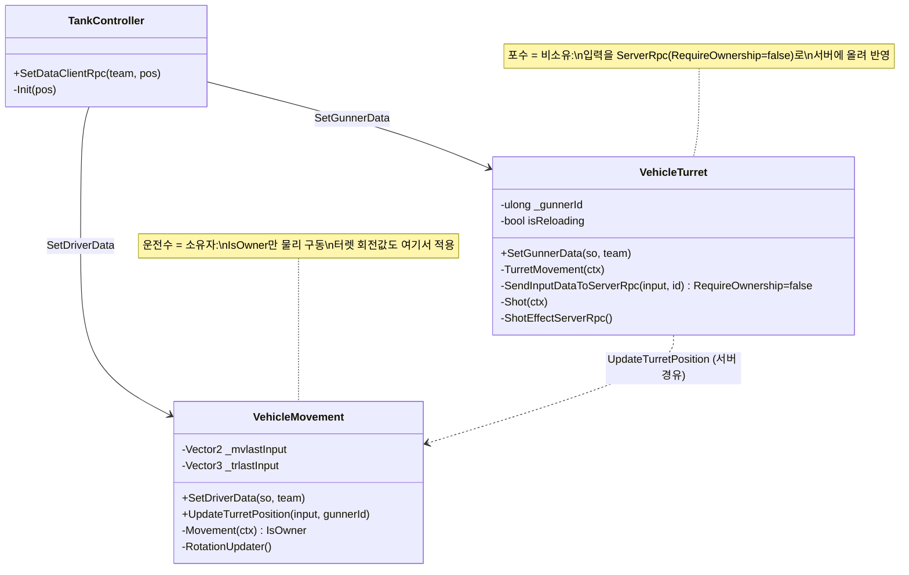

# 협력 탱크 조작 — 운전수·포수 분리 (Co-op Tank Control: Driver & Gunner Split)

> 하나의 전차를 두 사람이 나눠 몬다 — **운전수**는 차체를(이동·뒤집기), **포수**는 터렛을(조준·발사) 맡는다. 같은 탱크 오브젝트 위에서 두 조종수의 입력이 충돌 없이 갈라지고, 서로 다른 네트워크 권한 경로로 반영되는 방식을 다룬다.
> 핵심은 "한 오브젝트·두 역할"을 *역할별 컴포넌트 활성화*와 *소유/비소유에 따른 입력 경로 분기*로 푸는 것이다.
>
> 관련 문서: [`NetcodeSyncPatterns.md`](./NetcodeSyncPatterns.md) · [`LobbyPipeline.md`](./LobbyPipeline.md) · [`GameStateMachine.md`](./GameStateMachine.md) · [`ServiceLocator.md`](./ServiceLocator.md)

---

## 1. 개요

"두 사람이 한 탱크를 몬다"는 요구는 세 가지 문제로 갈라진다.

- **분담 축 (누가 무엇을 조종하는가)** — 차체 이동(운전수)과 터렛 조준·발사(포수)를 별개 컴포넌트(`VehicleMovement`/`VehicleTurret`)로 나눠, 같은 탱크에 붙이되 담당 영역을 분리한다.
- **활성 축 (내 역할만 켠다)** — 같은 탱크 프리팹이 모든 클라에 복제되지만, 각 클라는 *자기 역할에 해당하는 컴포넌트의 입력만* 바인딩한다. 운전수 클라는 이동만, 포수 클라는 터렛만 활성화한다.
- **권한 축 (입력을 어떻게 반영하는가)** — 탱크 소유권은 운전수에게 있다([`NetcodeSyncPatterns`](./NetcodeSyncPatterns.md)). 운전수는 소유자라 물리를 직접 굴리지만, 포수는 비소유자라 터렛 입력을 서버로 올려 반영한다.

같은 입력(`Player.Move`)이 역할에 따라 차체 회전이 되기도, 터렛 회전이 되기도 한다 — 활성 축이 겹침을 막고, 권한 축이 반영 경로를 정한다.

## 2. 설계 목표

| 목표 | 해결 방식 |
| --- | --- |
| 차체/터렛 담당 분리 | `VehicleMovement`(운전수)·`VehicleTurret`(포수) 별도 컴포넌트 |
| 자기 역할 입력만 바인딩 | `role == 내역할 && clientId == LocalClientId` 검사 후 `BindHandlers` |
| 같은 입력의 역할별 재사용 | 운전수·포수 클라가 각자 컴포넌트만 켜서 `Player.Move` 충돌 방지 |
| 운전수 = 물리 주체 | 소유자(`IsOwner`)만 `FixedUpdate` 물리 구동 |
| 포수 = 비소유 입력 전달 | `[ServerRpc(RequireOwnership = false)]`로 터렛 입력을 서버에 전송 |
| 올바른 포수 입력만 반영 | `UpdateTurretPosition`에서 `gunnerId == _gunnerId` 검사 |
| 발사 이펙트·사운드 공유 | `ShotEffectServerRpc` → VFX·SFX 팬아웃 |
| 재장전 통제 | `isReloading` 플래그 + `ReLoad` 코루틴(쿨다운 UI) |

## 3. 구성 요소

| 요소 | 역할 | 성격 |
| --- | --- | --- |
| `TankController` | 탱크 총괄 — 팀·색·HP·자식 컴포넌트에 데이터 주입 | `NetworkBehaviour` |
| `VehicleMovement` | 운전수 — 차체 이동·뒤집기 + 터렛 회전값 적용 | `NetworkBehaviour` |
| `VehicleTurret` | 포수 — 터렛 조준·발사·재장전 | `NetworkBehaviour` |
| `IInputSystem` | 입력 액션(Move/Attack/Jump/ScoreBoard) 제공 | 인터페이스(서비스) |
| `PlayerableStatisticsSO` | 이동·회전·재장전 등 수치 데이터 | ScriptableObject |
| `TeamInfo` / `PlayerInfo` | 팀·역할·clientId 편성 정보 | struct/데이터 |

## 4. 핵심 흐름

### 4-1. 역할별 활성화 — 내 역할 컴포넌트만 입력을 켠다

```csharp
// VehicleMovement (운전수)                     // VehicleTurret (포수)
foreach (var p in teamInfo.players)             foreach (var p in _teamInfo.players)
  if (p.role == Driver && p.clientId == Local)    if (p.role == Gunner && p.clientId == Local)
  { _isActiveScript = true; ActiveScript(); }     { _activeScript = true; ActiveScript(); }
```

> 같은 탱크가 모두에게 복제되지만, 각 클라는 편성 정보에서 "이 탱크의 내 역할"을 찾을 때만 입력을 바인딩한다. 운전수 클라는 이동 핸들러를, 포수 클라는 터렛 핸들러를 켠다 — 같은 `Player.Move`가 서로 다른 대상을 움직인다.

### 4-2. 운전수 — 소유자 물리로 직접 구동

```csharp
private void Movement(InputAction.CallbackContext ctx) {
    if (!IsOwner || !canMove) return;             // 소유자(운전수)만
    _mvlastInput = ctx.ReadValue<Vector2>();
}
private void FixedUpdate() {
    if (!IsOwner || !canMove) return;             // 물리도 소유자만
    // 접지 검사 후 forward 속도·angular 회전
}
```

> 운전수는 탱크 소유자라 물리를 로컬에서 직접 굴리고, 그 결과 위치가 다른 클라에 복제된다([`NetcodeSyncPatterns`](./NetcodeSyncPatterns.md) 4-4). 이동 권한이 소유권과 일치한다.

### 4-3. 포수 — 비소유 입력을 서버로 올려 터렛에 반영

```
[포수 클라] TurretMovement(입력)
   └─ SendInputDataToServerRpc(input, _gunnerId)   // RequireOwnership=false (포수는 비소유)
        ▼
[서버] _vehicleMovement.UpdateTurretPosition(input, gunnerId)
        └─ if (gunnerId == _gunnerId) _trlastInput = input   // 올바른 포수 확인
[전 클라] RotationUpdater(): _turretTf 회전 (_trlastInput 기반)
```

```csharp
[ServerRpc(RequireOwnership = false)]
private void SendInputDataToServerRpc(Vector2 input, ulong gunnerId)
    => _vehicleMovement.UpdateTurretPosition(input, gunnerId);
```

> 포수는 탱크를 소유하지 않으므로 물리처럼 직접 못 쓴다. `RequireOwnership=false`로 입력을 서버에 올리고, 서버가 `gunnerId`로 정당한 포수를 확인해 터렛 회전값(`_trlastInput`)을 세운다. 소유는 운전수, 조준 반영은 서버라는 권한 분리.

### 4-4. 발사 — 로컬 판정 + 이펙트 팬아웃 + 재장전

```csharp
private void Shot(InputAction.CallbackContext ctx) {
    if (isReloading) return;                       // 쿨다운 중 차단
    ShotEffectServerRpc();                          // VFX·SFX 전원 공유
    _projectile.Shot(_gunnerCam.transform, _teamInfo.teamNum);   // 투사체 발사
    _gunnerUI.Fire();
    StartCoroutine(ReLoad());                        // 재장전 쿨다운 시작
}
```

> 발사는 포수 로컬에서 트리거하되, 시각·청각 효과는 `ShotEffectServerRpc`로 전원에게 팬아웃한다. 연사는 `isReloading`+`ReLoad` 코루틴이 막고, 실제 명중 판정은 [투사체 시스템(C2)]으로 넘어간다.

## 5. 클래스 구조 (Mermaid)



## 6. 코드 하이라이트

### 6-1. 역할+본인 확인 후에만 입력 활성화

```csharp
if (player.role == PlayerRole.Gunner && player.clientId == NetworkManager.Singleton.LocalClientId)
{
    _gunnerId = player.clientId;
    _activeScript = true;
    ActiveScript();      // 카메라·UI 켜고 BindHandlers
    break;
}
```

> "이 탱크에서 내가 포수인가"를 역할과 `clientId` 두 조건으로 확인한 뒤에만 입력을 켠다. 복제된 남의 탱크나 다른 역할의 입력이 내 조작으로 새는 것을 원천 차단한다.

### 6-2. 비소유 포수의 서버 경유 조준

```csharp
[ServerRpc(RequireOwnership = false)]
private void SendInputDataToServerRpc(Vector2 input, ulong gunnerId)
    => _vehicleMovement.UpdateTurretPosition(input, gunnerId);

// 반영 측: 정당한 포수만
public void UpdateTurretPosition(Vector2 input, ulong gunnerId)
    { if (gunnerId == _gunnerId) _trlastInput = input; }
```

> 포수는 탱크 소유자가 아니므로 `RequireOwnership=false`로 게이트를 연다. 서버는 넘어온 `gunnerId`가 이 탱크의 포수인지 확인해, 엉뚱한 클라의 입력을 걸러낸다. 소유권과 조작권을 분리하면서도 위조를 막는 이중장치.

### 6-3. 재장전 게이팅 — 연사 방지 + 쿨다운 UI

```csharp
private void Shot(InputAction.CallbackContext ctx) {
    if (isReloading) return;             // 재장전 중이면 무시
    // ... 발사 ...
    StartCoroutine(ReLoad());            // 쿨다운 진행
}
IEnumerator ReLoad() {
    isReloading = true;
    while (_vehicleData.VechicleReloadtime > _currentTime) {
        _gunnerUI.UpdateToReloadUI((float)_currentTime / _vehicleData.VechicleReloadtime);   // 진행률 표시
        yield return null;
    }
    isReloading = false;
}
```

> 발사 쿨다운을 플래그 하나와 코루틴으로 관리하고, 진행률을 포수 UI에 그린다. 수치(`VechicleReloadtime`)는 SO에서 와, 밸런스 조정이 데이터로 분리된다.

## 7. 기술 포인트

- **한 오브젝트·두 역할의 분해** — 차체와 터렛을 별개 `NetworkBehaviour`로 나눠 같은 탱크에 얹고, 각 클라가 자기 역할 컴포넌트만 활성화한다. "2인 1조 협력"([`LobbyPipeline`](./LobbyPipeline.md)의 매칭 규칙)이 코드 구조로 그대로 드러난다.
- **입력의 역할별 재해석** — 같은 `Player.Move`가 운전수에겐 차체 회전, 포수에겐 터렛 회전이 된다. 활성화된 컴포넌트가 하나뿐이라 액션을 공유해도 충돌하지 않는다 — 입력 맵을 이중으로 정의할 필요가 없다.
- **소유권과 조작권의 분리** — 운전수는 소유자로서 물리를 직접 굴리고, 포수는 비소유자로서 `RequireOwnership=false` ServerRpc로 조준을 반영한다([`NetcodeSyncPatterns`](./NetcodeSyncPatterns.md)). 한 오브젝트를 두 권한 주체가 나눠 쓰는 실전 패턴.
- **서버 측 입력 검증** — 포수 입력을 서버가 `gunnerId`로 대조해 정당성을 확인한다. 비소유 호출을 허용하되 무분별하지 않게, 신원 확인을 한 겹 둔다.
- **데이터 주도 밸런스** — 이동 속도·회전 속도·재장전 시간·터렛 각도 제한이 모두 `PlayerableStatisticsSO`에서 온다. 조작 로직과 수치가 분리돼, 밸런싱이 코드 수정 없이 이뤄진다.
- **효과의 팬아웃 분리** — 발사의 판정(로컬 투사체)과 연출(VFX·SFX)을 나눠, 연출만 `ShotEffectServerRpc`로 전원에게 공유한다. 사건과 표현의 경계가 뚜렷하다.

## 8. 확장 포인트 / 한계

- **터렛 입력을 매 프레임 RPC** — 포수 조준이 입력 변화마다 `SendInputDataToServerRpc`를 탄다. 고빈도 입력에서 RPC 트래픽이 커질 수 있어, 입력을 `NetworkVariable`로 상태화하거나 전송 주기를 제한하면 대역폭이 개선된다.
- **역할 활성화가 편성 순회에 의존** — `SetDriverData`/`SetGunnerData`가 `teamInfo.players`를 순회해 자기 역할을 찾는다. 편성 데이터가 늦거나 어긋나면 입력이 영영 바인딩되지 않을 수 있어, 편성 보장 시점([`LobbyPipeline`](./LobbyPipeline.md)의 `SetData`)과의 타이밍 결합이 있다.
- **운전수 이탈 = 소유권 공백** — 소유자(운전수)가 나가면 물리 주체가 사라지지만, 포수에게 소유권을 넘기는 처리가 없다. 협력 관계의 한쪽 이탈에 대한 승계 전략이 필요하다([`RelayHostLifecycle`](./RelayHostLifecycle.md)의 마이그레이션과 별개 문제).
- **뒤집기·끼임 복구의 임시 수치** — `StuckChecker`의 3초, 뒤집기 이동값(`Vector3.up * 2`) 등이 하드코딩돼 있고 TODO 주석("경사로 회전 불가")이 남아 있다. 물리 복구 로직이 미완이다.
- **입력 시스템 단일 인스턴스 공유** — 운전수·포수가 같은 `IInputSystem`을 Enable/Disable한다. 한 기기에서 두 역할을 동시에 다루는 상황(로컬 협동)은 전제되지 않는다.
- **디버그 로그 과다** — 조작·RPC 경로에 `Debug.Log`가 촘촘히 남아 있어, 고빈도 입력에서 로그 비용이 든다. 릴리즈 정리 대상.
