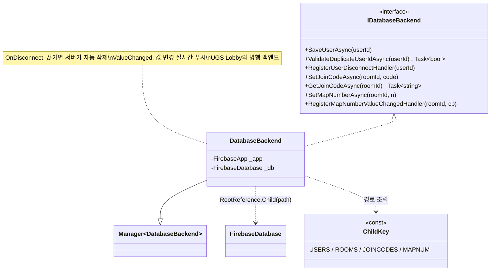

# Firebase Realtime DB 연동 (Firebase Realtime Database Backend)

> UGS Lobby가 맡지 못하는 보조 데이터 — 릴레이 Join Code 교환, 맵 선택 실시간 동기, 유저 중복·접속 관리 — 를 Firebase Realtime Database로 처리한다. 핵심은 계층 경로 키로 데이터를 조직하고, **접속이 끊기면 서버가 알아서 정리**(`OnDisconnect`)하며, **값 변경을 실시간으로 밀어주는**(`ValueChanged`) 두 가지다.
> 클라이언트가 비정상 종료해도 잔여 데이터가 남지 않게 하고, 로비의 맵 선택이 전원에게 즉시 반영되게 하는 백엔드 계층을 다룬다.
>
> 관련 문서: [`LobbyPipeline.md`](./LobbyPipeline.md) · [`RelayHostLifecycle.md`](./RelayHostLifecycle.md) · [`NetcodeSyncPatterns.md`](./NetcodeSyncPatterns.md) · [`ManagerLifecycle.md`](./ManagerLifecycle.md) · [`ServiceLocator.md`](./ServiceLocator.md)

---

## 1. 개요

Firebase 백엔드는 성격이 다른 세 관심사를 다룬다.

- **경로 축 (어디에 저장하는가)** — `users`/`rooms`/`joinCodes`/`mapNumber`라는 계층 키(`ChildKey`)로 데이터를 트리에 조직한다. 룸 하위에 조인코드·맵번호가 매달리는 구조다.
- **수명 축 (끊기면 어떻게 되는가)** — 유저·룸 데이터에 `OnDisconnect` 핸들러를 걸어, 연결이 끊기는 순간 Firebase 서버가 해당 데이터를 자동 제거한다. 클라가 죽어도 정리가 보장된다.
- **구독 축 (변경을 어떻게 아는가)** — 맵 번호에 `ValueChanged`를 걸어, 값이 바뀌면 전 클라에 실시간으로 푸시된다. 폴링 없이 로비 맵 선택이 동기화된다.

이 백엔드는 UGS Lobby와 **병행**한다 — 방 편성·플레이어 상태는 Lobby가([`LobbyPipeline`](./LobbyPipeline.md)), 릴레이 Join Code 교환·맵 실시간 동기·유저 관리는 Firebase가 맡는다.

## 2. 설계 목표

| 목표 | 해결 방식 |
| --- | --- |
| 데이터 계층 조직 | `ChildKey` 상수로 `users`/`rooms/{id}/joinCodes` 등 경로 조립 |
| 의존성 안전 초기화 | `CheckAndFixDependenciesAsync` 후 `_app`/`_db` 확보 |
| 비정상 종료 자동 정리 | `OnDisconnect().RemoveValue()`로 유저·룸 서버측 자동 삭제 |
| 릴레이 코드 교환 | `SetJoinCodeAsync`/`GetJoinCodeAsync`(Lobby 밖 채널) |
| 맵 선택 실시간 동기 | `ValueChanged` 구독으로 맵 번호 변경 푸시 |
| 유저 중복 방지 | `ValidateDuplicateUserIdAsync`(존재하면 중복) |
| Firebase 세부 은닉 | `IDatabaseBackend` 뒤로 DB 참조·경로 격리 |

## 3. 구성 요소

| 요소 | 역할 | 성격 |
| --- | --- | --- |
| `IDatabaseBackend` | DB 연산 계약(user/joinCode/mapNumber) | interface |
| `DatabaseBackend` | Firebase 초기화 + CRUD + 구독/정리 핸들러 | `Manager<T>` 구현체 |
| `ChildKey` | DB 경로 키 상수(users/rooms/joinCodes/mapNumber) | 상수 클래스 |
| `FirebaseDatabase` | Firebase Realtime DB SDK 진입점 | 외부 서비스 |
| `OnDisconnect()` | 연결 종료 시 서버측 자동 실행 예약 | Firebase 기능 |
| `ValueChanged` | 경로 값 변경 실시간 이벤트 | Firebase 이벤트 |

## 4. 핵심 흐름

### 4-1. 초기화 — 의존성 확인 후 참조 확보

```csharp
protected override void Init() {
    FirebaseApp.CheckAndFixDependenciesAsync().ContinueWithOnMainThread(task => {
        if (task.Result == DependencyStatus.Available) {
            _app = FirebaseApp.DefaultInstance;
            _db = FirebaseDatabase.DefaultInstance;
            FirebaseDatabase.DefaultInstance.SetPersistenceEnabled(false);   // 오프라인 캐시 끔
        } else { _app = null; _db = null; }                                  // 사용 불가 표식
    });
}
```

> Firebase는 네이티브 의존성 확인이 선행돼야 안전하다. 확인이 성공해야 `_db`를 잡고, 실패하면 참조를 `null`로 두어 이후 사용 불가를 표시한다([`ManagerLifecycle`](./ManagerLifecycle.md)의 `Init` 훅에 얹음).

### 4-2. 접속 종료 자동 정리 — OnDisconnect

```csharp
public void RegisterUserDisconnectHandler(string userId)
    => _db.RootReference.Child($"{ChildKey.USERS}/{userId}").OnDisconnect().RemoveValue();

public void RegisterRemoveRoomHandler(string roomId)
    => _db.RootReference.Child($"{ChildKey.ROOMS}/{roomId}").OnDisconnect().RemoveValue();
```

> `OnDisconnect`는 "이 연결이 끊기면 서버가 이 값을 지워라"를 *미리 서버에 예약*한다. 클라가 크래시·강제 종료돼도([`RelayHostLifecycle`](./RelayHostLifecycle.md)의 호스트 다운 포함) 유령 유저·유령 방이 남지 않는다. 정리 책임을 클라가 아닌 Firebase 서버로 넘긴 것이 핵심.

### 4-3. Join Code 교환 — Lobby 밖 릴레이 좌표 채널

```
[호스트] StartHost → joinCode 발급 (RelayHostLifecycle)
   └─ SetJoinCodeAsync(roomId, joinCode)   → rooms/{roomId}/joinCodes 에 기록
[참가자] GetJoinCodeAsync(roomId)           → 코드 읽어 StartClient(joinCode)
```

> UGS Lobby가 릴레이 Join Code를 실어 나르지 않으므로, Firebase의 `rooms/{roomId}/joinCodes`를 교환 채널로 쓴다. 호스트가 쓰고 참가자가 읽어, 두 서비스([`LobbyPipeline`](./LobbyPipeline.md)·[`RelayHostLifecycle`](./RelayHostLifecycle.md))를 잇는 접착제 역할을 한다.

### 4-4. 맵 선택 실시간 동기 — ValueChanged 구독

```csharp
public void RegisterMapNumberValueChangedHandler(string roomId, EventHandler<ValueChangedEventArgs> cb)
    => _db.RootReference.Child($"{ChildKey.ROOMS}/{roomId}/{ChildKey.MAPNUM}").ValueChanged += cb;
// 방장이 SetMapNumberAsync → 전 참가자의 ValueChanged 발화 → 로비 맵 UI 갱신
```

> 방장이 맵을 바꾸면 `mapNumber` 경로의 `ValueChanged`가 전 참가자에게 실시간으로 발화된다. 각 클라가 값을 폴링하지 않고 푸시로 받아, 로비 맵 선택이 즉시 일치한다([`LobbyPipeline`](./LobbyPipeline.md)의 `GetMapNumberFromDB` 소비).

## 5. 클래스 구조 (Mermaid)



## 6. 코드 하이라이트

### 6-1. 서버측 자동 정리 예약

```csharp
_db.RootReference.Child($"{ChildKey.USERS}/{userId}").OnDisconnect().RemoveValue();
```

> 클라이언트가 정상 종료 코드를 못 타도 데이터가 남지 않는다. "끊김"이라는 사건을 Firebase 서버가 감지해 예약된 삭제를 실행하므로, 크래시·네트워크 단절 같은 비정상 경로까지 정리가 보장된다.

### 6-2. 계층 경로 조립 — 키 상수로 트리 구성

```csharp
string path = $"{ChildKey.ROOMS}/{roomId}/{ChildKey.JOINCODES}";   // rooms/{id}/joinCodes
_db.RootReference.Child(path).SetValueAsync(joinCode);
```

> 경로를 문자열 리터럴이 아닌 `ChildKey` 상수 조합으로 만들어, DB 트리 구조가 코드에 명시된다. 룸 하위에 조인코드·맵번호가 매달리는 계층이 경로 문자열로 그대로 드러난다.

### 6-3. 존재 여부로 중복 판정

```csharp
DataSnapshot snapshot = await _db.RootReference.Child($"{ChildKey.USERS}/{userId}").GetValueAsync();
return snapshot.Exists;   // 존재하면 중복
```

> 유저 등록을 `users/{userId} = true` 단순 플래그로 두고, 스냅샷 존재 여부만으로 중복을 판정한다. 별도 스키마 없이 경로 존재 자체를 데이터로 활용하는 Realtime DB다운 접근.

### 6-4. DB 변경 구독 → 자기 로컬 상태 갱신 (ValueChanged)

```csharp
// 구독: 경로에 ValueChanged 핸들러 연결 (DatabaseBackend)
public void RegisterMapNumberValueChangedHandler(string roomId, EventHandler<ValueChangedEventArgs> callback)
    => _db.RootReference.Child($"{ChildKey.ROOMS}/{roomId}/{ChildKey.MAPNUM}").ValueChanged += callback;

// 소비: DB 값이 바뀌면 스냅샷을 읽어 자기 상태를 갱신 (LobbyRoomUIController)
private void GetMapNumberFromDB(object sender, ValueChangedEventArgs args)
{
    if (args.DatabaseError != null) return;
    if (args.Snapshot.Exists && int.TryParse(args.Snapshot.Value.ToString(), out int result))
        SelectedMapNumber = result;   // 방장 변경 → 각 클라가 자기 맵 상태를 맞춤
}
```

> 방장이 맵을 바꿔 `mapNumber`가 변하면, 구독한 전 참가자의 핸들러가 발화해 *각자 자기 로컬 상태*(`SelectedMapNumber`)를 갱신한다. 폴링 없이 원격 변경을 받아 자기 것을 맞추는 관찰자 소비의 실제 지점이다. 여기선 스냅샷을 `Value.ToString()` → `int.TryParse`로 안전히 읽어, §8에서 지적한 `GetMapNumberAsync`의 `as string` 결함을 우회한다.

## 7. 기술 포인트

- **정리 책임의 서버 위임** — `OnDisconnect`로 "끊기면 지워라"를 서버에 예약해, 클라의 종료 경로에 의존하지 않고 유령 데이터를 막는다. 분산 환경에서 가장 다루기 어려운 *비정상 종료 정리*를 인프라 기능으로 해결한 핵심 설계.
- **실시간 푸시 동기화** — `ValueChanged`로 맵 선택을 폴링 없이 전파한다. 이는 프로젝트의 세 관찰자 계층(C# event / `NetworkVariable.OnValueChanged` / Firebase `ValueChanged`) 중 하나로, 백엔드 데이터 변화를 UI에 잇는 통로다(→ [`ObserverLayers`](./ObserverLayers.md)에서 종합).
- **UGS Lobby와의 역할 분담** — 방 편성은 Lobby, 릴레이 코드 교환·맵 동기·유저 관리는 Firebase로 나눈다. 각 백엔드의 강점(Lobby=매칭/플레이어, Firebase=실시간/OnDisconnect)에 맞춰 데이터를 배치한 실용적 이원화.
- **경로 키 상수화** — DB 트리 구조를 `ChildKey`로 중앙화해, 경로 오타를 줄이고 스키마를 한눈에 파악하게 했다. 계층 데이터베이스에서 경로가 곧 스키마다.
- **의존성 안전 초기화** — `CheckAndFixDependenciesAsync`로 네이티브 준비를 확인한 뒤에만 참조를 잡아, Firebase의 플랫폼 의존성 문제를 초기화 단계에서 걸러낸다.

## 8. 확장 포인트 / 한계

- **Fire-and-forget 쓰기** — 대부분의 Set/Remove가 `void` + `ContinueWith` 로깅만 한다. 실패해도 호출부가 알 수 없어, Join Code 저장 실패 같은 사건이 조용히 넘어간다. 결과가 중요한 연산은 `Task` 반환으로 바꿔 상위에서 처리해야 한다.
- **초기화 완료 전 사용 위험** — `Init`이 비동기라 `_db`가 준비되기 전에 다른 메서드가 불리면 `NullReferenceException`이 난다. 준비 플래그·대기 게이트가 없어 초기 타이밍에 취약하다([`RelayHostLifecycle`](./RelayHostLifecycle.md)의 초기화 게이트 같은 장치가 없음).
- **`GetMapNumberAsync`의 타입 캐스팅 결함** — `SetMapNumberAsync`는 `int`를 저장하는데 `GetMapNumberAsync`는 `dataSnapshot.Value as string`으로 읽어, 항상 `null`이 반환될 수 있다. 실사용은 `ValueChanged` 경로에 의존하는 것으로 보이나, 이 Get 경로는 사실상 동작하지 않는 결함이다.
- **`SetMapNumberAsync` / `UpdateMapNumberAsync` 중복** — 두 메서드가 본문이 완전히 동일하다. 하나로 합치거나 의미를 분리해야 한다.
- **이중 백엔드 결합** — Lobby(UGS)와 Firebase 두 백엔드에 데이터가 나뉘어, 방 정리·동기화 실패 지점이 이원화된다([`LobbyPipeline`](./LobbyPipeline.md) §8). 두 저장소 간 정합성(예: Lobby 방은 사라졌는데 Firebase 룸이 남는 경우) 보장 장치가 없다.
- **보안 규칙 미문서화** — `users/{id}=true`, `rooms/...` 경로에 대한 Firebase 보안 규칙(읽기/쓰기 권한)이 코드에 드러나지 않는다. 클라 직접 쓰기 구조라, 규칙이 느슨하면 임의 조작 여지가 있다.
- **오프라인 캐시 비활성** — `SetPersistenceEnabled(false)`로 오프라인 지속성을 끈다. 순간 단절 시 재조회 비용이 들 수 있어, 게임 특성에 맞는지 재검토 여지가 있다.
