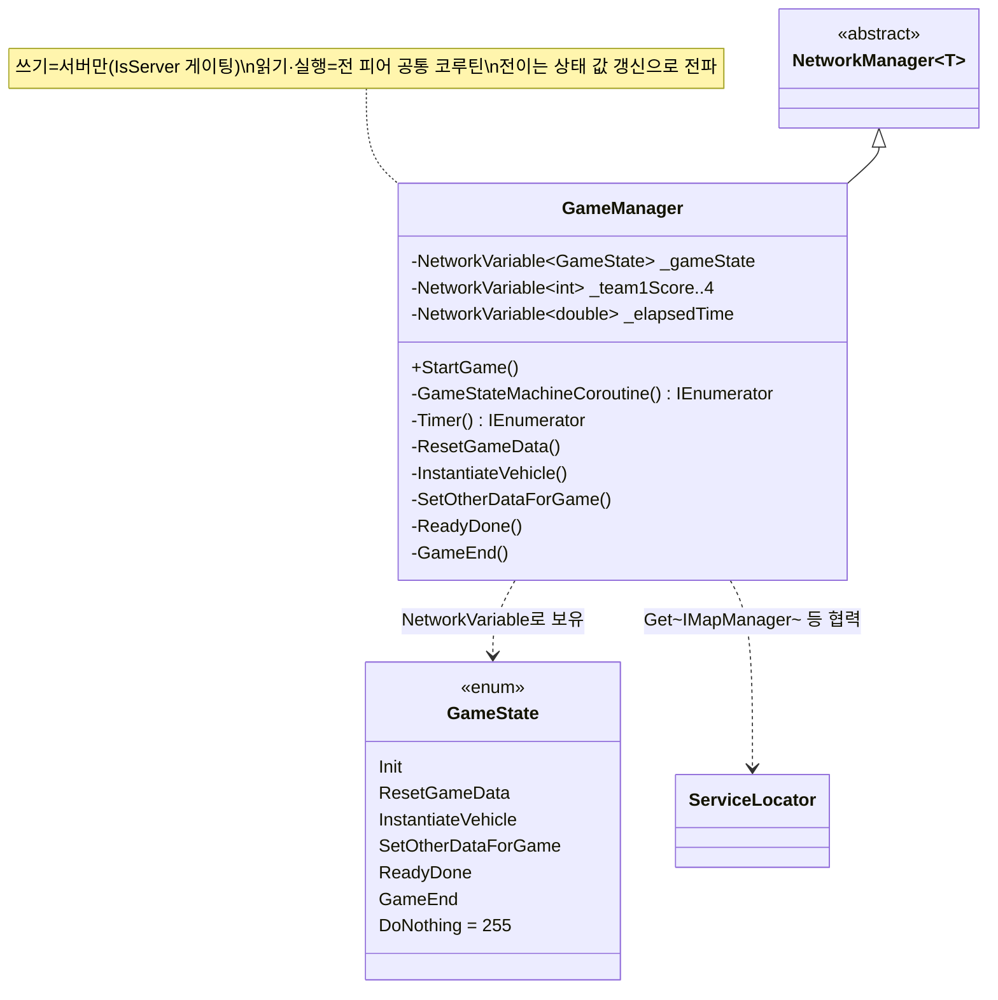

# 서버 권위형 게임 상태머신 (Server-Authoritative Game State Machine)

> 인게임 진행(로딩 → 데이터 초기화 → 전차 생성 → 세팅 → 플레이 → 종료)을 하나의 `NetworkVariable<GameState>`에 담고, **서버만 그 값을 쓰고 모든 피어가 코루틴으로 읽어** 같은 순서로 진행한다.
> 게임 흐름의 단일 진실 공급원(single source of truth)을 서버에 두어, 클라이언트가 흐름을 왜곡할 수 없게 만드는 것이 핵심이다.
>
> 관련 문서: [`ServiceLocator.md`](./ServiceLocator.md) · [`ManagerLifecycle.md`](./ManagerLifecycle.md)

---

## 1. 개요

멀티플레이 인게임은 "누가 진행 단계를 결정하는가"가 정합성의 출발점이다. 이 시스템은 진행 단계를 세 축으로 정리한다.

- **권위 축** — 상태를 바꾸는 주체는 오직 서버다. 모든 상태 쓰기가 `if (IsServer)`로 잠겨 있다.
- **동기화 축** — 상태는 `NetworkVariable<GameState>`라 서버가 쓰면 Netcode가 전 클라이언트에 복제한다.
- **실행 축** — 상태를 *읽어서 실행*하는 코루틴은 서버·클라이언트가 **동일하게** 돌린다. 클라이언트는 서버 전용 작업(스폰·점수 리셋)만 건너뛰고, 자기 화면 몫(로딩 UI·BGM·음성 입장)은 각 상태에서 직접 처리한다.

즉 **"결정은 서버 하나, 실행은 모두"** 구조다. 상태 하나가 서버·클라 양쪽에서 각자 할 일을 나눠 수행하고, 서버가 다음 상태를 써넣으면 그 값이 복제되어 전원이 다음 단계로 넘어간다.

## 2. 설계 목표

| 목표 | 해결 방식 |
| --- | --- |
| 게임 흐름의 단일 진실 공급원 | `NetworkVariable<GameState> _gameState` 하나로 진행 단계 표현 |
| 클라이언트의 흐름 조작 차단 | 모든 상태 전이 쓰기를 `if (IsServer)`로 게이팅 |
| 서버·클라 공통 진행 + 역할 분담 | 동일 `GameStateMachineCoroutine`을 전 피어가 실행, 서버 전용부만 `if(!IsServer) return` |
| 시작 실패 시 안전 복귀 | `StartGame`의 코루틴 기동을 try/catch로 감싸 실패 시 로비로 |
| 진행/종료 판정을 서버 시간 기준으로 | `Timer` 코루틴이 `ServerTime.Time`으로 경과 측정, 만료 시 `GameEnd` |

## 3. 구성 요소

| 요소 | 역할 | 성격 |
| --- | --- | --- |
| `GameState` | 진행 단계 enum (Init … GameEnd, DoNothing=255) | enum |
| `NetworkVariable<GameState> _gameState` | 현재 단계. 서버 쓰기 → 전 클라 복제 | NetworkVariable |
| `GameStateMachineCoroutine()` | 1초 주기로 상태를 읽어 switch 실행 (전 피어) | coroutine (Update loop) |
| 상태별 핸들러 | `ResetGameData`/`InstantiateVehicle`/`SetOtherDataForGame`/`ReadyDone`/`GameEnd` | private method |
| `Timer()` | 서버 시간 기준 경과 측정, 만료 시 `GameEnd`로 전이 | coroutine (server) |
| `GameManager` | 위 전부를 소유하는 서버 권위 매니저 | NetworkManager 구현체 |

> `GameState` 값: `Init → ResetGameData → InstantiateVehicle → SetOtherDataForGame → ReadyDone → DoNothing(플레이 중 대기, 255) → (시간 만료) GameEnd`.

## 4. 핵심 흐름

### 4-1. 진행 파이프라인 — 서버가 한 칸씩 밀고, 전원이 따라 실행

```
        [서버 쓰기]                 [NetworkVariable 복제]            [전 피어 코루틴이 읽어 실행]
StartGame()
  └ IsServer? _gameState = Init ───────────┐
                                           ▼
  ┌──────────────── GameStateMachineCoroutine (1초 tick, 서버+클라 공통) ────────────────┐
  │ Init             : 로딩 UI ON            → (서버)ResetGameData 로 전이               │
  │ ResetGameData    : 오디오 InitData       → (서버)Timer 기동·점수 0·InstantiateVehicle│
  │ InstantiateVehicle: (서버)전차 스폰       → (서버)SetOtherDataForGame                 │
  │ SetOtherDataForGame: 음성 입장·BGM·스코어 → (서버)ReadyDone                           │
  │ ReadyDone        : 로딩 UI OFF           → (서버)DoNothing (플레이 중 대기)           │
  │ DoNothing        : (아무것도 안 함, 게임 진행)                                        │
  │ GameEnd          : 정리 후 Result 씬 → yield break (코루틴 종료)                     │
  └──────────────────────────────────────────────────────────────────────────────────┘
                                           ▲
Timer(): ServerTime 경과 > 제한시간 ─ (서버) _gameState = GameEnd ─┘
```

> 서버는 각 상태에서 자기 일을 한 뒤 *다음 상태를 써넣는다*. 그 값이 복제되어, 다음 tick에 전 피어가 다음 case를 실행한다. 결과적으로 상태머신이 전원에게서 한 칸씩 함께 전진한다.

### 4-2. 상태 루프 — 값을 읽어 분기 (서버·클라 동일)

```csharp
private IEnumerator GameStateMachineCoroutine()
{
    while (true)
    {
        yield return new WaitForSecondsRealtime(1f);   // 1초 주기 폴링
        switch (_gameState.Value)                       // 복제된 현재 상태를 읽는다
        {
            case GameState.Init:
                ServiceLocator.Get<IInGameCommonUIController>()?.SetLoadingUIActive(true);
                if (IsServer) _gameState.Value = GameState.ResetGameData;   // 전이는 서버만
                break;
            // … ResetGameData / InstantiateVehicle / SetOtherDataForGame / ReadyDone …
            case GameState.GameEnd:
                GameEnd();
                yield break;                            // 종료 상태 → 코루틴 탈출
            case GameState.DoNothing:
                break;                                  // 플레이 중 대기
        }
    }
}
```

> 상태를 읽는 코드는 전원이 같고, **상태를 쓰는 코드만 서버로 잠겨 있다.** 이 한 줄(`if (IsServer)`)이 서버 권위의 실체다.

### 4-3. 상태 안 역할 분담 — 서버 전용부는 조기 반환

```csharp
private void InstantiateVehicle()
{
    if (!IsServer) { return; }                          // 클라는 스폰에 관여하지 않음
    foreach (var team in _teams)
    {
        GameObject body = Instantiate(_playerPrefabs[(int)team.vehicle]);
        var pos = ServiceLocator.Get<IMapManager>().GetStartPoint(team.teamNum);
        body.GetComponent<NetworkObject>().SpawnAsPlayerObject(driverId, true); // 서버 권위 스폰
        body.GetComponent<TankController>().SetDataClientRpc(team.teamNum, pos);
    }
    _gameState.Value = GameState.SetOtherDataForGame;
}
```

> 스폰·점수 같은 권위 작업은 서버에서만. 반대로 `SetOtherDataForGame`의 BGM·음성 입장은 각 클라가 자기 몫으로 실행한다.

### 4-4. 종료 판정 — 서버 시간 기준 타이머

```csharp
IEnumerator Timer()
{
    _startTime = NetworkManager.Singleton.ServerTime.Time;
    while (_elapsedTime.Value <= _gamePlayableTime)
    {
        _elapsedTime.Value = NetworkManager.Singleton.ServerTime.Time - _startTime; // 서버 시간
        yield return _tick;                                                         // 0.1초
    }
    _gameState.Value = GameState.GameEnd;   // 만료 → 종료 상태로 전이
}
```

> 경과 시간을 클라이언트 로컬 시간이 아니라 `ServerTime`으로 재, 피어마다 제각각인 종료 시점을 방지한다.

## 5. 클래스 구조 (Mermaid)



## 6. 코드 하이라이트

### 6-1. 서버 전용 쓰기 권한 — NetworkVariable 선언부터 권위 표현

```csharp
private NetworkVariable<GameState> _gameState = new();                                  // 서버 쓰기(기본)
private NetworkVariable<int> _team1Score = new(writePerm: NetworkVariableWritePermission.Owner);
```

> 진행 상태는 서버 기본 권한, 팀 점수는 소유자(Owner) 권한으로 나눴다. 데이터마다 "누가 쓸 수 있는가"를 선언 단계에서 못 박는다.

### 6-2. 시작 실패 안전망

```csharp
public void StartGame()
{
    ServiceLocator.Get<IMapManager>().SelectMap(_mapNumber);
    if (IsServer) _gameState.Value = GameState.Init;
    try { StartCoroutine(GameStateMachineCoroutine()); }
    catch (Exception e)
    {
        Debug.Log(e.Message);
        if (IsServer) ServiceLocator.Get<INetworkSceneLoader>().LoadScene("LobbyRoom"); // 실패 시 복귀
    }
}
```

> 인게임 진입이 깨지면 사용자를 매달아두지 않고 로비로 되돌린다.

### 6-3. 종료 상태의 결정성 — 정리 후 코루틴 탈출

```csharp
case GameState.GameEnd:
    GameEnd();        // 타이머 정지·리스폰 코루틴 정지·팀 점수 확정·Result 씬 로드
    yield break;      // 상태 루프 자체를 끝낸다
```

> `GameEnd`는 유일한 종료(terminal) 상태다. `yield break`로 상태머신을 완전히 닫아, 종료 후 상태가 다시 돌지 않게 한다.

## 7. 기술 포인트

- **서버 권위(Server Authority)** — 게임 흐름의 결정권을 서버 한 곳에 모으고 클라이언트는 복제된 결과만 실행. 클라 조작·상태 분기 왜곡을 원천 차단하는 멀티플레이 정합성의 기본기.
- **NetworkVariable = 상태 채널** — 상태를 RPC로 "명령 전송"하는 대신 *변수 복제*로 표현. 뒤늦게 값을 읽어도 현재 상태가 자명해, 재진입/지각 참가에도 흐름이 일관된다.
- **"결정/실행 분리"** — 같은 코루틴을 전 피어가 돌리되 쓰기만 서버로 잠금. 상태 하나가 서버·클라 각자의 몫을 나눠 갖는 구조라, 상태별로 "서버가 할 일 / 내가 할 일"이 한 함수에 모여 읽기 쉽다.
- **서버 시간 기준 타이밍** — 경과/종료 판정을 `ServerTime`으로 통일해, 클라 로컬 시계 편차로 인한 종료 시점 불일치를 제거.
- **명시적 유한 상태(enum)** — 진행 단계를 문자열/불린 플래그가 아니라 enum으로 못 박아, 흐름 전체가 한눈에 열거된다. `DoNothing`(대기)·`GameEnd`(종료) 같은 특수 상태도 명시적.

## 8. 확장 포인트 / 한계

- **폴링 기반(1초 tick)의 지연** — 상태를 `OnValueChanged` 이벤트가 아니라 1초 주기 폴링으로 읽는다. 구현이 단순하고 "복제 지각"에 강한 대신, 상태 전환마다 최대 ~1초 지연이 쌓인다. 로딩 단계엔 무해하지만, 즉각 반응이 필요한 흐름엔 이벤트 구독으로 바꿀 여지가 있다.
- **전이 규칙이 코드에 흩어짐** — "다음 상태"가 각 핸들러 끝에 하드코딩돼 있어, 상태 그래프가 한 곳에 표로 존재하지 않는다. 전이 테이블/상태 객체(State 패턴)로 분리하면 흐름 변경·검증이 쉬워진다.
- **`try/catch`의 범위 한계** — `StartGame`의 catch는 *코루틴 기동* 예외만 잡는다. 코루틴이 도는 도중(각 상태 내부)에 던진 예외는 이 catch가 잡지 못하므로, 상태 내부 실패에 대한 별도 방어가 필요하다.
- **점수 NetworkVariable 4개 하드코딩** — 팀별 점수/리스폰 시간이 `_team1..4`로 개별 변수라 팀 수가 고정된다. 팀 수 가변화를 원하면 `NetworkList`나 배열형 구조로 일반화가 필요.
- **클라이언트 재접속(late-join) 미검증** — 현재 흐름은 게임 시작 시 전원이 함께 진행하는 것을 전제한다. 진행 중 재접속 시 중간 상태를 어떻게 따라잡을지는 이 문서 범위 밖으로, 별도 설계가 필요.
