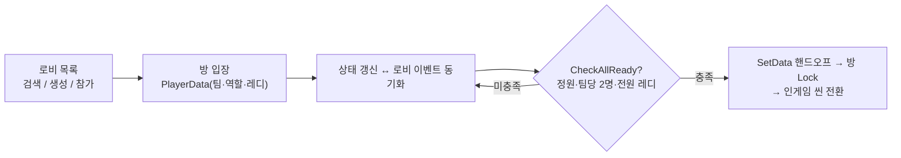
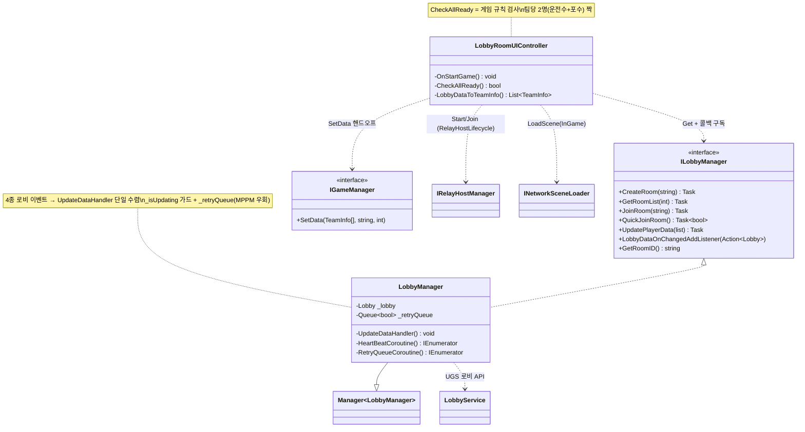

# 로비 → 매칭 → 인게임 파이프라인 (Lobby → Matchmaking → In-Game Pipeline)

> 흩어진 플레이어를 방으로 모으고(로비), 팀·역할·준비 상태를 맞추고(매칭), 조건이 갖춰지면 전원을 인게임으로 넘기는(핸드오프) 한 줄기 흐름을 다룬다. 중심은 UGS Lobby를 감싼 `LobbyManager`와, 로비 데이터를 게임 데이터로 옮기는 `SetData` 핸드오프다.
> "누가 같은 방에 있는가 → 팀이 갖춰졌는가 → 이제 넘어가도 되는가"를 로비 서비스 이벤트 위에서 판정하고, 그 결과를 [`RelayHostLifecycle`](./RelayHostLifecycle.md)·[`Bootstrap`](./Bootstrap.md)·[`NetcodeSyncPatterns`](./NetcodeSyncPatterns.md)로 넘기는 접합부가 이 문서의 주제다.
>
> 관련 문서: [`RelayHostLifecycle.md`](./RelayHostLifecycle.md) · [`Bootstrap.md`](./Bootstrap.md) · [`NetcodeSyncPatterns.md`](./NetcodeSyncPatterns.md) · [`GameStateMachine.md`](./GameStateMachine.md) · [`ServiceLocator.md`](./ServiceLocator.md)

---

## 1. 개요

"플레이어를 세션에 묶는" 일은 겉으로 한 흐름 같지만, 서로 다른 세 관심사로 나뉜다.

- **집합 축 (누가 같은 방에 있는가)** — UGS Lobby로 방을 만들고(Create)·찾고(Query)·들어간다(Join/QuickJoin). 방의 실재는 하트비트로 유지되고, 방 목록은 빈자리 있는 최신 순으로 노출된다.
- **합의 축 (팀·역할·준비가 맞는가)** — 각 플레이어는 `PlayerData`(팀/역할/레디)를 갱신하고, 로비 이벤트가 그 변화를 전원에게 전파한다. 여러 종류의 변경 이벤트를 *하나의 갱신 경로*로 수렴시켜 로컬 뷰를 최신으로 맞춘다.
- **전이 축 (이제 넘어가도 되는가)** — `CheckAllReady`가 게임 규칙(정원·팀 편성·전원 레디)을 검사하고, 통과하면 로비 데이터를 게임 데이터로 변환해 `GameManager`에 넘긴 뒤 방을 잠그고 인게임 씬으로 전원을 데려간다.

`LobbyManager`가 집합·합의 축을 담당하고, 전이 축은 `LobbyRoomUIController`가 판정·핸드오프한다. 로비(UGS)·릴레이·씬 로더·Firebase가 이 파이프라인에서 만난다.

## 2. 설계 목표

| 목표 | 해결 방식 |
| --- | --- |
| 방 생성·검색·참가 | UGS Lobby(`CreateLobbyAsync`/`QueryLobbiesAsync`/`JoinLobbyByIdAsync`) 래핑 |
| 빈자리 있는 최신 방만 노출 | Query 필터 `AvailableSlots > 0` + `Created desc` 정렬 |
| 방 실재 유지 | 호스트가 15초 주기 `SendHeartbeatPingAsync` |
| 플레이어 상태 공유 | `PlayerData`(팀/역할/레디) `UpdatePlayerAsync` → 로비 이벤트 전파 |
| 변경 이벤트의 단일 처리 | 4종 콜백을 모두 `UpdateDataHandler` 하나로 수렴 |
| 갱신 재진입·유실 방어 | `_isUpdating` 가드 + `_retryQueue`(MPPM 세션 공유 우회) |
| 데이터 변경을 UI에 통지 | `Lobby` 세터가 `_onChangeLobbyData` 발화 → 뷰 갱신 |
| 시작 가능 여부 판정 | `CheckAllReady`(정원·팀당 2명·전원 레디) |
| 로비→게임 데이터 이관 | `SetData(teams, roomId, mapNumber)`로 `GameManager`에 주입 |
| 전원 동시 인게임 진입 | 방 `Lock` 후 `INetworkSceneLoader.LoadScene("InGame")` |

## 3. 구성 요소

| 요소 | 역할 | 성격 |
| --- | --- | --- |
| `LobbyManager` | UGS Lobby 래핑 — 생성/검색/참가/이탈·이벤트·하트비트 | `Manager<T>` 구현체 |
| `LobbyPlayerDataKey` | PlayerData 키 상수(UserID/ClientID/Team/Role/Ready) | 상수 클래스 |
| `LobbyEventCallbacks` | UGS 로비 변경 이벤트 구독 지점 | Netcode/UGS 콜백 |
| `LobbyListUIController` | 방 목록 조회·표시·입장 진입 | MonoBehaviour |
| `LobbyRoomUIController` | 팀/역할/레디 UI + 매칭 판정 + 인게임 핸드오프 | MonoBehaviour |
| `IGameManager.SetData` | 로비 팀 편성을 게임 상태로 이관하는 접합부 | 인터페이스 메서드 |

## 4. 핵심 흐름

### 4-1. 파이프라인 전경 — 목록에서 인게임까지

```
[LobbyList]                     [LobbyRoom]                          [InGame]
 Query/QuickJoin/Create   ─►   PlayerData(팀·역할·레디) 갱신   ─►   씬 전환 후
   └ AvailableSlots>0            └ 로비 이벤트 → UpdateDataHandler       GameManager 가동
     Created desc                  → Lobby 세터 → UI 갱신               (SetDataClientRpc 배포)
                                 CheckAllReady 통과 시:
                                   SetData(teams) → Lock → LoadScene("InGame")
```



> 목록·방·인게임이 각각 다른 UI 컨트롤러지만, 관통하는 데이터는 하나의 `Lobby` 객체다. 이 객체의 변화가 UI를 흐르고, 마지막에 게임 데이터로 굳는다. `CheckAllReady`가 미충족이면 방 상태로 되돌아가 계속 맞추고(자기 순환), 충족되어야 핸드오프로 넘어간다.

### 4-2. 참가 시 초기 PlayerData — 합의의 출발점

```csharp
private Dictionary<string, T> MyDataFormat<T>() where T : class {
    data.Add(LobbyPlayerDataKey.USER_ID, CreateDataObject<T>(userInfo.userId));
    data.Add(LobbyPlayerDataKey.TEAM,    CreateDataObject<T>("0"));            // 미배정
    data.Add(LobbyPlayerDataKey.ROLE,    CreateDataObject<T>($"{PlayerRole.None}"));
    data.Add(LobbyPlayerDataKey.READY,   CreateDataObject<T>("false"));
    return data;
}
```

> 방에 들어가는 순간 "팀 없음·역할 없음·미준비"라는 백지 상태로 시작한다. 이후 모든 합의는 이 `PlayerData`를 `UpdatePlayerAsync`로 고쳐 쓰는 것으로 이뤄진다.

### 4-3. 변경 이벤트의 단일 수렴 — 4종 → UpdateDataHandler

```
PlayerJoined  ┐
PlayerLeft    ├─► UpdateDataHandler()
PlayerDataChanged ┤       ├─ _isUpdating? → return           (재진입 방어)
LobbyChanged  ┘          ├─ Lobby = await GetLobbyAsync(id)  (세터가 _onChangeLobbyData 발화)
                         └─ 실패 → _retryQueue.Enqueue(true) (MPPM 세션 공유 우회)
```

```csharp
_callbacks.PlayerJoined      += _ => UpdateDataHandler();
_callbacks.PlayerLeft        += _ => UpdateDataHandler();
_callbacks.PlayerDataChanged += _ => UpdateDataHandler();
_callbacks.LobbyChanged      += _ => UpdateDataHandler();
```

> "무엇이 바뀌었는지"와 무관하게 대응은 하나 — 로비를 다시 받아 로컬 뷰를 통째로 갱신한다. 이벤트 종류별 분기 대신 단일 진리 재조회로, 부분 갱신의 정합성 문제를 피한다.

### 4-4. 매칭 판정 → 핸드오프 — 조건을 넘으면 게임으로

```csharp
private void OnStartGame() {
    if (!CheckAllReady()) { /* 경고 팝업 */ return; }        // 정원·팀당2명·전원레디
    List<TeamInfo> teams = LobbyDataToTeamInfo();            // 로비 → 게임 데이터 변환
    string roomId = ServiceLocator.Get<ILobbyManager>().GetRoomID();
    ServiceLocator.Get<IGameManager>().SetData(teams.ToArray(), roomId, _selectedMapNumber);  // 이관
    if (IsHost) {
        ServiceLocator.Get<ILobbyManager>().Lock(true);                     // 난입 차단
        ServiceLocator.Get<INetworkSceneLoader>().LoadScene("InGame");      // 전원 동시 전환
    }
}
```

> `CheckAllReady`는 단순 준비 확인이 아니라 게임 규칙 검사다 — 정원 4+, 전원 팀·역할·레디, **팀당 0 또는 2명(운전수+포수 짝)**. 통과하면 로비의 진리를 `SetData`로 게임에 넘기고, 서버 권위 씬 전환([`Bootstrap`](./Bootstrap.md))으로 전원을 인게임에 데려간다. 이후는 [`GameStateMachine`](./GameStateMachine.md)이 이어받는다.

## 5. 클래스 구조 (Mermaid)



## 6. 코드 하이라이트

### 6-1. 빈자리 있는 최신 방만 — Query 필터·정렬

```csharp
options.Filters = new List<QueryFilter> {
    new QueryFilter(field: QueryFilter.FieldOptions.AvailableSlots, value: "0", op: QueryFilter.OpOptions.GT)
};
options.Order = new List<QueryOrder> { new QueryOrder(asc: false, field: QueryOrder.FieldOptions.Created) };
```

> 목록에 노출할 방을 서버 쿼리 단계에서 걸러낸다. 꽉 찬 방·오래된 방을 클라이언트가 후처리하지 않고, "빈자리 있는 최신 순"을 UGS에 위임한다.

### 6-2. 이벤트 수렴 + 재진입 가드 — 갱신을 한 곳으로

```csharp
private async void UpdateDataHandler() {
    if (_isUpdating) return;                     // 동시 갱신 방지
    _isUpdating = true;
    try {
        Lobby = await LobbyService.Instance.GetLobbyAsync(_lobby.Id);  // 세터가 UI 통지 발화
        _retryQueue.Clear();                     // 성공 시 재시도 큐 비움
    } catch (Exception e) {
        _retryQueue.Enqueue(true);               // 실패는 큐에 쌓아 뒤에서 재시도
    }
    _isUpdating = false;
}
```

> 어떤 로비 이벤트가 오든 결국 "로비를 다시 받아 세팅"만 한다. 재진입은 `_isUpdating`으로 막고, 실패는 큐에 쌓아 `RetryQueueCoroutine`이 되돌린다.

### 6-3. 데이터 세터가 UI를 깨운다 — 관찰자 접합

```csharp
public Lobby Lobby {
    get => _lobby;
    set { _lobby = value; _onChangeLobbyData?.Invoke(value); }   // 값 교체 = UI 통지
}
```

> 로비 값을 바꾸는 행위 자체가 UI 갱신 신호가 된다. 갱신 코드가 "값을 넣고 따로 UI를 부르는" 두 단계를 세터 하나로 합쳐, 통지 누락을 구조적으로 막는다.

### 6-4. 매칭 규칙 검사 — 팀당 운전수+포수 짝

```csharp
private bool CheckAllReady() {
    var players = lobbyManager.GetPlayerList();
    if (players.Count < 4) return false;                                   // 정원
    foreach (var p in players) {
        if (p.Data[TEAM].Value == "0" || p.Data[ROLE].Value == $"{PlayerRole.None}" || p.Data[READY].Value == "false")
            return false;                                                   // 전원 팀·역할·레디
        playersPerTeam[int.Parse(p.Data[TEAM].Value) - 1]++;
    }
    foreach (var n in playersPerTeam) if (n % 2 != 0) return false;         // 팀당 0 또는 2명
    return true;
}
```

> 시작 버튼은 UI 상태가 아니라 게임 규칙으로 잠긴다. 협력 탱크의 "운전수+포수 2인 1조"([`NetcodeSyncPatterns`](./NetcodeSyncPatterns.md))가 매칭 조건(`n % 2`)으로 그대로 표현된다.

## 7. 기술 포인트

- **UGS Lobby의 얇은 파사드** — 생성/검색/참가/이탈·이벤트·하트비트를 `LobbyManager` 뒤로 숨겨, UI는 `ILobbyManager`만 알면 된다. [`ServiceLocator`](./ServiceLocator.md)로 주입돼 로비 백엔드 교체가 한 클래스로 국한된다.
- **이벤트 단일 수렴** — 4종 변경 콜백을 `UpdateDataHandler` 하나로 모으고, 부분 갱신 대신 로비 전체 재조회로 로컬 뷰를 맞춘다. "무엇이 바뀌었나"를 따지지 않아 정합성 분기가 사라진다.
- **재진입·유실 이중 방어** — `_isUpdating`로 동시 호출을 막고, 실패한 갱신은 `_retryQueue`+코루틴으로 되살린다. MPPM(멀티플레이 플레이 모드)에서 싱글턴 세션이 공유되며 갱신이 누락되는 현상에 대한 실전 대응.
- **세터 기반 관찰자 통지** — `Lobby` 프로퍼티 세터가 곧 UI 통지 지점이다. 값 갱신과 통지가 한 몸이라, "값만 바꾸고 UI를 잊는" 버그가 원천 차단된다.
- **매칭 = 게임 규칙의 코드화** — `CheckAllReady`가 정원·역할·팀 편성을 검사해, 준비 UI가 아닌 "게임이 성립하는가"로 시작을 통제한다. 협력 2인 1조 규칙이 매칭 로직에 직접 박혀 있다.
- **로컬/네트워크 이중 핸드오프** — `SetData`는 각 클라의 `GameManager`에 로컬로 팀 데이터를 주입하고, 인게임 진입 후 `SetDataClientRpc`가 네트워크로 재배포한다([`NetcodeSyncPatterns`](./NetcodeSyncPatterns.md)). 씬 전환을 사이에 둔 데이터 승계를 두 경로로 보장.
- **하트비트로 방 실재 유지** — 호스트만 15초 주기로 핑을 보내 방이 UGS에서 회수되지 않게 한다. 방 수명을 호스트가 책임지는 구조.

## 8. 확장 포인트 / 한계

- **`PlayerData`가 전부 문자열** — 팀·역할·레디가 문자열 dict로 저장돼(`"0"`, `"false"`, `"None"`) 타입 안전성이 없고, `int.Parse`·문자열 비교가 여러 곳에 흩어진다. 파싱 실패에 취약하며, 스키마 변경 시 문자열 키가 산발적으로 깨질 수 있다.
- **`_retryQueue` 상시 폴링** — `RetryQueueCoroutine`이 0.1초마다 큐를 확인하는 무한 루프다. MPPM 세션 공유 문제의 *우회책*이며 근본 원인은 미해결 — 정식 환경에서 불필요한 상시 코스트가 된다.
- **매칭 조건 하드코딩** — 정원 4, 팀 4개(`int[4]`), 팀당 2명이 코드에 고정돼 다른 모드(인원·팀 수 변형)를 수용하지 못한다. 규칙을 데이터(SO)로 빼면 유연해진다.
- **JoinCode를 Firebase로 우회 교환** — Relay JoinCode를 로비 데이터가 아닌 Firebase([`RelayHostLifecycle`](./RelayHostLifecycle.md))로 주고받아, 로비(UGS)와 Firebase 두 백엔드에 결합돼 있다. 교환 채널이 이원화된 만큼 정리·동기화 실패 지점이 늘어난다.
- **이탈 시 방 정리 경쟁** — `LeaveRoom`이 마지막 이탈자일 때 Firebase의 JoinCode·MapNumber를 지우지만, 동시 이탈·비정상 종료 시 잔여 데이터가 남을 수 있다. 정리 책임을 서버 측(OnDisconnect)으로 옮기는 편이 견고하다.
- **`SetData` 타이밍 가정** — 모든 클라가 씬 전환 전 로컬 `SetData`를 마쳤다는 전제 위에서 인게임이 시작된다. 늦게 처리되는 클라가 있으면 `GameManager`가 빈 팀 데이터로 진입할 여지가 있어, 진입 배리어(전원 준비 확인)가 있으면 더 안전하다.
