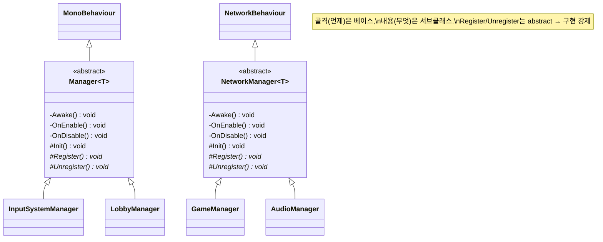

# 매니저 수명주기 자동화 (Manager Lifecycle / Template Method)

> 13개 매니저가 공통으로 반복하던 "초기화 → 서비스 등록 → 해제" 배선을, 두 개의 추상 베이스(`Manager<T>` / `NetworkManager<T>`)가 **수명주기에 못 박아** 대신 호출해 준다.
> 구현체는 "무엇을" 할지 세 개의 훅만 채우고, "언제" 부를지는 베이스가 통제한다 — Template Method 패턴이다.
>
> 관련 문서: [`ServiceLocator.md`](./ServiceLocator.md) · [`GameStateMachine.md`](./GameStateMachine.md)

---

## 1. 개요

[`ServiceLocator`](./ServiceLocator.md)가 자리 잡으면 모든 매니저는 똑같은 3박자를 반복하게 된다.

- **초기화 축** — 생성 시 자기 리소스를 만든다(입력 액션, Firebase 앱, 사운드 테이블 …).
- **등록 축** — 활성화되면 자신을 인터페이스로 `ServiceLocator`에 등록한다.
- **해제 축** — 비활성화되면 등록을 되돌린다.

이 세 박자를 매니저마다 손으로 `Awake`/`OnEnable`/`OnDisable`에 배선하면, **누군가는 반드시 하나를 빠뜨린다**(특히 `Unregister`). 그래서 배선 자체를 베이스 클래스로 끌어올리고, 구현체에는 *내용을 채울 훅*만 남겼다. 호출 시점은 프레임워크가, 내용은 서브클래스가 — 전형적인 Template Method 구조다.

## 2. 설계 목표

| 목표 | 해결 방식 |
| --- | --- |
| 등록/해제 누락 원천 차단 | `OnEnable→Register()`, `OnDisable→Unregister()`를 베이스가 강제 호출 |
| 구현 강제 vs 선택 구분 | `Register`/`Unregister`는 `abstract`(필수), `Init`은 `virtual`(선택) |
| 초기화 시점 통일 | `Awake→Init()` 한 곳으로 고정, 생성 타이밍 편차 제거 |
| MonoBehaviour / NetworkBehaviour 양쪽 지원 | 동일 골격을 `Manager<T>`와 `NetworkManager<T>` 두 판으로 제공 |
| 구현체 보일러플레이트 최소화 | 서브클래스는 한 줄짜리 훅만 채움 |

## 3. 구성 요소

| 요소 | 역할 | 성격 |
| --- | --- | --- |
| `Manager<T>` | `MonoBehaviour` 기반 수명주기 골격 | abstract base |
| `NetworkManager<T>` | `NetworkBehaviour` 기반 동일 골격(네트워크 매니저용) | abstract base |
| `Init()` | 생성 시 1회 초기화 훅 (기본 빈 구현) | virtual hook |
| `Register()` / `Unregister()` | 서비스 등록/해제 훅 (반드시 구현) | abstract hook |
| 각 구체 매니저 | 훅을 채우는 구현체 (`AudioManager`, `GameManager` …) | Manager 구현체 |

> `Manager<T>` 상속: `DatabaseBackend`, `InputSystemManager`, `LobbyManager`, `LocalSceneManager`, `RelayHostManager`, `UserInfoManager`, `VoiceManager`, `WarpManager`.
> `NetworkManager<T>` 상속: `AudioManager`, `GameManager`, `MapManager`, `NetworkSceneLoader`, `InGameCommonUIController`.

## 4. 핵심 흐름

### 4-1. 수명주기 → 훅 매핑

Unity 이벤트 함수를 베이스가 가로채, 정해진 순서로 훅을 호출한다.

```
Unity 수명주기            베이스가 호출하는 훅        서브클래스가 채우는 내용
────────────────────────────────────────────────────────────────────
Awake()   (1회)    ──►    Init()        (virtual)   리소스 생성/초기화
OnEnable() (활성마다) ─►   Register()    (abstract)  ServiceLocator에 자신 등록
OnDisable()(비활성마다)─►  Unregister()  (abstract)  ServiceLocator에서 해제
```

> `Init`은 있으면 좋고 없어도 되지만, `Register`/`Unregister`는 **컴파일러가 구현을 강제**한다. 등록만 하고 해제를 잊는 실수가 구조적으로 불가능해진다.

### 4-2. 구현체 관점 — 훅만 채운다

```csharp
public class InputSystemManager : Manager<InputSystemManager>, IInputSystem
{
    private InputSystem_Actions _inputSystemActions;

    protected override void Init()       // "무엇을 초기화할지"
    {
        _inputSystemActions = new InputSystem_Actions();
        _inputSystemActions.Enable();
    }
    protected override void Register()   => ServiceLocator.Register<IInputSystem>(this);
    protected override void Unregister() => ServiceLocator.Unregister<IInputSystem>(this);
}
```

> "언제(Awake/OnEnable/OnDisable)"는 코드 어디에도 없다. 서브클래스는 오직 "무엇을"에만 집중한다.

### 4-3. 비동기 초기화도 같은 자리에서

```csharp
// DatabaseBackend — 무거운 초기화도 Init() 훅 한 곳으로 수렴
protected override void Init()
{
    FirebaseApp.CheckAndFixDependenciesAsync().ContinueWithOnMainThread(task => { /* 앱/DB 준비 */ });
}
```

> 동기(입력 액션 생성)든 비동기(Firebase 의존성 체크)든, 초기화 진입점이 `Init()` 하나로 통일된다.

## 5. 클래스 구조 (Mermaid)



## 6. 코드 하이라이트

### 6-1. 골격 — 수명주기에 훅을 못 박는다

```csharp
public abstract class Manager<T> : MonoBehaviour
{
    private void Awake()     => Init();
    protected virtual void Init() { }        // 선택 훅 (기본 빈 구현)

    private void OnEnable()  => Register();
    private void OnDisable() => Unregister();
    protected abstract void Register();       // 필수 훅
    protected abstract void Unregister();
}
```

> `private` 수명주기 + `protected` 훅. "언제 부를지"는 봉인하고 "무엇을 할지"만 열어 준다.

### 6-2. 네트워크 판 — 상속 부모만 다르고 계약은 동일

```csharp
public abstract class NetworkManager<T> : NetworkBehaviour   // ← NetworkBehaviour
{
    private void Awake()     => Init();
    protected virtual void Init() { }
    private void OnEnable()  => Register();
    private void OnDisable() => Unregister();
    protected abstract void Register();
    protected abstract void Unregister();
}
```

> `NetworkBehaviour`를 상속해야 하는 매니저(권한/RPC 사용)를 위해 같은 계약을 한 벌 더 뒀다. 서브클래스 코드는 베이스 이름만 바꾸면 그대로 동작.

### 6-3. 구현 강제의 효과 — 등록/해제가 항상 쌍으로

```csharp
protected override void Register()   => ServiceLocator.Register<IAudioService>(this);
protected override void Unregister() => ServiceLocator.Unregister<IAudioService>(this);
```

> `abstract`라 둘 다 반드시 존재한다. 등록/해제가 코드상 항상 대칭을 이룬다.

## 7. 기술 포인트

- **Template Method 패턴** — 불변의 알고리즘(수명주기 순서)은 베이스가 소유하고, 가변 단계(Init/Register/Unregister)만 서브클래스에 위임. "제어의 역전"으로 프레임워크가 구현체를 호출한다.
- **abstract vs virtual의 의도적 구분** — 반드시 있어야 하는 등록/해제는 `abstract`(강제), 있을 수도 없을 수도 있는 초기화는 `virtual`(선택). 타입 시스템으로 규약을 표현했다.
- **[`ServiceLocator`](./ServiceLocator.md)와의 결착** — 이 베이스가 없으면 서비스 등록은 개발자 규율에 의존한다. 수명주기에 묶음으로써 "등록 깜빡"을 컴파일·런타임 양쪽에서 봉쇄.
- **일관된 초기화 진입점** — 동기/비동기를 불문하고 초기화가 `Init()` 한 곳으로 모여, 매니저를 처음 읽는 사람이 "여기부터 본다"가 자명해진다.

## 8. 확장 포인트 / 한계

- **파생 클래스가 수명주기를 다시 선언하면 배선이 끊긴다(주의)** — 베이스의 `OnEnable`/`OnDisable`은 `private`이라 재정의가 아니라 *가려짐(shadowing)*이 된다. 실제로 `InputSystemManager`는 자체 `private void OnDisable()`을 선언하는데, 이 경우 베이스의 `OnDisable→Unregister()` 배선이 함께 호출되는지는 Unity 메시지 디스패치 동작에 달려 있어 **확인이 필요**하다. 추가 수명주기 로직이 필요하면 별도 이벤트 함수를 새로 만들기보다 훅을 확장하는 편이 안전하다.
- **제네릭 `T`가 실제로 쓰이지 않음** — `Manager<T>`의 `T`는 self-type 관습 표기일 뿐, 베이스 내부에서 사용되지 않는다. 싱글턴 접근자(`Instance`)나 타입 안전 유틸에 활용할 여지가 남아 있다.
- **두 베이스의 코드 중복** — `Manager<T>`와 `NetworkManager<T>`는 상속 부모(`MonoBehaviour`/`NetworkBehaviour`)만 다르고 본문이 동일하다. 공통 로직을 별도 헬퍼로 뽑거나 인터페이스로 계약을 공유하면 중복을 줄일 수 있다.
- **초기화 순서 보장 없음** — `Init`은 각자 `Awake`에서 돌 뿐, 매니저 간 초기화 순서는 이 베이스가 보장하지 않는다. 의존 순서가 중요한 경우 부트스트랩/실행 순서(Script Execution Order) 쪽에서 별도로 통제해야 한다.
