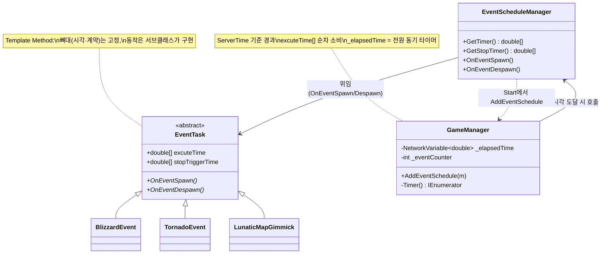

# 맵 돌발 이벤트 스케줄러 (Map Event Scheduler)

> 경기 도중 정해진 시각에 맵 전체를 뒤흔드는 돌발 이벤트(눈보라·토네이도·운석 등)를 시간표대로 발동·종료시킨다. "언제 터지는가"(스케줄)와 "무엇이 터지는가"(이벤트 내용)를 분리해, 서버 시간 기준으로 결정적으로 굴리는 것이 핵심이다.
> 스케줄은 [`GameStateMachine`](./GameStateMachine.md)의 게임 타이머가 관장하고, 이벤트 내용은 `EventTask`를 상속한 각 맵 기믹이 채운다 — Template Method로 뼈대와 살을 나눈 구조다.
>
> 관련 문서: [`GameStateMachine.md`](./GameStateMachine.md) · [`NetcodeSyncPatterns.md`](./NetcodeSyncPatterns.md) · [`ManagerLifecycle.md`](./ManagerLifecycle.md) · [`ServiceLocator.md`](./ServiceLocator.md)

---

## 1. 개요

"정해진 시각에 맵 이벤트를 발동한다"는 요구는 세 관심사로 나뉜다.

- **시간 축 (언제 터지는가)** — 게임 타이머가 서버 시간 기준으로 흐르고, 이벤트 발동/종료 시각 배열을 순서대로 소비한다. 클라 프레임률과 무관하게 서버가 시각을 판정한다.
- **내용 축 (무엇이 터지는가)** — 눈보라·토네이도처럼 이벤트마다 동작이 다르다. 공통 계약(`OnEventSpawn`/`OnEventDespawn`)만 `EventTask`로 고정하고, 구체 동작은 각 맵 이벤트가 구현한다.
- **연결 축 (스케줄과 내용을 잇는다)** — 씬에 놓인 `EventScheduleManager`가 자기 이벤트를 게임 매니저에 등록하고, 매니저가 시각 도달 시 그 이벤트를 호출한다.

시간 축은 [`GameStateMachine`](./GameStateMachine.md)의 `Timer` 코루틴이, 내용 축은 `EventTask` 서브클래스가, 연결 축은 `EventScheduleManager`가 맡는다. 발동 판정·데미지는 서버 권위, 연출만 클라로 뿌린다([`NetcodeSyncPatterns`](./NetcodeSyncPatterns.md)).

## 2. 설계 목표

| 목표 | 해결 방식 |
| --- | --- |
| 스케줄과 내용 분리 | 시간 판정=GameManager, 동작=`EventTask` 추상 메서드 |
| 이벤트별 동작 다형성 | `abstract OnEventSpawn()`/`OnEventDespawn()` (Template Method) |
| 프레임 독립 결정적 타이밍 | `NetworkManager.ServerTime.Time` 기준 경과 시간 |
| 게임 타이머 전원 동기 | `_elapsedTime` `NetworkVariable<double>` |
| 다중 발동 시각 | `excuteTime[]` 배열 + `_eventCounter` 순차 소비 |
| 발동 후 자동 종료 | `stopTriggerTime[]` 도달 시 `OnEventDespawn` |
| 발동 판정 서버 권위 | `if (IsServer)` 게이팅 + 서버에서만 데미지 |
| 연출만 클라 전파 | 시각/사운드는 `ClientRpc`로 팬아웃 |
| 씬-매니저 자동 연결 | `EventScheduleManager.Start`에서 `AddEventSchedule` 등록 |

## 3. 구성 요소

| 요소 | 역할 | 성격 |
| --- | --- | --- |
| `EventTask` | 맵 이벤트 계약(발동/종료 + 시각 배열) | abstract `NetworkBehaviour` |
| `EventScheduleManager` | 씬 이벤트를 매니저에 등록 + 발동 위임 | MonoBehaviour |
| `GameManager.Timer` | 서버 시간 진행 + 시각 도달 판정 | 코루틴(서버) |
| `_elapsedTime` | 경과 시간(게임 타이머, 전원 동기) | `NetworkVariable<double>` |
| `BlizzardEvent` 등 | 구체 이벤트(틱 데미지·연출) | `EventTask` 구현체 |
| `BonfireArea` | 이벤트 예외 구역(눈보라 안전지대) | 판정 오브젝트 |

## 4. 핵심 흐름

### 4-1. 등록 — 씬 이벤트가 매니저에 자기를 건다

```csharp
// EventScheduleManager.Start()
if (ServiceLocator.Get<ILocalSceneLoader>().GetCurrentSceneName() == "Login") return;
ServiceLocator.Get<IGameManager>().AddEventSchedule(this);
// GameManager
public void AddEventSchedule(EventScheduleManager m) {
    _eventScheduleManager = m;
    _eventTimer    = m.GetTimer();        // excuteTime[]
    _eventEndTimer = m.GetStopTimer();    // stopTriggerTime[]
}
```

> 맵마다 놓인 스케줄 매니저가 자기 시간표를 게임 매니저에 넘겨 등록한다. 매니저는 어떤 이벤트인지 몰라도 되고, 시각 배열만 받아 소비한다 — 스케줄과 내용의 결합이 이 한 지점으로 좁혀진다.

### 4-2. 발동 판정 — 서버 시간으로 시각 배열을 순차 소비

```csharp
while (_elapsedTime.Value <= _gamePlayableTime) {
    _elapsedTime.Value = NetworkManager.Singleton.ServerTime.Time - _startTime;   // 서버 기준 경과
    if (IsServer && _eventScheduleManager != null) {
        if (_eventCounter < _eventTimer.Length && _eventTimer[_eventCounter] <= _elapsedTime.Value) {
            if (_eventEndTimer != null && _eventCounter < _eventEndTimer.Length) _isEventEndTimer = true;
            _eventScheduleManager.OnEventSpawn();          // 발동
            _eventCounter++;
        }
        else if (_isEventEndTimer && _eventEndTimer[_eventCounter - 1] <= _elapsedTime.Value) {
            _isEventEndTimer = false;
            _eventScheduleManager.OnEventDespawn();         // 종료
        }
    }
    yield return _tick;
}
```

> 경과 시간을 서버 시간으로 재, `excuteTime` 배열을 `_eventCounter`로 하나씩 넘긴다. 프레임률이 달라도 발동 시각이 흔들리지 않고, 발동·종료 판정이 서버 한 곳에서만 일어난다.

### 4-3. 위임 — 매니저는 호출만, 동작은 EventTask가

```csharp
// EventScheduleManager                         // EventTask (추상)
public void OnEventSpawn()  => _events.OnEventSpawn();      public abstract void OnEventSpawn();
public void OnEventDespawn()=> _events.OnEventDespawn();    public abstract void OnEventDespawn();
```

> 스케줄러는 "터뜨려라"만 전하고, 실제로 무엇이 일어나는지는 `EventTask` 구현체가 정한다. 새 이벤트를 추가해도 스케줄 코드는 그대로 — Template Method로 뼈대와 내용을 분리했다([`ManagerLifecycle`](./ManagerLifecycle.md)의 훅 패턴과 같은 결).

### 4-4. 구체 이벤트 — 눈보라: 서버 판정 + 연출 팬아웃

```csharp
public override void OnEventSpawn() {
    if (!IsServer) return;                                   // 판정은 서버만
    if (_tickCoroutine == null) {
        _tickCoroutine = StartCoroutine(TickDamageCoroutine());
        ShowBlizzardEffectClientRpc();                       // 연출은 전원에게
    }
}
private IEnumerator TickDamageCoroutine() {
    while (true) {
        yield return new WaitForSeconds(_tickInterval);
        foreach (var tank in _tanks)
            if (!IsTankInBonfire(tank)) tank.TakeDamaged(_tickDamage, PlayerTeamEnum.neutralObject);  // 안전지대 밖만
    }
}
```

> 눈보라는 모닥불(`BonfireArea`) 밖 탱크에 주기적 틱 데미지를 준다. 데미지 판정은 서버에서, 화면 효과는 `ClientRpc`로 전원에게 — 판정과 연출의 경계가 [`NetcodeSyncPatterns`](./NetcodeSyncPatterns.md)와 일관되게 나뉜다.

## 5. 클래스 구조 (Mermaid)



## 6. 코드 하이라이트

### 6-1. 서버 시간 기준 결정적 진행

```csharp
_startTime = NetworkManager.Singleton.ServerTime.Time;
_elapsedTime.Value = NetworkManager.Singleton.ServerTime.Time - _startTime;
```

> 경과 시간을 `Time.time`이 아니라 `ServerTime.Time`으로 잰다. 클라마다 프레임률·시작 시점이 달라도 이벤트 발동 시각이 서버 시간 하나로 통일돼, 눈보라가 누구에겐 일찍·누구에겐 늦게 오는 일이 없다.

### 6-2. 추상 계약으로 이벤트 다형화

```csharp
[Serializable]
public abstract class EventTask : NetworkBehaviour {
    [SerializeField] public double[] excuteTime;        // 발동 시각들
    [SerializeField] public double[] stopTriggerTime;   // 종료 시각들
    public abstract void OnEventSpawn();
    public abstract void OnEventDespawn();
}
```

> 모든 맵 이벤트가 "발동 시각·종료 시각·발동/종료 동작"이라는 같은 형태를 공유한다. 스케줄러는 이 계약만 알면 되고, 눈보라든 토네이도든 동일하게 다뤄진다. 시각은 인스펙터에서 데이터로 편집된다.

### 6-3. 판정/연출 분리 + 안전지대 예외

```csharp
if (!IsTankInBonfire(tank))
    tank.TakeDamaged(_tickDamage, PlayerTeamEnum.neutralObject);   // 모닥불 밖만 피해
```

> 눈보라 데미지에 `BonfireArea` 안전지대 예외를 둬, 이벤트가 단순 전역 피해가 아니라 위치 기반 전술 요소가 된다. 데미지는 서버, 시각 효과는 `ClientRpc`로 나눠 권위와 표현을 분리한다.

## 7. 기술 포인트

- **스케줄과 내용의 분리** — "언제"(GameManager 타이머)와 "무엇"(`EventTask`)을 갈라, 새 이벤트를 추가해도 시간 관리 코드가 바뀌지 않는다. 시간표(`excuteTime[]`)는 데이터, 동작은 다형성으로 처리한 확장 가능한 구조.
- **Template Method 이벤트 계약** — `OnEventSpawn`/`OnEventDespawn` 추상 메서드가 이벤트의 골격을 고정하고, 각 맵이 살을 채운다([`ManagerLifecycle`](./ManagerLifecycle.md)의 수명주기 훅과 같은 설계 철학의 재사용).
- **서버 시간 결정론** — `ServerTime.Time`으로 발동 시각을 판정해, 클라 환경차에 무관하게 모두가 같은 순간 같은 이벤트를 겪는다. 멀티플레이 타이밍 공정성의 기본기.
- **동기 타이머 + 순차 카운터** — `_elapsedTime`을 `NetworkVariable`로 두어 게임 타이머 UI가 전원 동기되고, `_eventCounter`로 시각 배열을 순서대로 소비해 발동 상태를 단순한 인덱스 하나로 관리한다.
- **판정/연출 경계** — 발동 판정·데미지는 서버, 화면·사운드는 `ClientRpc`. 이벤트 시스템도 [`NetcodeSyncPatterns`](./NetcodeSyncPatterns.md)의 서버 권위 원칙을 그대로 따른다.
- **위치 기반 전술 예외** — 안전지대(`BonfireArea`)로 이벤트에 회피 여지를 줘, 돌발 이벤트가 운이 아니라 플레이로 대응 가능한 요소가 된다.

## 8. 확장 포인트 / 한계

- **겹치는 이벤트 처리 취약** — 발동 상태를 `_eventCounter` 하나·`_isEventEndTimer` 단일 플래그로 관리해, 앞 이벤트가 끝나기 전에 다음 이벤트가 시작되는 *동시 진행*을 제대로 다루지 못한다. 종료 타이머가 `_eventCounter - 1` 하나만 추적하므로, 이벤트별 독립 상태 관리가 필요하다.
- **맵당 단일 EventTask 전제** — `EventScheduleManager`가 `_events` 하나만 들어, 한 맵에서 종류가 다른 여러 이벤트를 병행하려면 구조 확장이 필요하다(현재는 이벤트 하나가 배열 시각으로 반복 발동하는 형태).
- **틱 코루틴의 종료 의존** — `TickDamageCoroutine`이 `while(true)`라 `OnEventDespawn`의 `StopCoroutine`에만 의존해 멈춘다. 종료 호출이 누락되면(예외 경로) 무한 피해가 지속될 위험이 있다.
- **런타임 탐색 비용** — 이벤트 시작 시 `FindObjectsByType<BonfireArea>`·탱크 수집을 런타임에 한다. 첫 발동 시 한 번이지만, 대상이 많아지면 캐싱·주입으로 개선할 여지가 있다.
- **틱 데미지도 소유 클라 적용** — `TakeDamaged`가 결국 소유자(운전수) 클라에서 HP를 감산한다([`NetcodeSyncPatterns`](./NetcodeSyncPatterns.md) §8, [`RespawnScore`](./RespawnScore.md)와 동일 한계). 이벤트 데미지의 서버 권위도 반쪽이다.
- **필드명 오타** — `excuteTime`(execute), `InergrityCheck`(integrity) 등 철자 오류가 공개 필드·메서드에 남아 있어, 인스펙터·호출부에 그대로 노출된다. 리네임 시 직렬화 데이터 마이그레이션 주의.
