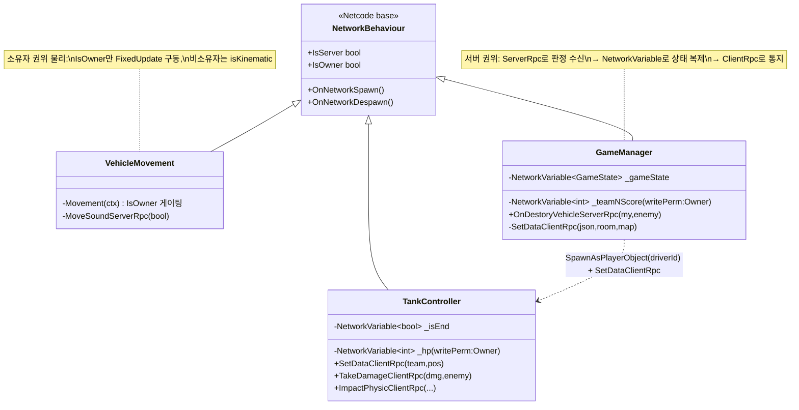

# Netcode 동기화 패턴 (Netcode Synchronization Patterns)

> 서버·클라이언트 간에 "무엇을 어떻게 맞추는가"를 세 가지 도구로 나눠 쓴다 — 상태를 자동 복제하는 **`NetworkVariable`**, 한쪽에서 다른 쪽으로 명령을 던지는 **RPC**, 그리고 그 둘의 쓰기 권한을 정하는 **Ownership**.
> 프로젝트 전반(탱크·투사체·맵 이벤트·점수판)에서 반복되는 이 동기화 관용구들을 한데 모아, 팀 전원이 같은 규약으로 네트워크 코드를 쓰게 만드는 것이 목적이다.
>
> 관련 문서: [`GameStateMachine.md`](./GameStateMachine.md) · [`RelayHostLifecycle.md`](./RelayHostLifecycle.md) · [`ManagerLifecycle.md`](./ManagerLifecycle.md) · [`ServiceLocator.md`](./ServiceLocator.md)

---

## 1. 개요

멀티플레이 동기화는 성격이 다른 세 가지 문제로 쪼개진다. 이 프로젝트는 각 문제를 Netcode의 서로 다른 도구에 대응시킨다.

- **상태 축 (값을 계속 맞춰야 한다)** — HP·점수·팀 위치처럼 *지속적으로 유지되는 값*은 `NetworkVariable`로 선언해 자동 복제한다. 늦게 접속한 클라이언트도 최신 값을 받고, 값이 바뀌면 `OnValueChanged`로 UI가 반응한다.
- **명령 축 (한 번의 사건을 전달한다)** — "포를 쐈다", "파괴됐다", "효과를 켜라" 같은 *일회성 사건*은 RPC로 보낸다. 클라→서버는 `ServerRpc`, 서버→전 클라는 `ClientRpc`로 방향을 나눈다.
- **권한 축 (누가 쓸 수 있는가)** — 같은 값도 *누가 갱신 권한을 갖는가*가 다르다. `SpawnAsPlayerObject`로 탱크를 운전수에게 귀속시키고, `writePerm: Owner`·`IsOwner` 게이팅으로 그 소유자만 물리·입력·특정 값을 쓰게 한다.

세 축은 함께 맞물린다: **Ownership이 권한을 정하고 → 그 권한 위에서 NetworkVariable이 상태를 복제하고 → RPC가 그 사이의 사건을 실어 나른다.**

## 2. 설계 목표

| 목표 | 해결 방식 |
| --- | --- |
| 지속 상태의 자동 복제 | `NetworkVariable<T>` 선언 → 값 변경 시 전 클라 자동 동기화 |
| 상태 변화에 UI 반응 | `NetworkVariable.OnValueChanged += handler`로 값→표현 연결 |
| 값별 쓰기 권한 분리 | `writePerm: NetworkVariableWritePermission.Owner`로 소유자만 쓰기 |
| 클라→서버 요청 | `[ServerRpc]` / `[Rpc(SendTo.Server)]`로 서버에 권위 위임 |
| 서버→전 클라 통지 | `[ClientRpc]`로 사건·데이터 팬아웃 |
| 비소유자 호출 허용 | `InvokePermission = RpcInvokePermission.Everyone`로 게이트 완화 |
| 오브젝트를 특정 플레이어에 귀속 | `SpawnAsPlayerObject(clientId, true)`로 운전수에게 소유권 |
| 소유자만 물리·입력 | `if (!IsOwner) return` 게이팅 + 비소유자 `isKinematic` |

## 3. 구성 요소

| 요소 | 역할 | 성격 |
| --- | --- | --- |
| `NetworkVariable<T>` | 서버↔클라 값 자동 복제 + 변경 이벤트 | Netcode 상태 컨테이너 |
| `[ServerRpc]` / `[Rpc(SendTo.Server)]` | 클라이언트→서버 명령 | RPC(수신=서버) |
| `[ClientRpc]` | 서버→전 클라 통지·데이터 배포 | RPC(수신=클라) |
| `RpcInvokePermission.Everyone` | 소유자 아닌 쪽도 RPC 호출 허용 | RPC 옵션 |
| `NetworkBehaviour` | 위 도구를 담는 네트워크 컴포넌트(Spawn 훅 제공) | 베이스 클래스 |
| `SpawnAsPlayerObject` | 스폰과 동시에 소유권을 특정 클라에 배정 | NetworkObject API |

## 4. 핵심 흐름

### 4-1. 상태 복제 — 선언 → 소유자 쓰기 → 전원 반영 → UI 반응

```
[소유자 클라]  _hp.Value -= dmg         // writePerm:Owner 라 소유자만 씀
     │  Netcode가 자동 복제
     ▼
[전 클라]     _hp.OnValueChanged(old,new) → HpValueChangeHandler → 체력바 갱신
```

```csharp
private NetworkVariable<int> _hp = new(0, writePerm: NetworkVariableWritePermission.Owner);
// ...
_hp.OnValueChanged += HpValueChangeHandler;         // 값 변화를 UI로
private void HpValueChangeHandler(int oldVal, int newVal)
    => _driverUI?.ChangeVehicleHealth(newVal / (float)_stat.VechicleMaximumHP);
```

> 값을 "동기화하라"고 명령하지 않는다. `NetworkVariable`로 선언하는 순간 복제는 프레임워크가 맡고, 코드는 *값을 쓰는 쪽*과 *값 변화에 반응하는 쪽*만 기술한다.

### 4-2. 명령 방향 — ServerRpc(올려보내기) ↔ ClientRpc(내려보내기)

```
[클라] 포탄 명중 판정
   └─ OnDestoryVehicleServerRpc(myTeam, enemy)   ─►  [서버]  점수/리스폰 권위 처리
                                                          │
[서버] 팀 데이터 배포                                       ▼
   └─ SetDataClientRpc(teamJson, roomId, mapNo)  ─►  [전 클라]  로컬 상태 세팅
```

```csharp
// 클라 → 서버 : 권위 판정을 서버에 위임
[Rpc(SendTo.Server, InvokePermission = RpcInvokePermission.Everyone)]
public void OnDestoryVehicleServerRpc(PlayerTeamEnum myTeam, PlayerTeamEnum enemy) { if (!IsServer) return; /* 점수·리스폰 */ }

// 서버 → 전 클라 : 사건·데이터 팬아웃
[ClientRpc]
private void SetDataClientRpc(string teamsJson, string roomId, int mapNumber) { if (IsServer) return; /* 로컬 반영 */ }
```

> RPC 이름의 접미사(`...ServerRpc`/`...ClientRpc`)가 곧 방향이다. 권위가 필요한 판정은 서버로 올리고, 그 결과·데이터는 클라로 내린다. [`GameStateMachine`](./GameStateMachine.md)의 서버 권위 상태 전이와 짝을 이룬다.

### 4-3. 권한 배정 — 스폰과 동시에 소유권을 운전수에게

```csharp
// 서버: 탱크를 만들고, 그 팀 '운전수' 클라에게 소유권을 준다
GameObject bodyObj = Instantiate(_playerPrefabs[(int)team.vehicle]);
bodyObj.GetComponent<NetworkObject>().SpawnAsPlayerObject(driverId, true);  // driverId = 소유자
tc.SetDataClientRpc(team.teamNum, pos);                                     // 이어서 팀·색·위치 배포
```

> 탱크의 소유자가 그 팀 운전수로 고정된다. 이 소유권이 있어야 4-1의 `writePerm:Owner` HP를 그 운전수 클라가 쓸 수 있고, 4-4의 `IsOwner` 물리 게이팅이 성립한다. 스폰·귀속·초기화가 한 흐름에 놓인다.

### 4-4. 소유자 권위 조작 — 소유자만 물리/입력, 비소유자는 수신만

```csharp
public override void OnNetworkSpawn()
{
    if (IsOwner) { _rb.isKinematic = false; _rb.collisionDetectionMode = CollisionDetectionMode.ContinuousDynamic; }
    else          _rb.isKinematic = true;   // 타인 차량은 물리 끄고 위치만 동기화받음
}
private void FixedUpdate() { if (!IsOwner || !canMove) return; /* 소유자만 물리 구동 */ }
```

> 소유자만 물리를 굴리고, 그 결과 위치는 다른 클라에 복제돼 들어온다. 비소유자가 같은 물리를 돌려 어긋나는 걸 `IsOwner` 한 줄로 막는다 — "각 탱크는 자기 주인이 운전한다"는 규칙의 구현.

## 5. 클래스 구조 (Mermaid)



## 6. 코드 하이라이트

### 6-1. 소유자 쓰기 권한 + 변경 이벤트 = 상태와 표현의 분리

```csharp
private NetworkVariable<int> _hp = new(0, writePerm: NetworkVariableWritePermission.Owner);
// 값을 쓰는 쪽 (소유자)
_hp.Value -= dmg;
// 값에 반응하는 쪽 (전 클라)
_hp.OnValueChanged += (oldVal, newVal) => _driverUI?.ChangeVehicleHealth(newVal / (float)_stat.VechicleMaximumHP);
```

> HP는 소유자만 쓰고, 화면 반영은 모두가 `OnValueChanged`로 받는다. "값의 진실"과 "값의 표현"을 갈라놔, UI가 값을 폴링하지 않는다.

### 6-2. ServerRpc로 권위 판정 위임

```csharp
[Rpc(SendTo.Server, InvokePermission = RpcInvokePermission.Everyone)]
public void OnDestoryVehicleServerRpc(PlayerTeamEnum myTeam, PlayerTeamEnum enemy)
{
    if (!IsServer) return;                 // 이 로직은 서버에서만 실행됨을 재확인
    // 점수 가감 · 리스폰 타이머 시작 (권위 판정)
}
```

> 파괴 판정 같은 게임 결과는 클라가 각자 계산하지 않고 서버로 올려 한 곳에서 정한다. `SendTo.Server`가 목적지를, `if (!IsServer) return`이 실행지를 이중으로 못 박는다.

### 6-3. ClientRpc 팬아웃 — 서버가 전원에게 데이터를 뿌린다

```csharp
[ClientRpc]
private void SetDataClientRpc(string teamsJson, string roomId, int mapNumber)
{
    if (IsServer) return;                  // 서버 자신은 이미 값이 있으니 제외
    _teams = JsonUtility.FromJson<TeamContainer>(teamsJson).teams;   // 각 클라 로컬 반영
}
```

> 팀 편성처럼 한 번에 배포할 구조체는 JSON으로 직렬화해 `ClientRpc` 인자로 실어 보낸다. 서버는 `if (IsServer) return`으로 자기 자신만 건너뛴다.

### 6-4. 소유자 권위 물리 — 비소유자는 계산하지 않는다

```csharp
public override void OnNetworkSpawn()
{
    if (IsOwner) _rb.isKinematic = false;   // 내가 굴린다
    else         _rb.isKinematic = true;    // 남의 차는 위치만 받는다
}
private void FixedUpdate() { if (!IsOwner || !canMove) return; /* 물리 이동 */ }
```

> 소유권을 물리 주체 선정에 직접 활용한다. 비소유자 차량은 `isKinematic`으로 물리를 끄고 복제된 위치만 따르므로, 중복 시뮬레이션에 의한 떨림·불일치가 사라진다.

## 7. 기술 포인트

- **세 도구의 역할 분담** — 지속 상태=`NetworkVariable`, 일회성 사건=RPC, 쓰기 권한=Ownership. "이건 값인가 사건인가, 누가 주인인가"만 판단하면 어떤 도구를 쓸지 정해진다. 팀 전원이 같은 결정 규칙을 공유한다.
- **선언적 상태 동기화** — `NetworkVariable`은 복제를 프레임워크에 위임하고, 코드는 쓰기와 `OnValueChanged` 반응만 남긴다. 수동 동기 메시지·폴링이 사라져 상태/표현이 깔끔히 분리된다([`GameStateMachine`](./GameStateMachine.md)의 `_gameState`도 같은 패턴).
- **접미사 규약으로 드러나는 방향** — `...ServerRpc`/`...ClientRpc` 이름만으로 데이터 흐름 방향이 읽힌다. 새 `[Rpc(SendTo.Server)]` 문법과 혼용하되, 권위 판정은 항상 서버로 모은다.
- **`InvokePermission.Everyone`의 의도적 사용** — 기본적으로 소유자만 RPC를 호출할 수 있으나, 효과음·물리 충격처럼 누구나 촉발할 수 있어야 하는 호출엔 게이트를 열어준다. 권한을 *필요한 만큼만* 완화.
- **소유권을 게임 규칙에 활용** — `SpawnAsPlayerObject(driverId)`로 "탱크=운전수 소유"를 못 박고, 그 위에서 `writePerm:Owner`·`IsOwner`가 HP 쓰기·물리 구동 권한을 자연스럽게 정한다. 소유권 하나가 여러 규칙의 기준점이 된다.
- **`NetworkBehaviour` 수명 훅** — 구독/해제를 `OnNetworkSpawn`/`OnNetworkDespawn`에 맞춰, 네트워크 오브젝트의 생성·소멸 타이밍과 이벤트 배선을 일치시킨다.

## 8. 확장 포인트 / 한계

- **HP 권한이 소유자(운전수 클라)에 있음** — `_hp`는 `writePerm:Owner`라 서버가 아니라 *운전수 클라이언트*가 데미지를 적용한다(`TakeDamageClientRpc`에서 각 클라가 자기 팀 것만 감산). 서버 완전 권위가 아니어서, 소유 클라가 조작되면 HP 정합성이 흔들릴 여지가 있다. 엄격한 서버 권위가 필요하면 데미지 산정을 서버로 옮겨야 한다.
- **점수·팀 위치도 `writePerm:Owner`** — `_teamNScore`, `_teamNPos`가 소유자 쓰기라, 권위 소재가 값마다 흩어져 있다. 권위 모델(서버 vs 소유자)을 값 단위로 문서화·통일할 여지가 있다.
- **JSON 문자열 RPC 인자** — 팀 편성을 `JsonUtility`로 직렬화해 문자열로 넘긴다. 간편하지만 타입 안전성이 없고 크기·파싱 비용이 든다. `INetworkSerializable` 구조체로 바꾸면 대역폭·안전성이 개선된다.
- **RPC 남용 시 대역폭** — 매 사건마다 `ClientRpc` 팬아웃이 일어난다. 고빈도 사건(예: 이동 사운드 토글)은 상태 변수화하거나 병합해 호출 수를 줄일 여지가 있다.
- **테스트/미사용 스폰 코드 잔존** — `testTankCreator.cs`에 `SpawnAsPlayerObject(0)` 등 실험용 경로가 남아 있어, 실제 스폰 경로(`GameManager`)와 혼동될 수 있다. 정리 대상.
- **소유권 이양 미고려** — 현재 소유권은 스폰 시 운전수로 고정된다. 운전수 이탈·[호스트 마이그레이션](./RelayHostLifecycle.md) 시 탱크 소유권을 누구에게 넘길지는 다루지 않는다.
