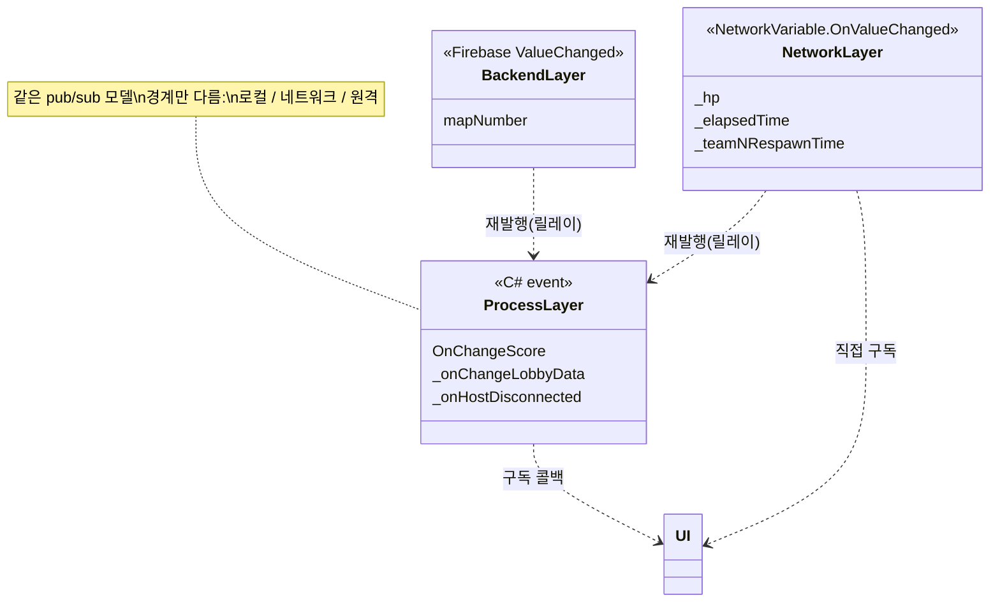

# Observer 3계층 (Three-Layer Observer Pattern)

> 이 프로젝트는 "값이 바뀌면 알림받아 반응한다"는 관찰자 패턴을 **세 개의 경계**에서 각기 다른 도구로 구현한다 — 프로세스 안은 **C# event**, 서버↔클라 네트워크 상태는 **`NetworkVariable.OnValueChanged`**, 원격 백엔드는 **Firebase `ValueChanged`**.
> 세 계층은 넘나드는 경계만 다를 뿐 프로그래밍 모델(구독→반응)이 같아, 개발자가 로컬·네트워크·백엔드를 하나의 사고방식으로 다루게 한다. 이 문서는 앞선 시스템 문서들에 흩어진 관찰자 사용을 한데 모아 그 공통 구조를 정리한다.
>
> 관련 문서: [`NetcodeSyncPatterns.md`](./NetcodeSyncPatterns.md) · [`FirebaseBackend.md`](./FirebaseBackend.md) · [`LobbyPipeline.md`](./LobbyPipeline.md) · [`RespawnScore.md`](./RespawnScore.md) · [`GameStateMachine.md`](./GameStateMachine.md)

---

## 1. 개요

"어떤 값의 변화를 다른 쪽이 알아야 한다"는 요구는, 그 값이 *어느 경계를 넘느냐*에 따라 세 계층으로 나뉜다.

- **프로세스 내 계층 (같은 앱 안)** — 매니저의 상태 변화를 같은 프로세스의 UI가 안다. C# `event`/`Action`으로 발행·구독한다. 예: 점수 변경, 로비 데이터 갱신, 호스트 다운.
- **네트워크 계층 (서버↔클라)** — 복제되는 게임 상태의 변화를 각 클라가 로컬에서 안다. `NetworkVariable.OnValueChanged`로 반응한다. 예: HP, 리스폰 카운트다운, 게임 경과 시간.
- **백엔드 계층 (원격 DB↔클라)** — 원격 데이터베이스 값의 변화를 클라가 실시간으로 안다. Firebase `ValueChanged`로 푸시받는다. 예: 로비 맵 선택.

세 계층은 "구독(+=) → 발행자가 값 변경 → 구독자 콜백"이라는 같은 형태를 공유한다. 다른 것은 *변화가 전달되는 거리*뿐이다.

## 2. 설계 목표

| 목표 | 해결 방식 |
| --- | --- |
| 로컬 상태 변화 통지 | C# `event`/`Action` (`+=`/`-=`) |
| 네트워크 상태 변화 통지 | `NetworkVariable<T>.OnValueChanged` |
| 원격 DB 변화 통지 | Firebase `Child(path).ValueChanged` |
| 폴링 제거 | 세 계층 모두 변경 시점에 콜백 발화(pull 아님) |
| 구독 수명 관리 | 등록/해지를 수명 훅에 대칭 배치 |
| 계층 릴레이 | 원격/네트워크 변화를 로컬 이벤트로 재발행 |
| 경계별 도구 일관 | "어느 경계인가"로 세 도구 중 하나를 규칙적으로 선택 |

## 3. 구성 요소

| 계층 | 도구 | 대표 사용처 | 경계 |
| --- | --- | --- | --- |
| 프로세스 내 | C# `event`/`Action` | `OnChangeScore`·`_onChangeLobbyData`·`_onHostDisconnected` | 앱 내부 |
| 네트워크 | `NetworkVariable.OnValueChanged` | `_hp`·`_elapsedTime`·`_teamNRespawnTime` | 서버↔클라 |
| 백엔드 | Firebase `ValueChanged` | `mapNumber` 실시간 동기 | 원격 DB↔클라 |

## 4. 핵심 흐름

### 4-1. 프로세스 내 — C# event로 매니저→UI 통지

```csharp
// 발행 (GameManager)                          // 구독 (ScoreboardController)
OnChangeScore?.Invoke(scoreStringData);        gameManager.OnChangeScore += ScoreListenerClientRpc;
```

> 같은 프로세스 안의 매니저가 상태를 바꾸면 event로 UI에 알린다. 점수([`RespawnScore`](./RespawnScore.md))·로비 데이터([`LobbyPipeline`](./LobbyPipeline.md))·호스트 다운([`RelayHostLifecycle`](./RelayHostLifecycle.md)) 모두 이 계층의 통지다.

### 4-2. 네트워크 — NetworkVariable로 서버 변화를 각 클라가 반응

```csharp
// 발행 (소유자/서버가 값 변경)                  // 구독 (전 클라)
_hp.Value -= dmg;                              _hp.OnValueChanged += HpValueChangeHandler;
netVar.Value--;  // 리스폰 카운트다운           _teamNRespawnTime.OnValueChanged += 카운트다운UI;
```

> 복제되는 상태가 바뀌면 전 클라의 `OnValueChanged`가 같은 값으로 반응한다([`NetcodeSyncPatterns`](./NetcodeSyncPatterns.md)). HP·타이머·카운트다운처럼 "모두가 같은 값을 봐야 하는" 것에 쓰인다.

### 4-3. 백엔드 — Firebase ValueChanged로 원격 변화 푸시

```csharp
// 구독 (DatabaseBackend)
_db.RootReference.Child($"rooms/{roomId}/mapNumber").ValueChanged += callback;
// 방장이 SetMapNumberAsync → 전 참가자의 callback 발화
```

> 원격 DB의 값이 바뀌면 클라가 폴링 없이 실시간으로 통지받는다([`FirebaseBackend`](./FirebaseBackend.md)). 로비 맵 선택이 이 계층으로 전 참가자에게 동기화된다.

### 4-4. 계층 릴레이 — 한 값이 여러 계층을 탄다

```
[백엔드] Firebase ValueChanged(mapNumber)
   └─► [프로세스 내] LobbyRoomUIController.GetMapNumberFromDB
          └─► C# event(OnSelectedMapNumberChanged) ─► 맵 UI 갱신

[네트워크] NetworkVariable(_isEnd) OnValueChanged
   └─► [프로세스 내] C# event(OnKillLog) ─► ClientRpc ─► 킬로그 UI
```

> 원격/네트워크 계층의 변화를 프로세스 내 event로 *재발행*해, 하위 UI는 익숙한 로컬 event만 구독하면 된다. 계층을 릴레이로 이어, 먼 경계의 변화를 가까운 통지로 번역한다.

## 5. 클래스 구조 (Mermaid)



## 6. 코드 하이라이트

### 6-1. 세 계층, 같은 등록/해지 형태

```csharp
gameManager.OnChangeScore += handler;                          // 프로세스 내
_hp.OnValueChanged += HpValueChangeHandler;                    // 네트워크
_db.RootReference.Child(path).ValueChanged += callback;        // 백엔드
```

> 세 도구가 모두 `+=`/`-=`로 구독·해지하는 동일한 인터페이스를 가진다. 개발자는 "어느 경계를 넘는 값인가"만 판단해 도구를 고르고, 사용법은 하나로 통일된다.

### 6-2. 수명 대칭 구독 — 누수 방지

```csharp
private void OnEnable()  => Get<IRelayHostManager>()?.OnHostDisconnectedAddListener(Handler);
private void OnDisable() => Get<IRelayHostManager>()?.OnHostDisconnectedRemoveListener(Handler);
// 네트워크 계층은 OnNetworkSpawn/OnNetworkDespawn, 백엔드는 방 입장/이탈에 대칭
```

> 어느 계층이든 등록과 해지를 수명 훅에 짝지어 배치한다. UI는 `OnEnable/OnDisable`, 네트워크 오브젝트는 `OnNetworkSpawn/Despawn`, 로비 구독은 입장/이탈 — 계층마다 수명 경계가 다르지만 대칭 원칙은 같다.

## 7. 기술 포인트

- **경계별 도구의 일관 선택** — "프로세스 내→C# event, 네트워크 상태→NetworkVariable, 원격 DB→Firebase"라는 규칙으로 관찰자를 배치한다. 세 계층이 각자 최적 도구를 쓰면서도, 값이 넘는 경계를 보면 어떤 도구인지 정해진다.
- **통일된 프로그래밍 모델** — 세 도구가 같은 구독-반응 형태를 가져, 로컬·네트워크·백엔드를 하나의 사고방식으로 다룬다. 폴링이 사라지고 코드가 "값이 바뀌면 무엇을 한다"로 선언적으로 표현된다.
- **계층 릴레이(번역)** — 먼 경계(백엔드/네트워크)의 변화를 프로세스 내 event로 재발행해, 하위 UI가 익숙한 로컬 통지만 구독하게 한다. 계층 간 결합을 릴레이 지점으로 좁힌다.
- **수명 대칭 구독** — 계층마다 수명 경계는 달라도 등록/해지를 짝지어, 리스너 누수와 중복 발화를 공통 원칙으로 막는다.
- **역할 분담과의 정합** — 이 관찰자 계층은 [`NetcodeSyncPatterns`](./NetcodeSyncPatterns.md)(상태/명령/권한)·[`FirebaseBackend`](./FirebaseBackend.md)(OnDisconnect/ValueChanged)와 맞물려, 데이터 흐름 전체가 pub/sub로 일관되게 조직된다.

## 8. 확장 포인트 / 한계

- **혼용의 디버깅 난이도** — 한 값이 세 계층을 릴레이로 타면(4-4), 통지가 어디서 끊겼는지 추적하기 어렵다. 계층 경계마다 로그·추적 지점이 필요하며, 현재는 `Debug.Log`에 의존한다.
- **해지 누락의 계층별 누수** — 세 계층이 각자 다른 수명 경계를 가져, 한 곳이라도 해지를 빠뜨리면 누수·중복 발화가 난다. 특히 Firebase `ValueChanged`는 경로 참조 수명이 명시적으로 관리되지 않으면 남기 쉽다.
- **계층 간 순서·타이밍 미보장** — 백엔드→프로세스 내 릴레이에서 두 통지 사이에 지연이 있어, 네트워크 상태와 백엔드 상태가 순간 어긋날 수 있다. 계층을 가로지르는 정합성 보장 장치가 없다.
- **네트워크 계층의 권한 이슈 상속** — `NetworkVariable` 계층은 `writePerm` 소재 문제([`NetcodeSyncPatterns`](./NetcodeSyncPatterns.md) §8)를 그대로 안고 있어, "누가 발행하는가"가 값마다 흩어져 있다.
- **추상화 부재** — 세 계층이 공통 인터페이스(예: 통합 `IObservable`)로 묶여 있지 않고 각 SDK API를 직접 쓴다. 관찰자 사용이 코드 전반에 산재해, 계층 전환·모킹·테스트가 어렵다. 공통 파사드로 감싸면 일관성과 테스트성이 오른다.
