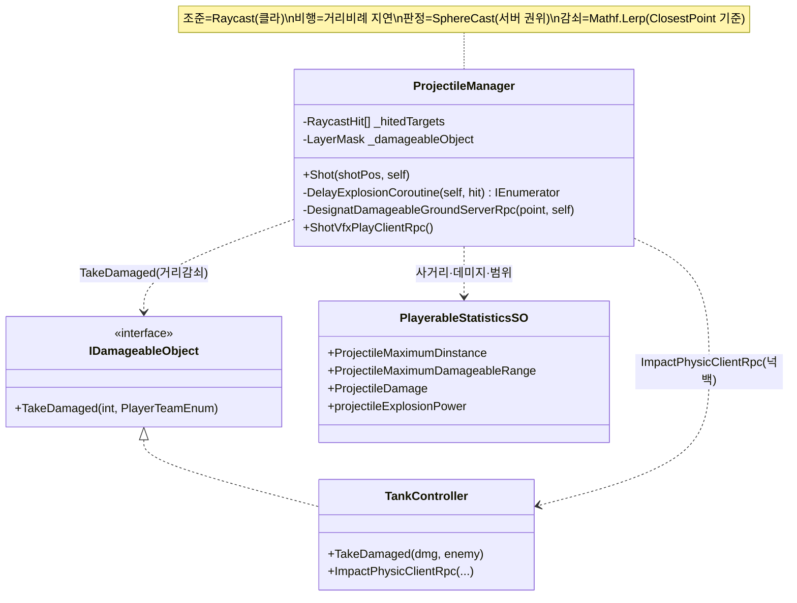

# 투사체 · 데미지 판정 (Projectile & Damage Resolution)

> 포탄이 "어디에 맞고, 언제 터지고, 얼마나 아픈가"를 세 단계로 나눠 푼다 — 조준선을 쏘는 **Raycast**, 거리에 비례해 늦게 터지는 **비행 지연**, 폭심지 주변을 훑어 거리 감쇠 데미지를 매기는 **서버 권위 SphereCast**.
> 실제 투사체 오브젝트를 날리지 않고, *히트스캔 + 지연 + 범위 판정*의 조합으로 포물선 없는 탱크 포격을 가볍게 구현하는 것이 핵심이다.
>
> 관련 문서: [`NetcodeSyncPatterns.md`](./NetcodeSyncPatterns.md) · [`CoopTankControl.md`](./CoopTankControl.md) · [`GameStateMachine.md`](./GameStateMachine.md) · [`ServiceLocator.md`](./ServiceLocator.md)

---

## 1. 개요

포격 판정은 성격이 다른 세 문제로 쪼개진다.

- **조준 축 (어디에 맞는가)** — 포수 카메라 정면으로 `Physics.Raycast`를 쏴, 사거리 안에서 처음 닿은 지점을 폭발 좌표로 삼는다. 실제 포탄을 물리로 날리지 않는 히트스캔 방식.
- **비행 축 (언제 터지는가)** — 즉발이 아니라, 포구에서 명중 지점까지의 거리에 비례한 지연 후 폭발한다. 투사체 없이 "날아가는 시간"을 코루틴 지연으로 흉내 낸다.
- **판정 축 (누가 얼마나 아픈가)** — 폭발은 서버에서만 일어난다. 폭심지에 구형 판정(`SphereCast`)을 던져 범위 안 대상을 찾고, 폭심지와의 거리로 데미지를 `Mathf.Lerp` 감쇠한다. 게임 결과에 직결되므로 서버 권위로 처리한다.

조준(클라)→비행 지연(클라)→폭발 판정(서버)으로 권한이 이동하며, 최종 데미지 적용은 [`NetcodeSyncPatterns`](./NetcodeSyncPatterns.md)의 상태 동기화로 넘어간다.

## 2. 설계 목표

| 목표 | 해결 방식 |
| --- | --- |
| 조준선 명중 지점 산출 | 포수 카메라 forward `Physics.Raycast`(사거리 제한) |
| 실체 없는 포탄 | 투사체 오브젝트 대신 히트스캔 + 지연으로 비행 표현 |
| 거리 비례 비행 시간 | `_waitTime * distance` 지연 후 폭발 |
| 폭발 결과의 서버 권위 | `[Rpc(SendTo.Server)]` 안에서만 판정·데미지 |
| 범위 내 대상 탐지 | `SphereCastNonAlloc`(폭심지, 반경=최대 피해 범위) |
| GC 없는 반복 탐지 | 사전 할당 배열(`_hitedTargets[5]`) 재사용 |
| 거리 감쇠 데미지 | `Mathf.Lerp(full, full/4, distance/range)` |
| 정확한 거리 기준 | 콜라이더 `ClosestPoint`(접촉부위, 중심 아님) 사용 |
| 폭발 물리 반응 | `ImpactPhysicClientRpc`로 넉백 힘 전파 |

## 3. 구성 요소

| 요소 | 역할 | 성격 |
| --- | --- | --- |
| `ProjectileManager` | 조준·비행 지연·폭발 판정·데미지·물리 총괄 | `NetworkBehaviour` |
| `PlayerableStatisticsSO` | 사거리·데미지·범위·비행계수·폭발력 수치 | ScriptableObject |
| `IDamageableObject` | 피해 수용 계약(`TakeDamaged`) | interface |
| `TankController` | 피격 대상 — 데미지·물리 충격 수신 | `NetworkBehaviour` |
| `TargetRabbit` | 폭발 지점 시각 표식 | 연출 오브젝트 |
| `_damageableObject` (LayerMask) | 판정 대상 레이어 한정 | 설정값 |

## 4. 핵심 흐름

### 4-1. 조준 — 히트스캔으로 명중 지점 확정

```csharp
public void Shot(Transform shotPos, PlayerTeamEnum self) {
    _ray = new Ray(shotPos.position, shotPos.forward);
    if (Physics.Raycast(_ray, out _targetPoint, _vechicleSO.ProjectileMaximumDinstance))
        StartCoroutine(DelayExplosionCoroutine(self, _targetPoint.point));  // 닿은 지점으로 폭발 예약
}
```

> 포탄을 날리는 대신 조준선을 즉시 쏴 명중 지점을 확정한다. 사거리(`ProjectileMaximumDinstance`)를 Raycast 길이로 제한해, 닿지 않으면 폭발 자체가 없다.

### 4-2. 비행 — 거리에 비례해 늦게 터진다

```csharp
private IEnumerator DelayExplosionCoroutine(PlayerTeamEnum self, Vector3 hitPosition) {
    var distance = Vector3.Distance(hitPosition, transform.position);
    _delayTime = _waitTime * distance;                        // 멀수록 오래 난다
    yield return new WaitForSeconds(_delayTime);
    DesignatDamageableGroundServerRpc(hitPosition, self);     // 서버에 폭발 요청
}
```

> 명중 지점은 즉시 정해지지만 폭발은 거리만큼 늦춘다. 투사체 없이 "포탄이 날아가는 시간"을 지연으로 흉내 내, 원거리 사격이 늦게 터지는 감각을 저비용으로 만든다.

### 4-3. 폭발 판정 — 서버가 구형 범위를 훑는다

```
DesignatDamageableGroundServerRpc(point, self)   // SendTo.Server
   ├─ SphereCastNonAlloc(point, range, _hitedTargets, _damageableObject) → count
   └─ for each hit:
        ├─ distance = Vector3.Distance(collider.ClosestPoint(point), point)   // 접촉부위 기준
        ├─ damage = Mathf.Lerp(full, full/4, distance/range)                  // 거리 감쇠
        ├─ tc.TakeDamaged(damage, self)          → HP 처리 (NetcodeSyncPatterns)
        └─ tc.ImpactPhysicClientRpc(ep, point, mr, eu)   → 넉백 물리
```

> 폭발과 데미지 산정은 `SendTo.Server`에서만 일어난다. 각 클라가 제각기 계산하지 않고 서버 한 곳에서 범위·거리·데미지를 정해, 판정 불일치를 막는다([`GameStateMachine`](./GameStateMachine.md)의 서버 권위와 일관).

### 4-4. 거리 감쇠 — 폭심지에 가까울수록 아프다

```csharp
var distance = Vector3.Distance(_hitedTargets[i].collider.ClosestPoint(point), point);
(tc as IDamageableObject).TakeDamaged((int)Mathf.Lerp(damage, damage / 4, distance / dmgRange), self);
```

> 폭심지에서 정통이면 최대 데미지, 가장자리면 1/4까지 선형 감쇠한다. 거리 기준을 콜라이더 *중심*이 아니라 `ClosestPoint`(가장 가까운 접촉부위)로 잡아, 큰 대상이 부당하게 약하게 맞는 왜곡을 피한다.

## 5. 클래스 구조 (Mermaid)



## 6. 코드 하이라이트

### 6-1. GC 없는 범위 탐지 — NonAlloc + 사전 할당 배열

```csharp
_hitedTargets = new RaycastHit[5]; // 5개 초과 검출은 설계 실수로 간주(검출용 상한)
// ...
int count = Physics.SphereCastNonAlloc(point, range, Vector3.forward, _hitedTargets, 0.001f, _damageableObject);
```

> 폭발마다 배열을 새로 만들지 않고 사전 할당 배열을 재사용해 GC 부담을 없앤다. 크기 5는 "동시 피격이 그보다 많으면 설계가 잘못된 것"이라는 상한 겸 진단 장치다.

### 6-2. 접촉부위 기준 거리 감쇠

```csharp
var distance = Vector3.Distance(_hitedTargets[i].collider.ClosestPoint(point), point);
int dmg = (int)Mathf.Lerp(damage, damage / 4, distance / dmgRange);
```

> `ClosestPoint`로 콜라이더의 실제 접촉면과 폭심지 거리를 재, `Mathf.Lerp`로 최대~1/4 사이를 선형 보간한다. 거리비를 `distance/dmgRange`로 정규화해 감쇠를 범위에 맞춘다.

### 6-3. 서버 권위 폭발 게이트

```csharp
[Rpc(SendTo.Server, InvokePermission = RpcInvokePermission.Everyone)]
private void DesignatDamageableGroundServerRpc(Vector3 point, PlayerTeamEnum self) { /* 판정·데미지·물리 */ }
```

> 포수는 누구든 폭발을 요청할 수 있지만(`Everyone`), 실제 판정은 `SendTo.Server`로 서버에서만 실행된다. 데미지라는 게임 결과의 권위를 서버로 모으는 [`NetcodeSyncPatterns`](./NetcodeSyncPatterns.md) 원칙의 적용.

## 7. 기술 포인트

- **히트스캔 + 지연 = 저비용 포격** — 실제 투사체 오브젝트·물리 없이, Raycast로 명중을 확정하고 거리 비례 지연으로 비행을 흉내 낸다. 네트워크로 투사체를 동기화할 필요가 없어 가볍고, 탱크 포격의 즉발성과도 맞는다.
- **2단 판정(선 + 구)** — 명중은 `Raycast`(정확한 한 점), 피해는 `SphereCast`(범위)로 나눈다. "정확히 어디에 맞았나"와 "그 주변 누가 피해받나"를 다른 도구로 각각 최적 처리한다.
- **서버 권위 데미지** — 폭발 판정 전체가 `SendTo.Server` 안에서만 돌아, 데미지 산정의 진리가 서버에 있다. 클라별 판정 불일치·조작 여지를 줄인다([`GameStateMachine`](./GameStateMachine.md)와 일관된 권위 모델).
- **거리 감쇠의 정확성** — `Mathf.Lerp`로 부드러운 감쇠를 주되, 기준을 콜라이더 `ClosestPoint`로 잡아 대상 크기에 따른 왜곡을 없앤다. "폭심지에서 얼마나 가까운 부위가 맞았나"를 정직하게 측정.
- **GC 회피 설계** — `SphereCastNonAlloc` + 사전 할당 배열로 폭발 반복에도 할당이 없다. 배열 크기를 진단 상한으로 삼는 방어적 습관도 함께 드러난다.
- **데이터 주도 밸런스** — 사거리·데미지·범위·비행 계수·폭발력이 모두 SO에서 온다. 무기 밸런싱이 코드가 아닌 데이터에서 이뤄진다([`CoopTankControl`](./CoopTankControl.md)와 같은 SO 공유).

## 8. 확장 포인트 / 한계

- **`ImpactClientRpc` 죽은 코드 + 순회 버그** — 호출되지 않는 `ImpactClientRpc`가 남아 있고, 그 안의 루프가 `count`가 아니라 `_hitedTargets.Length`(항상 5)를 순회해 빈 슬롯 참조로 `NullReferenceException` 위험이 있다. 제거 대상.
- **SphereCast를 사실상 제자리 판정으로 사용** — 거리 `0.001f`로 `SphereCast`를 써 실질적으로 한 지점의 구 판정을 한다. 의도가 `Physics.OverlapSphere`에 가까우므로, 그쪽으로 바꾸면 의미가 명확하고 오용 소지가 준다.
- **탐지 배열 고정 크기(5)** — 6명 이상이 한 폭발 범위에 겹치면 초과분이 누락된다. 진단 상한으로는 유효하나, 대규모 밀집 교전에선 판정 유실이 될 수 있다.
- **아군 오사 필터 부재** — 판정이 `self`(공격 팀)를 넘기지만, `SphereCast` 대상에서 같은 팀을 제외하지 않는다. 아군 피해 허용 여부가 판정 단계에 명시돼 있지 않아, 팀킬 정책을 여기서 정할지 확인이 필요하다.
- **데미지 적용은 소유 클라** — 서버가 `TakeDamaged`를 부르지만, 실제 HP 감산은 `TankController`가 다시 소유자(운전수) 클라로 넘긴다([`NetcodeSyncPatterns`](./NetcodeSyncPatterns.md) §8). 서버가 "판정"은 하되 "적용"은 소유 클라라 권위가 반쪽이다.
- **미검증 서버 부하** — 코드 주석("서버측 전송·부하 테스트 필요")대로 폭발 판정의 서버 부하가 실측되지 않았다. 고빈도 교전 시 `SphereCast`·RPC 비용 프로파일링이 필요하다.
- **잔여 using·주석 코드** — `System.Drawing` 등 불필요한 using과 주석 처리된 기즈모·RPC가 남아 정리 여지가 있다.
