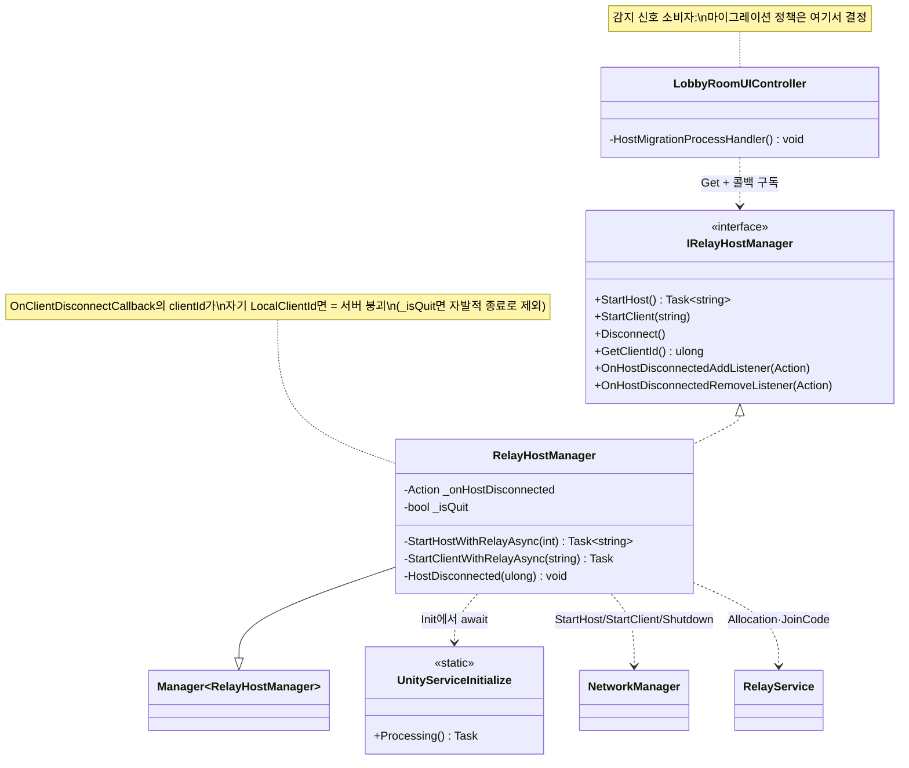

# Relay 연결 생명주기 & 호스트 다운 감지 (Relay Connection Lifecycle & Host-Down Detection)

> Unity Relay로 공인 IP 없이 P2P 세션을 여는 **연결 수립**, 호스트/클라이언트로 갈리는 **권위 구분**, 그리고 호스트가 사라진 순간을 잡아내는 **붕괴 감지**를 한 매니저(`RelayHostManager`)로 묶는다.
> "어떻게 연결하고, 누가 서버이며, 서버가 죽은 걸 어떻게 아는가"를 분리해 다루고, 그 신호를 상위(로비)가 호스트 마이그레이션으로 소비하도록 콜백만 흘려보내는 것이 목적이다.
>
> 관련 문서: [`ManagerLifecycle.md`](./ManagerLifecycle.md) · [`ServiceLocator.md`](./ServiceLocator.md) · [`Bootstrap.md`](./Bootstrap.md) · [`GameStateMachine.md`](./GameStateMachine.md)

---

## 1. 개요

공인 IP·포트포워딩 없이 플레이어들을 한 세션에 묶으려면 세 가지 다른 질문을 각각 풀어야 한다.

- **연결 축 (어떻게 붙는가)** — NAT 뒤에 있는 기기끼리는 직접 연결이 어렵다. Unity Relay 서버에 중계 공간(Allocation)을 할당받고, 그 좌표를 담은 **Join Code**를 교환해 모두가 같은 릴레이를 경유하게 만든다.
- **권위 축 (누가 서버인가)** — 같은 코드로 붙어도 한 명은 `StartHost`(서버 겸 클라), 나머지는 `StartClient`다. 서버가 곧 게임의 권위이며, 이 구분은 [`GameStateMachine`](./GameStateMachine.md)의 서버 권위 전제와 직결된다.
- **붕괴 축 (서버가 죽은 걸 어떻게 아는가)** — 호스트가 나가면 세션 전체가 무너진다. 남은 클라이언트가 이 사건을 *즉시* 감지해야 방을 재구성(호스트 마이그레이션)할 수 있다.

`RelayHostManager`는 연결·권위 축을 직접 담당하고, 붕괴 축은 **감지만** 한 뒤 `Action` 콜백으로 상위에 통보한다. 실제 마이그레이션 정책은 로비 UI 컨트롤러가 결정한다 — 감지와 대응의 책임을 갈라 놓았다.

## 2. 설계 목표

| 목표 | 해결 방식 |
| --- | --- |
| 공인 IP 없이 세션 연결 | Relay `CreateAllocationAsync` → Join Code 발급/참가로 릴레이 경유 |
| 연결 수단을 호출부에서 은닉 | `IRelayHostManager` 인터페이스 뒤로 Relay/UTP 세부를 숨김 |
| 서비스 초기화 중복 방지 | `UnityServiceInitialize`가 단일 `Task`를 캐시해 재초기화 차단 |
| 호스트 다운을 클라가 감지 | Relay 특성상 서버 붕괴 시 `OnClientDisconnectCallback`이 **자기 ID**로 옴 → 이를 판별 |
| "내가 나감" vs "서버 터짐" 구분 | `_isQuit` 플래그로 자발적 종료를 붕괴 감지에서 제외 |
| 감지와 대응의 분리 | 매니저는 `Action` 콜백만 발화, 마이그레이션 정책은 상위(로비)가 소유 |

## 3. 구성 요소

| 요소 | 역할 | 성격 |
| --- | --- | --- |
| `IRelayHostManager` | 연결 생명주기 계약(StartHost/StartClient/Disconnect/콜백 등록) | interface |
| `RelayHostManager` | Relay 연결 수립 + 호스트 다운 감지 + 콜백 발화 | `Manager<T>` 구현체 |
| `UnityServiceInitialize` | UGS 초기화·익명 로그인을 단일 Task로 1회 보장 | static 유틸 |
| `LobbyRoomUIController` | 콜백 소비자 — 감지 신호를 받아 호스트 마이그레이션 수행 | MonoBehaviour(소비자) |

## 4. 핵심 흐름

### 4-1. 호스트 시작 — 릴레이 공간 할당 → 코드 발급 → 서버 기동

```
StartHost()
   └─ StartHostWithRelayAsync()
        ├─ RelayService.CreateAllocationAsync(maxConnections)   // 릴레이 중계 공간 확보
        ├─ RelayService.GetJoinCodeAsync(allocationId)          // 참가용 Join Code 발급
        ├─ UnityTransport.SetRelayServerData(serverData)        // UTP에 릴레이 좌표 주입
        └─ NetworkManager.StartHost()                           // 서버 겸 클라로 기동
   └─ IUserInfoManager.SetClientId(LocalClientId)               // 내 클라 ID 기록
   → return joinCode                                            // 상위가 DB에 저장·공유
```

> 호스트는 릴레이 공간을 열고 그 열쇠(Join Code)를 반환한다. 이 코드는 [`LobbyManager`] 흐름을 통해 Firebase에 올라가 다른 참가자에게 전달된다.

### 4-2. 클라이언트 참가 — 코드로 같은 릴레이에 합류

```csharp
private async Task StartClientWithRelayAsync(string joinCode)
{
    JoinAllocation joinAllocation = await RelayService.Instance.JoinAllocationAsync(joinCode);
    RelayServerData serverData = AllocationUtils.ToRelayServerData(joinAllocation, "dtls");
    NetworkManager.Singleton.GetComponent<UnityTransport>().SetRelayServerData(serverData);
    NetworkManager.Singleton.StartClient();
}
```

> 클라는 Join Code로 같은 Allocation에 붙어, 호스트와 동일한 릴레이를 경유한다. 연결 수단(dtls 릴레이)은 이 메서드 안에만 있고 호출부는 코드 문자열만 넘긴다.

### 4-3. 호스트 다운 감지 — 끊김 콜백의 clientId를 읽는다

```
OnClientDisconnectCallback(clientId)  →  HostDisconnected(clientId)
   ├─ 내가 서버인가? (LocalClientId == ServerClientId)
   │     └─ 예 → "나는 서버다" (남이 나감, 무시) + _isQuit 리셋
   └─ 아니오(나는 클라) →
         └─ clientId == 내 LocalClientId ?          // 서버가 죽으면 '나'로 통보됨
               ├─ _isQuit == true → 내가 자발적으로 나간 것 → 리셋 후 return
               └─ else → "서버가 터졌다" → _onHostDisconnected?.Invoke()
```

> Relay 세션에서 **서버가 사라지면 클라이언트에게 끊긴 대상이 자기 자신(LocalClientId)으로 통보**된다. 이 관찰을 판별식으로 삼아, 남의 이탈/내 자발적 종료/서버 붕괴를 한 콜백 안에서 갈라낸다.

### 4-4. 신호 소비 — 로비의 호스트 마이그레이션

```
[RelayHostManager]  서버 붕괴 감지 → _onHostDisconnected.Invoke()
        │
        ▼
[LobbyRoomUIController.HostMigrationProcessHandler]
   ├─ relay.Disconnect()                       // 죽은 세션 정리
   ├─ DB에 RELAY_SYNC 신호 기록 → 로비 데이터 재동기 대기
   ├─ IsHost(승격됨)?  → CreateRelayHost()      // 새 방장이 릴레이 재생성
   └─ else            → 새 JoinCode 대기 → relay.StartClient(newCode)   // 재접속
```

```csharp
// 구독/해지는 UI 수명(OnEnable/OnDisable)에 맞춰 대칭으로
private void OnEnable()  => ServiceLocator.Get<IRelayHostManager>()?.OnHostDisconnectedAddListener(HostMigrationProcessHandler);
private void OnDisable() => ServiceLocator.Get<IRelayHostManager>()?.OnHostDisconnectedRemoveListener(HostMigrationProcessHandler);
```

> 매니저는 "서버가 죽었다"는 사실만 알린다. 누가 새 호스트가 되고 어떻게 재접속할지는 로비가 판단한다. 덕분에 매니저는 마이그레이션 정책 변경에 영향받지 않는다.

## 5. 클래스 구조 (Mermaid)



## 6. 코드 하이라이트

### 6-1. 연결 수립을 인터페이스 뒤로 — 호출부는 Relay를 모른다

```csharp
public async Task<string> StartHost()
{
    string joinCode = await StartHostWithRelayAsync();
    ServiceLocator.Get<IUserInfoManager>()?.SetClientId(NetworkManager.Singleton.LocalClientId);
    return joinCode;
}
```

> 호출부(`LobbyRoomUIController`)는 `StartHost()`를 부르고 Join Code만 받는다. Allocation·UTP·dtls 같은 릴레이 세부는 전부 매니저 내부에 격리돼, 전송 계층 교체가 이 한 클래스로 국한된다.

### 6-2. 호스트 다운 판별 — 자기 ID로 오는 끊김을 서버 붕괴로 해석

```csharp
private void HostDisconnected(ulong clientId)
{
    if (NetworkManager.Singleton.LocalClientId != NetworkManager.ServerClientId)
    {   // 나는 클라이언트다
        if (clientId == NetworkManager.Singleton.LocalClientId)
        {   // 서버가 터지면 clientId 는 '나'로 나온다
            if (_isQuit) { _isQuit = false; return; }   // 내가 자발적으로 나간 것 → 제외
            _onHostDisconnected?.Invoke();               // 서버 붕괴 → 상위에 통보
        }
    }
    else { _isQuit = false; }                            // 나는 서버 → 남의 이탈, 플래그만 리셋
}
```

> 별도 하트비트·타임아웃 없이, Netcode가 주는 끊김 콜백의 `clientId` 한 값으로 세 상황(남의 이탈/내 종료/서버 붕괴)을 구분한다. Relay 세션의 관찰된 동작을 판별 규칙으로 승격한 핵심.

### 6-3. 자발적 종료 플래그 — Disconnect가 오탐을 막는다

```csharp
public void Disconnect()
{
    _isQuit = true;                          // "이건 내가 의도한 종료다" 표식
    NetworkManager.Singleton.Shutdown();
}
```

> `Shutdown()`도 끊김 콜백을 유발하므로, 정상 퇴장까지 "서버 붕괴"로 오인될 수 있다. `_isQuit`를 먼저 세워, 4-4의 마이그레이션이 헛돌지 않게 한다.

### 6-4. 서비스 초기화 1회 보장 — Task 캐시 게이트

```csharp
public static async Task Processing()
{
    if (_isInitializing != null) { await _isInitializing; return; }  // 진행 중이면 그 Task를 공유
    _isInitializing = InternalInitializeAsync();
    await _isInitializing;
}
```

> 여러 매니저가 동시에 UGS 초기화를 요청해도, 단일 `Task`를 캐시해 실제 `InitializeAsync`/익명 로그인은 한 번만 실행된다. 비동기 초기화의 중복·경쟁을 게이트 하나로 막았다.

## 7. 기술 포인트

- **Relay 기반 NAT 우회** — 공인 IP·포트포워딩 없이, 릴레이 Allocation과 Join Code 교환만으로 임의의 플레이어들을 한 세션에 묶는다. 로비→릴레이→인게임 파이프라인의 연결 진입점.
- **끊김 콜백의 clientId를 판별식으로** — 호스트 다운을 별도 감시 스레드가 아니라, `OnClientDisconnectCallback`이 *자기 LocalClientId로 통보된다*는 Relay 동작을 이용해 감지한다. 프레임워크가 이미 주는 신호를 재해석한 저비용 설계.
- **자발/붕괴의 구분(`_isQuit`)** — 정상 종료도 붕괴와 같은 콜백을 타는 문제를, 종료 직전 세우는 플래그 한 개로 분리. 오탐(불필요한 재접속)을 원천 차단.
- **감지와 대응의 분리** — 매니저는 "서버가 죽었다"만 `Action`으로 알리고, 새 호스트 선정·재접속 같은 정책은 [`ServiceLocator`](./ServiceLocator.md)로 주입된 소비자(로비)가 소유한다. 마이그레이션 로직이 바뀌어도 매니저는 그대로다.
- **수명주기 위임** — 콜백 배선(`OnClientDisconnectCallback` 구독/해지)과 서비스 등록을 [`Manager<T>`](./ManagerLifecycle.md)의 `Register`/`Unregister` 훅에 얹어, 초기화·정리 순서를 베이스가 보장한다.
- **UI 수명 대칭 구독** — 소비자는 `OnEnable`/`OnDisable`에서 콜백을 짝지어 등록/해지해, 씬을 드나들어도 리스너 누수·중복 호출이 없다.

## 8. 확장 포인트 / 한계

- **`StartClient`가 `async void`** — 클라 접속은 `Task`가 아니라 `async void`라 호출부가 완료/실패를 `await`할 수 없다. 접속 결과에 따라 UI를 분기하려면 `Task` 반환으로 바꿔 예외를 상위로 전파해야 한다.
- **재시도·타임아웃 부재** — Allocation 생성이나 JoinAllocation이 일시적으로 실패하면 그대로 에러 로그만 남고 끝난다. 지수 백오프 재시도, 연결 타임아웃 처리가 없어 네트워크 불안정에 취약하다.
- **`maxConnections` 하드코딩(7)** — 방 정원이 코드 기본값에 고정돼 있어, 모드별 인원(4v4 외 변형)에 맞추려면 파라미터를 로비 설정에서 주입하도록 열어야 한다.
- **붕괴 감지의 관찰 의존** — "서버가 죽으면 clientId가 나로 온다"는 특정 Relay/Netcode 버전의 동작에 기댄다. 트랜스포트/버전 업그레이드 시 이 가정이 유지되는지 회귀 검증이 필요하다.
- **마이그레이션 중 상태 유실** — 호스트가 바뀌는 동안 진행 중이던 게임 상태([`GameStateMachine`](./GameStateMachine.md)의 `NetworkVariable`)는 새 서버로 승계되지 않는다. 현재 마이그레이션은 로비 단계 재구성 위주이며, 인게임 도중 승계는 범위 밖이다.
- **콜백 다중 구독 방어 부재** — `_onHostDisconnected`는 `+=`로 누적된다. 소비자가 해지를 빠뜨리면 중복 발화가 가능하므로, 구독 규약(OnEnable/OnDisable 대칭)을 벗어난 사용은 위험하다.
