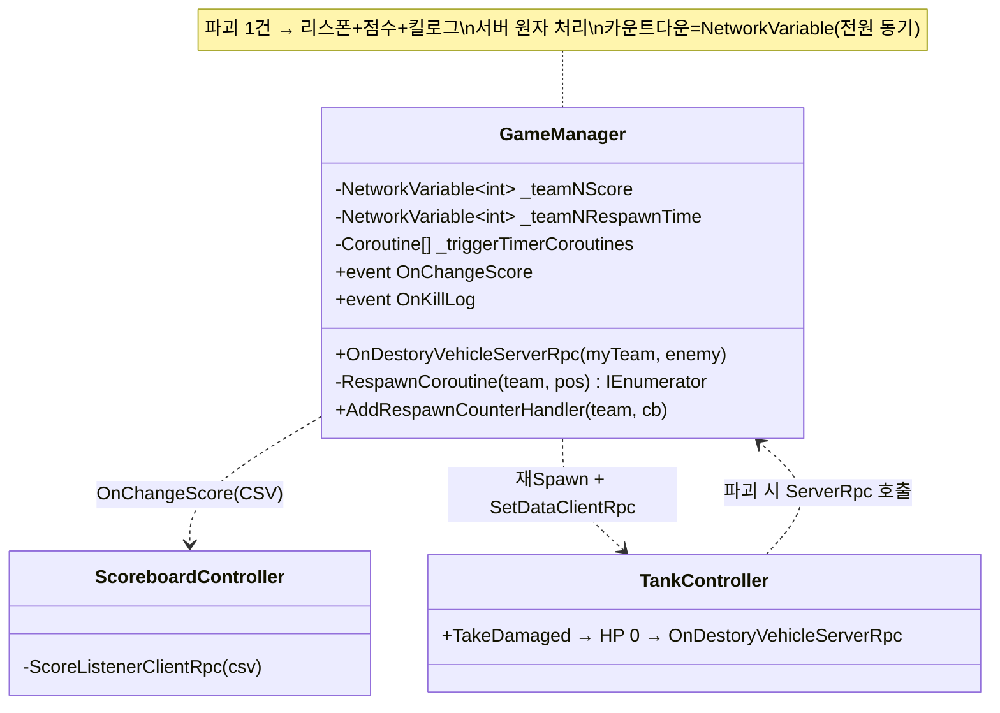

# 리스폰 · 스코어 시스템 (Respawn & Score System)

> 탱크가 파괴된 한 사건에서 세 가지가 동시에 일어난다 — 파괴된 팀의 **리스폰**(카운트다운 후 재스폰), 처치한 팀의 **점수 가산**, 그리고 **킬로그** 통지. 이 셋을 서버의 단일 `OnDestoryVehicleServerRpc`에서 원자적으로 처리하고, 결과를 각각의 소비자(UI)에게 흘려보내는 방식을 다룬다.
> 핵심은 "파괴 = 리스폰+점수+로그"를 한 권위 지점에 모으고, 리스폰 카운트다운을 `NetworkVariable`로 전원에게 똑같이 보여주는 것이다.
>
> 관련 문서: [`NetcodeSyncPatterns.md`](./NetcodeSyncPatterns.md) · [`ProjectileDamage.md`](./ProjectileDamage.md) · [`GameStateMachine.md`](./GameStateMachine.md) · [`ServiceLocator.md`](./ServiceLocator.md)

---

## 1. 개요

파괴 판정 이후 처리는 성격이 다른 세 갈래로 나뉜다.

- **부활 축 (파괴된 팀을 되살린다)** — 파괴된 탱크를 비활성·Despawn하고, 팀별 카운트다운이 끝나면 원래 소유자(운전수)에게 다시 스폰한다. 재스폰 위치는 팀 시작점이다.
- **점수 축 (처치한 팀에 가산한다)** — 처치한 팀의 점수 `NetworkVariable`를 올리고, 4팀 점수를 문자열로 묶어 점수판에 통지한다.
- **통지 축 (모두에게 알린다)** — 리스폰 남은 시간·점수·킬로그를 각각의 UI 소비자에게 이벤트/`NetworkVariable`로 전달한다. 카운트다운처럼 전원이 같은 값을 봐야 하는 것은 `NetworkVariable`로 동기화한다.

세 축의 방아쇠는 하나 — [`ProjectileDamage`](./ProjectileDamage.md)의 데미지로 HP가 0이 되면 [`NetcodeSyncPatterns`](./NetcodeSyncPatterns.md)를 통해 서버의 `OnDestoryVehicleServerRpc`가 호출된다. 이후는 전부 서버 권위로 진행된다.

## 2. 설계 목표

| 목표 | 해결 방식 |
| --- | --- |
| 파괴 후처리를 한 곳에 | `OnDestoryVehicleServerRpc` 하나에서 리스폰·점수·킬로그 |
| 팀별 독립 리스폰 | `_triggerTimerCoroutines[team]`로 팀별 코루틴 관리 |
| 중복 리스폰 방지 | 코루틴 진행 중(`!= null`)이면 재시작 안 함 |
| 카운트다운 전원 동기 | 팀별 `NetworkVariable<int>` 매초 감소 → 전 클라 동일 표시 |
| 재스폰 시 소유권 복원 | `SpawnAsPlayerObject(driverId, true)`로 운전수에 재귀속 |
| 오브젝트 재사용 | 같은 탱크를 `Despawn(false)` 후 재 Spawn(풀링 유사) |
| 점수 서버 권위 | 서버에서 `_teamNScore.Value += 1` |
| 점수판 통지 | 4팀 점수 CSV → `OnChangeScore` 이벤트 → `ClientRpc` |
| 카운트다운 UI 연결 | `AddRespawnCounterHandler`로 `OnValueChanged` 구독 |

## 3. 구성 요소

| 요소 | 역할 | 성격 |
| --- | --- | --- |
| `GameManager.OnDestoryVehicleServerRpc` | 파괴 후처리 진입점(리스폰+점수+킬로그) | ServerRpc |
| `RespawnCoroutine` | Despawn→카운트다운→재Spawn 진행 | 코루틴 |
| `_teamNRespawnTime` | 팀별 리스폰 카운트다운(전원 동기) | `NetworkVariable<int>` |
| `_teamNScore` | 팀별 점수 | `NetworkVariable<int>` |
| `OnChangeScore` / `OnKillLog` | 점수·킬로그 통지 이벤트 | C# event |
| `ScoreboardController` | 점수 문자열 수신·표시 | `NetworkBehaviour`(소비자) |

## 4. 핵심 흐름

### 4-1. 파괴 한 사건 → 세 처리 (서버 원자 처리)

```
OnDestoryVehicleServerRpc(myTeam, enemy)   // SendTo.Server
   ├─ [리스폰] _triggerTimerCoroutines[myTeam] == null 이면
   │            → StartCoroutine(RespawnCoroutine(myTeam, 시작점))
   ├─ [점수]   switch(enemy) → _teamNScore.Value += 1
   │            → OnChangeScore?.Invoke("s1,s2,s3,s4")
   └─ [킬로그] OnKillLog?.Invoke(myTeam, enemy)
```

> 파괴가 유발하는 모든 상태 변화를 서버의 한 메서드에 모았다. 리스폰·점수·로그가 같은 사건에서 함께 일어나므로, 처리 지점을 나누지 않아 순서·정합성 고민이 없다.

### 4-2. 리스폰 — Despawn → 카운트다운 → 재Spawn

```csharp
IEnumerator RespawnCoroutine(PlayerTeamEnum team, Vector3 respawnPos) {
    RespawnUIControl(team, true);
    var bodyObject = _managementObject[team];
    bodyObject.SetActive(false);
    bodyObject.GetComponent<NetworkObject>().Despawn(false);       // 오브젝트 유지, 네트워크만 해제
    netVar.Value = _respawnInterval;
    while (netVar.Value > 0) { netVar.Value--; yield return new WaitForSecondsRealtime(1f); }  // 매초 감소
    bodyObject.SetActive(true);
    bodyObject.GetComponent<NetworkObject>().SpawnAsPlayerObject(driverId, true);  // 운전수에 재귀속
    tc.SetDataClientRpc(team, respawnPos);
    _triggerTimerCoroutines[team] = null;                          // 다음 파괴 허용
}
```

> 파괴된 탱크를 파기하지 않고 `Despawn(false)`로 네트워크에서만 내렸다가, 카운트다운 후 같은 오브젝트를 재스폰한다. 오브젝트를 재사용해 생성 비용을 아끼고, 소유권을 다시 운전수에게 준다([`NetcodeSyncPatterns`](./NetcodeSyncPatterns.md) 4-3).

### 4-3. 카운트다운 동기화 — 전원이 같은 숫자를 본다

```csharp
netVar.Value = _respawnInterval;
while (netVar.Value > 0) { netVar.Value--; yield return new WaitForSecondsRealtime(1f); }
// 소비 측(UI)
gameManager.AddRespawnCounterHandler(team, (old, now) => _countdownText.text = now.ToString());
```

> 리스폰 남은 시간을 `NetworkVariable<int>`로 두어, 서버가 1초씩 줄이면 전 클라의 `OnValueChanged`가 같은 값으로 반응한다. 각자 타이머를 돌리지 않아 카운트다운이 어긋나지 않는다.

### 4-4. 점수 통지 — CSV 이벤트로 점수판 갱신

```csharp
// GameManager (서버)                              // ScoreboardController (전 클라)
_teamNScore.Value += 1;                            OnChangeScore += ScoreListenerClientRpc;
string s = $"{_team1Score.Value},{...},{...},{...}";  // ...
OnChangeScore?.Invoke(s);                          int[] score = s.Split(',') → 파싱 → 4팀 텍스트
```

> 4팀 점수를 CSV 한 줄로 묶어 `OnChangeScore`로 발화하고, 점수판이 `ClientRpc`로 받아 파싱·표시한다. 점수 변경의 단일 통지 채널로 UI가 폴링 없이 갱신된다.

## 5. 클래스 구조 (Mermaid)



## 6. 코드 하이라이트

### 6-1. 팀별 코루틴 가드 — 중복 리스폰 차단

```csharp
if (_triggerTimerCoroutines[myTeam] == null)
    _triggerTimerCoroutines[myTeam] = StartCoroutine(RespawnCoroutine(myTeam, respawnPos));
// 코루틴 끝에서
_triggerTimerCoroutines[team] = null;
```

> 리스폰 진행 중인 팀은 코루틴 핸들이 비어 있지 않아 재시작되지 않는다. 같은 팀이 카운트다운 중 또 파괴 신호를 받아도 타이머가 리셋되거나 중복 스폰되지 않는다.

### 6-2. 오브젝트 재사용 재스폰

```csharp
bodyObject.GetComponent<NetworkObject>().Despawn(false);   // false = 오브젝트 파괴 안 함
// ... 카운트다운 ...
bodyObject.SetActive(true);
bodyObject.GetComponent<NetworkObject>().SpawnAsPlayerObject(driverId, true);
```

> `Despawn(false)`로 네트워크 등록만 해제하고 GameObject는 남긴다. 재스폰 때 새로 `Instantiate`하지 않고 같은 오브젝트를 다시 올려, 파괴-부활 반복의 생성 비용을 줄인다.

### 6-3. 점수 CSV 단일 통지

```csharp
string scoreStringData = $"{_team1Score.Value},{_team2Score.Value},{_team3Score.Value},{_team4Score.Value}";
OnChangeScore?.Invoke(scoreStringData);
```

> 점수가 바뀌는 모든 지점(파괴·리스폰 완료)에서 같은 CSV 조립·통지를 쓴다. 점수판은 이 한 이벤트만 구독하면 되고, 점수 표현의 형식이 한 곳으로 통일된다.

## 7. 기술 포인트

- **파괴 후처리의 원자화** — 리스폰·점수·킬로그를 서버의 단일 `ServerRpc`에 모아, 한 사건이 유발하는 상태 변화를 한 트랜잭션처럼 처리한다. 처리 분산에서 오는 순서·누락 문제가 구조적으로 사라진다.
- **카운트다운의 상태 동기화** — 리스폰 시간을 `NetworkVariable`로 두어 서버가 줄이면 전원이 같은 숫자를 본다([`NetcodeSyncPatterns`](./NetcodeSyncPatterns.md)). 클라별 로컬 타이머가 어긋날 여지를 없앤 선택.
- **팀별 병렬 관리** — 코루틴·카운트다운·점수를 팀 단위로 분리해, 여러 팀이 동시에 파괴·부활해도 서로 간섭하지 않는다. 팀별 코루틴 핸들이 중복 방지 가드까지 겸한다.
- **오브젝트 재사용(풀링 유사)** — `Despawn(false)`+재 Spawn으로 같은 탱크를 되살려, 반복적인 파괴-부활에서 할당을 아낀다. 재스폰 시 소유권을 다시 운전수에 귀속시켜 조작권도 복원한다.
- **단일 통지 채널** — 점수 변경을 CSV 이벤트 하나로 통일해, UI가 폴링 없이 갱신된다. 점수의 진리는 `NetworkVariable`, 표현 전달은 이벤트로 역할을 나눴다.

## 8. 확장 포인트 / 한계

- **팀 4개 하드코딩 반복** — 점수·리스폰 시간·코루틴이 `_team1~4`로 필드가 4벌씩 복제되고, `switch(team)`이 여러 메서드에 반복된다. 팀을 배열/딕셔너리로 인덱싱하면 코드량과 실수 여지가 크게 준다(가장 큰 리팩터 후보).
- **점수 규칙 미완** — 현재는 "처치한 팀에 +1"뿐이며, 코드 주석대로("Playable 유닛에 따라 점수 판정 달라짐") 유닛별 점수 차등이 미구현이다. 점수 산정을 데이터/전략으로 분리할 여지가 있다.
- **점수 CSV 파싱 취약** — 점수를 문자열로 직렬화·`Split(',')` 파싱한다. 팀 수 변경·형식 오류에 약하고, 점수판이 항상 4개를 가정한다. 구조체/배열 동기화로 바꾸면 안전하다.
- **`driverId` 미발견 시 0 스폰** — 재스폰 시 편성에서 운전수를 못 찾으면 `driverId`가 기본값 `0L`로 남아 clientId 0에 귀속될 수 있다. 편성 무결성 검증이 없다.
- **점수 `NetworkVariable`의 권한 소재** — `_teamNScore`가 `writePerm:Owner`라 GameManager(서버 소유 오브젝트) 전제 위에서만 서버가 쓴다([`NetcodeSyncPatterns`](./NetcodeSyncPatterns.md) §8). 권위 모델이 값마다 흩어진 문제의 연장선.
- **리스폰 무적·연출 부재** — 재스폰 직후 무적 시간·등장 연출이 리스폰 흐름에 명시돼 있지 않다(탱크 자체의 `ChangeDamagableCoroutine`과 별개로). 부활 순간의 즉사 방지 정책을 명확히 할 여지가 있다.
