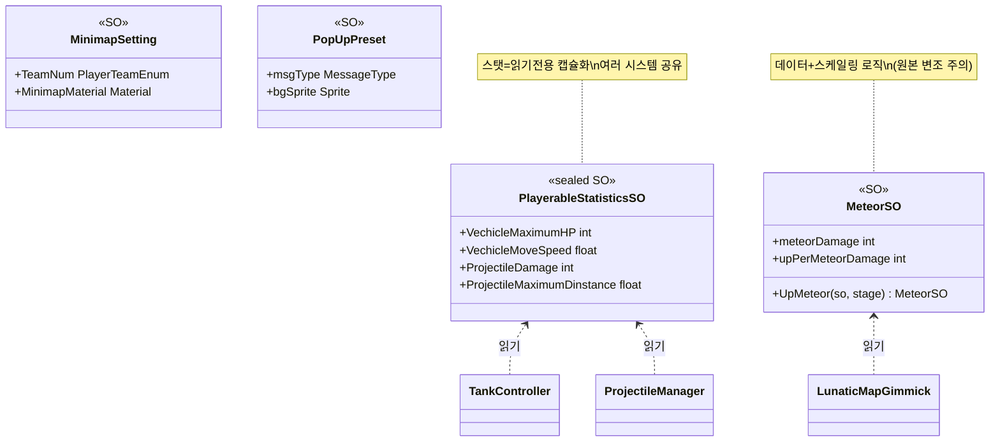

# ScriptableObject 데이터 설계 (ScriptableObject Data Design)

> 전차 스탯·투사체 수치·이벤트 튜닝·UI 프리셋 같은 "값"을 코드가 아니라 에셋으로 분리해, 밸런싱을 기획자가 인스펙터에서 조정하게 한다. 핵심은 데이터와 로직의 분리, 그리고 그 데이터를 여러 시스템이 참조로 공유하는 방식이다.
> 조작·판정·이벤트 로직([`CoopTankControl`](./CoopTankControl.md)·[`ProjectileDamage`](./ProjectileDamage.md)·[`MapEventScheduler`](./MapEventScheduler.md))이 하드코딩 대신 이 SO들을 읽어 동작한다.
>
> 관련 문서: [`CoopTankControl.md`](./CoopTankControl.md) · [`ProjectileDamage.md`](./ProjectileDamage.md) · [`MapEventScheduler.md`](./MapEventScheduler.md) · [`ServiceLocator.md`](./ServiceLocator.md)

---

## 1. 개요

게임의 "값"은 성격에 따라 네 갈래로 SO에 담긴다.

- **스탯 축 (플레이 수치)** — 전차 HP·이동/회전 속도·재장전·터렛 각도·투사체 데미지/사거리를 `PlayerableStatisticsSO`에 모은다. 읽기 전용으로 노출해 런타임 변조를 막는다.
- **튜닝 축 (이벤트 수치 + 스케일링)** — 운석 이벤트의 데미지·범위·연출 크기와 "스테이지당 증가량"을 `MeteorSO`에 담고, 강화 계산까지 포함한다.
- **참조 축 (에셋 묶음)** — 팀별 미니맵 머티리얼·렌더텍스처(`MinimapSetting`), UI 팝업의 스프라이트 프리셋(`PopUpPreset`)처럼 에셋 참조를 조합으로 묶는다.

공통 목표는 하나 — **밸런스와 표현을 코드에서 떼어내 에셋으로 옮기는 것.** 로직 클래스는 SO를 주입받아 읽기만 하고, 값 조정은 에셋 편집으로 끝난다.

## 2. 설계 목표

| 목표 | 해결 방식 |
| --- | --- |
| 밸런스를 코드에서 분리 | 수치를 `ScriptableObject` 에셋에 저장, 로직은 참조만 |
| 에디터에서 인스턴스 생성 | `[CreateAssetMenu]`로 메뉴 등록 |
| 런타임 변조 방지 | private 필드 + `get`/private `set` 프로퍼티(스탯) |
| 여러 시스템 공유 | 같은 SO를 탱크·투사체·터렛이 함께 참조 |
| 스테이지 스케일링 | `MeteorSO.UpMeteor(so, stage)`로 증가량 반영 |
| 에셋 참조 조합 | 팀↔머티리얼, 타입↔스프라이트를 SO로 매핑 |
| 인스펙터 가독성 | `[Header]`/`[Tooltip]`로 그룹·설명 |

## 3. 구성 요소

| 요소 | 역할 | 성격 |
| --- | --- | --- |
| `PlayerableStatisticsSO` | 전차·투사체 스탯(읽기 전용) | `sealed ScriptableObject` |
| `MeteorSO` | 운석 이벤트 수치 + 연출 + 스테이지 강화 | `ScriptableObject` |
| `MinimapSetting` | 팀별 미니맵 머티리얼·렌더텍스처 매핑 | `ScriptableObject` |
| `PopUpPreset` | UI 팝업 타입·제목·스프라이트 프리셋 | `ScriptableObject` |
| `[CreateAssetMenu]` | 에디터 생성 메뉴 등록 | 속성 |

## 4. 핵심 흐름

### 4-1. 스탯 공유 — 하나의 SO를 여러 시스템이 읽는다

```
PlayerableStatisticsSO (전차 1종)
   ├─ TankController      : VechicleMaximumHP (체력 초기화)
   ├─ VehicleMovement     : VechicleMoveSpeed / RotationSpeed (이동)
   ├─ VehicleTurret       : VechicleReloadtime / 터렛 각도 (조준·재장전)
   └─ ProjectileManager   : ProjectileDamage / MaximumDinstance (판정)
```

> 전차 한 종의 모든 수치가 SO 하나에 모여, 탱크·이동·터렛·투사체 시스템이 같은 에셋을 참조한다. 밸런스를 한 곳에서 조정하면 관련 시스템 전체에 일관되게 반영된다([`CoopTankControl`](./CoopTankControl.md)·[`ProjectileDamage`](./ProjectileDamage.md)).

### 4-2. 읽기 전용 캡슐화 — 값은 에셋에서만 바뀐다

```csharp
[SerializeField] int _vechicleMaximumHP;
public int VechicleMaximumHP {
    get => _vechicleMaximumHP;
    private set => _vechicleMaximumHP = value;   // 외부 쓰기 차단
}
```

> 필드는 `[SerializeField]`로 인스펙터에 노출하되, 프로퍼티는 `get`만 공개하고 `set`은 private으로 막는다. 로직 코드가 실수로 스탯을 바꿔 에셋을 오염시키는 것을 타입 수준에서 방지한다.

### 4-3. 데이터에 스케일링 로직 — 스테이지별 강화

```csharp
[Header("1업 당 증가 수치")] public int upPerMeteorDamage;
public MeteorSO UpMeteor(MeteorSO so, int stage) {
    so.meteorDamage      = meteorDamage + upPerMeteorDamage * stage;
    so.meteorDamageRange = meteorDamageRange + upPerMeteorDamageRange * stage;
    so.meteorMaxSpawnMeteor = meteorMaxSpawnMeteor + upPerMeteorMaxSpawnMeteor * stage;
    return so;
}
```

> 운석 이벤트는 기본 수치와 "스테이지당 증가량"을 함께 담아, 진행에 따라 강해지는 계산을 SO가 스스로 한다. 밸런스 곡선(base + up*stage)이 에셋 데이터로 표현된다.

### 4-4. 에셋 참조 매핑 — 조합을 SO로

```csharp
// MinimapSetting: 팀 → 미니맵 에셋           // PopUpPreset: 메시지 타입 → UI 스프라이트
_teamNum → MinimapMaterial / MaximapTexture   msgType, titleText, bgSprite, btSprite
```

> 팀별 미니맵 머티리얼, 팝업 종류별 스프라이트처럼 "어떤 키에 어떤 에셋"이라는 조합을 SO로 묶는다. 매핑 테이블을 코드가 아니라 에셋으로 관리해, 아트 교체가 코드 변경 없이 이뤄진다.

## 5. 클래스 구조 (Mermaid)



## 6. 코드 하이라이트

### 6-1. 스탯 SO — 한 종의 전차를 한 에셋에

```csharp
[Header("전차 관련")] [SerializeField] int _vechicleMaximumHP; float _vechicleMoveSpeed; /* ... */
[Header("투사체 관련")] [SerializeField] int _projectileDamage; float _projectileMaximumDinstance; /* ... */
```

> 전차·투사체 수치를 `[Header]`로 그룹지어 한 SO에 담는다. 이동·조준·발사·판정에 필요한 값이 흩어지지 않고, "이 전차는 이렇다"가 에셋 하나로 표현된다.

### 6-2. 스케일링을 품은 데이터

```csharp
public int meteorDamage;
public int upPerMeteorDamage;   // 스테이지당 증가
public MeteorSO UpMeteor(MeteorSO so, int stage) { so.meteorDamage = meteorDamage + upPerMeteorDamage * stage; ... }
```

> 기본값과 성장값을 함께 두어, 데이터가 "현재 값"뿐 아니라 "어떻게 자라는가"까지 표현한다. 이벤트 난이도 곡선을 코드가 아닌 에셋에서 설계할 수 있다.

## 7. 기술 포인트

- **데이터 주도 밸런스** — 스탯·데미지·이벤트 수치를 SO 에셋으로 빼, 밸런싱이 코드 재빌드 없이 인스펙터 편집으로 끝난다. 조작·판정·이벤트 로직이 값과 분리돼 각자 단순해진다([`ProjectileDamage`](./ProjectileDamage.md)·[`MapEventScheduler`](./MapEventScheduler.md)와 짝).
- **읽기 전용 캡슐화** — 스탯을 private 필드 + get 전용 프로퍼티로 노출해, 런타임 코드가 밸런스 에셋을 오염시키지 못하게 막는다. "데이터는 에셋에서만 바뀐다"를 타입으로 강제.
- **공유 참조 모델** — 같은 `PlayerableStatisticsSO`를 탱크·이동·터렛·투사체가 함께 읽어, 값의 단일 출처를 만든다. 중복 정의·불일치가 원천 차단된다.
- **SO의 다목적 활용** — 단순 값(스탯), 값+로직(운석 스케일링), 에셋 매핑(미니맵/팝업)까지 SO 하나의 개념을 용도별로 응용한다. 데이터·튜닝·참조를 같은 도구로 일관되게 다룬 설계.
- **인스펙터 친화** — `[Header]`/`[Tooltip]`로 그룹·설명을 붙여, 기획자가 코드를 몰라도 값을 이해하고 조정하게 한다.

## 8. 확장 포인트 / 한계

- **`MeteorSO` 원본 변조 위험** — `UpMeteor`가 전달된 `so`의 필드를 직접 덮어써 반환한다. 대상이 프로젝트 에셋이면 런타임 강화가 에셋 원본을 오염시켜, 다음 판·다음 세션까지 값이 누적될 수 있다. 강화는 인스턴스 복제본(`Instantiate`) 위에서 해야 안전하다.
- **SO 복사 생성자의 무효성** — `MeteorSO(MeteorSO so)` 생성자는 Unity가 SO를 `CreateInstance`로 만들기 때문에 실제로 호출되지 않는다(죽은 코드에 가깝다). 게다가 일부 필드(`meteorExplosionPower/Upper` 등)는 복사 목록에서 빠져 있어, 쓰이더라도 불완전하다.
- **캡슐화 일관성 부재** — `PlayerableStatisticsSO`는 읽기 전용 프로퍼티로 감싸면서도 `projectileExplosionPower/Upper`만 public 필드로 노출한다. `MeteorSO`·`PopUpPreset`은 전부 public 필드다. 캡슐화 정책이 SO마다 달라 구멍이 생긴다.
- **명명 오타의 API 고착** — `Vechicle`(vehicle), `Dinstance`(distance) 등 오타가 공개 프로퍼티·필드명에 박혀 있어, 참조하는 모든 시스템에 그대로 노출된다. 리네임 시 직렬화 값 마이그레이션이 필요하다.
- **SO 인스턴스 스코프 미정의** — 여러 시스템이 같은 SO를 공유할 때, 그것이 "읽기 전용 공유"인지 "인스턴스별 복제"인지 규약이 명시돼 있지 않다. 런타임에 값을 바꾸는 SO(MeteorSO)와 불변 SO(스탯)가 섞여 있어, 공유/복제 정책을 SO별로 문서화할 여지가 있다.
