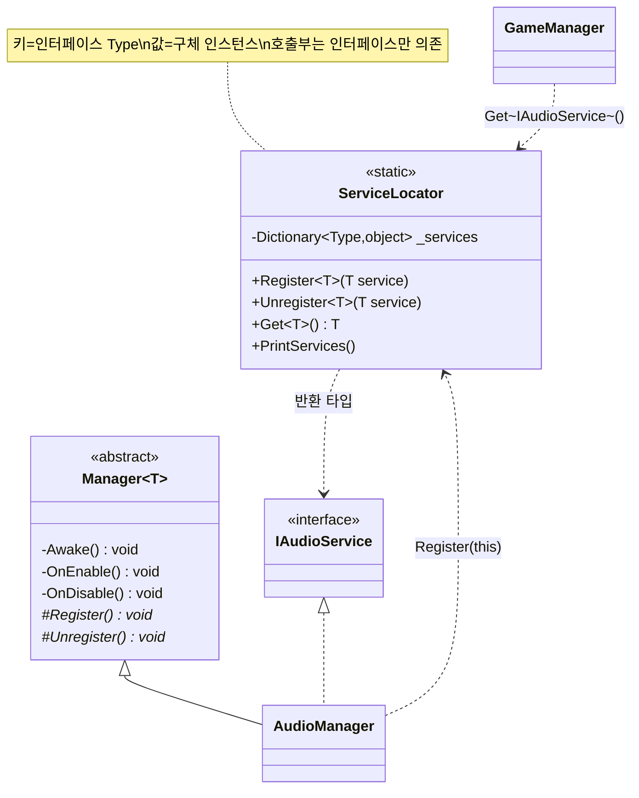

# 서비스 로케이터 기반 의존성 관리 (Service Locator)

> 매니저 12여 개가 서로를 직접 참조하지 않고, **인터페이스 타입을 열쇠로** 전역 레지스트리에서 서비스를 찾아 쓰는 구조다.
> 씬을 넘나드는 네트워크 게임에서 "누가 먼저 생성됐는지"에 흔들리지 않는 느슨한 결합을 만드는 것이 목적이다.
>
> 관련 문서: [`ManagerLifecycle.md`](./ManagerLifecycle.md) · [`GameStateMachine.md`](./GameStateMachine.md)

---

## 1. 개요

멀티플레이 구조상 매니저들은 서로를 자주 호출한다. `GameManager`는 맵·오디오·음성·UI·씬로더를 부르고, `LobbyManager`는 유저정보·DB를 부른다. 이 참조를 전부 `[SerializeField]`나 `FindObjectOfType`으로 잇는 순간 두 가지 축에서 문제가 터진다.

- **생성 순서 축** — 씬 로드/네트워크 스폰 타이밍에 따라 참조 대상이 아직 없을 수 있다. 인스펙터 연결은 씬을 넘으면 끊긴다.
- **결합도 축** — A가 B의 *구체 클래스*를 알면, B를 교체·모킹·분리하기 어렵다.

이 시스템은 **"타입(인터페이스) → 인스턴스"** 딕셔너리 하나로 두 축을 동시에 푼다. 등록/해제는 매니저의 활성화 수명주기(`OnEnable`/`OnDisable`)에 자동으로 묶여, 호출부는 오직 인터페이스에만 의존한다.

## 2. 설계 목표

| 목표 | 해결 방식 |
| --- | --- |
| 매니저 간 직접 참조 제거 | 인터페이스 타입을 키로 하는 전역 `Dictionary<Type, object>` |
| 구체 구현 은닉 / 교체 가능 | 등록·조회 모두 `IXxx` 인터페이스 기준 (`Register<IAudioService>(this)`) |
| 씬 전환에 견디는 등록/해제 | `Manager<T>`의 `OnEnable→Register`, `OnDisable→Unregister` 자동 연동 |
| 잘못된 해제로부터 방어 | `Unregister`는 `ReferenceEquals`로 "현재 등록된 그 인스턴스"일 때만 제거 |
| 중복 등록 방지 | `Register`는 `ContainsKey` 가드로 **먼저 등록된 쪽 우선** |

## 3. 구성 요소

| 요소 | 역할 | 성격 |
| --- | --- | --- |
| `ServiceLocator` | 타입→인스턴스 전역 레지스트리. Register/Unregister/Get | static class |
| `Manager<T>` | 등록/해제를 수명주기에 묶는 MonoBehaviour 베이스 | abstract base |
| `NetworkManager<T>` | 위와 동일 역할의 `NetworkBehaviour` 판 | abstract base |
| `IAudioService`, `IGameManager`, `IMapManager` … | 서비스 계약(열쇠). 호출부는 이것만 참조 | interface |
| 각 구체 매니저 | `Register()`에서 자신을 인터페이스로 등록 | Manager 구현체 |

> 등록되는 서비스(인터페이스 키) 13종: `IGameManager`, `IAudioService`, `IDatabaseBackend`, `ILobbyManager`, `IMapManager`, `IUserInfoManager`, `IVoiceManager`, `IInputSystem`, `ILocalSceneLoader`, `INetworkSceneLoader`, `IRelayHostManager`, `IInGameCommonUIController`, `IWarpManager`.

## 4. 핵심 흐름

### 4-1. 등록 — 매니저가 활성화되며 자신을 인터페이스로 꽂는다

```
[씬 로드] → Manager.OnEnable() → Register()
                                    └─ ServiceLocator.Register<IAudioService>(this)
                                          └─ _services[typeof(IAudioService)] = this   // 첫 등록만
```

```csharp
// AudioManager.cs
protected override void Register()   => ServiceLocator.Register<IAudioService>(this);
protected override void Unregister() => ServiceLocator.Unregister<IAudioService>(this);
```

> 매니저는 "나는 IAudioService다"라고 선언만 한다. 구체 타입은 바깥에 드러나지 않는다.

### 4-2. 조회 — 호출부는 인터페이스만 알고 꺼내 쓴다

```
GameManager.PlayBattleBGM()
   └─ ServiceLocator.Get<IAudioService>().PlayBGM(_mapNumber)
        └─ (IAudioService) _services[typeof(IAudioService)]
```

```csharp
// GameManager.cs — 구체 AudioManager가 아니라 계약(IAudioService)에만 의존
ServiceLocator.Get<IAudioService>().PlayBGM(_mapNumber);
ServiceLocator.Get<IVoiceManager>()?.OnJoinVoiceChannel(_voiceChannelName); // 선택 서비스는 ?. 로 방어
```

> `IVoiceManager`처럼 없을 수도 있는 서비스는 `?.`로 감싼다. `Get`이 미등록 시 `default(null)`을 돌려주기 때문.

### 4-3. 해제 — 비활성화되며 "내가 그 인스턴스일 때만" 뺀다

```
[씬 이탈] → Manager.OnDisable() → Unregister()
                                     └─ ReferenceEquals(현재등록, this) 일 때만 Remove
```

> 씬 전환 중 새 인스턴스가 먼저 `OnEnable`로 등록되고 옛 인스턴스가 뒤늦게 `OnDisable`될 때, 옛 인스턴스가 새 등록을 지워버리는 사고를 막는다. (→ 8장 참조)

## 5. 클래스 구조 (Mermaid)



## 6. 코드 하이라이트

### 6-1. 등록 — 중복 방지 가드

```csharp
public static void Register<T>(T service)
{
    var type = typeof(T);
    if (!_services.ContainsKey(type)) _services[type] = service;
}
```

> 이미 있으면 덮어쓰지 않는다 → **먼저 등록된 인스턴스가 임자**. 중복 스폰 시 원본 보호.

### 6-2. 해제 — 인스턴스 일치 검사

```csharp
public static void Unregister<T>(T service)
{
    var type = typeof(T);
    if (_services.TryGetValue(type, out var current) && ReferenceEquals(current, service))
        _services.Remove(type);
}
```

> `ReferenceEquals(current, service)` 한 줄이 이 시스템의 안전장치. "지금 등록된 게 나일 때만" 지운다.

### 6-3. 조회 — 없으면 조용히 default

```csharp
public static T Get<T>()
{
    var type = typeof(T);
    if (_services.TryGetValue(type, out var service)) return (T)service;
    return default;
}
```

> 예외를 던지지 않고 `null`을 반환 → 선택적 서비스는 `?.`로, 필수 서비스는 호출부 계약으로 다룬다.

### 6-4. 수명주기 연동 (베이스 클래스)

```csharp
public abstract class Manager<T> : MonoBehaviour
{
    private void Awake()     => Init();
    private void OnEnable()  => Register();
    private void OnDisable() => Unregister();
    protected abstract void Register();
    protected abstract void Unregister();
}
```

> 등록/해제를 개발자가 잊을 수 없게 **수명주기에 강제**로 못 박았다. 구현체는 한 줄만 채우면 된다. (자세히 → [`ManagerLifecycle.md`](./ManagerLifecycle.md))

## 7. 기술 포인트

- **인터페이스 키(Type-keyed) 레지스트리** — 값이 아니라 `typeof(T)`가 열쇠. 호출부는 구체 클래스를 몰라도 되고, 구현 교체·모킹이 자유롭다. DI 컨테이너 없이 컴파일 의존성만 끊는 최소 비용 접근.
- **수명주기 결착** — 등록/해제를 `OnEnable`/`OnDisable`에 묶어, 씬 전환 시 자동으로 최신 인스턴스만 남게 했다. "등록 깜빡"을 구조적으로 차단.
- **해제 안전성(ReferenceEquals 가드)** — 멀티 씬/네트워크 환경에서 신·구 인스턴스 수명이 겹칠 때 발생하는 *교차 해제*를 방어. 이 한 줄이 실전 버그를 막는 핵심.
- **선언적 등록** — 각 매니저의 `Register()`가 곧 "내가 제공하는 계약" 문서 역할. 시스템 전체의 서비스 목록이 코드로 자명해진다.

## 8. 확장 포인트 / 한계

- **전역 정적 상태의 그림자** — 서비스 로케이터는 의존성이 시그니처에 드러나지 않는다(숨은 의존성). 어떤 클래스가 무엇을 쓰는지 코드를 열어봐야 안다. 규모가 더 커지면 생성자 주입형 DI로 옮길 여지가 있다.
- **미등록 시 런타임 NRE 위험** — `Get`이 `null`을 반환하므로, 필수 서비스가 등록 전에 조회되면 그 자리에서 터진다. 현재는 등록 순서를 부트스트랩이 보장하는 것에 의존.
- **타입당 1개 전제(싱글턴)** — 같은 인터페이스의 인스턴스를 여럿 둘 수 없다. 팀별/플레이어별 서비스가 필요해지면 키에 식별자를 더하는 확장이 필요.
- **스레드 안전 아님** — Unity 메인 스레드 전제. 백그라운드 스레드에서의 등록/조회는 보호되지 않는다.
- **약한 진단** — 부재를 조용히 넘기므로, 개발 중엔 `PrintServices()`나 미등록 경고 로그를 함께 두면 디버깅이 빨라진다.
