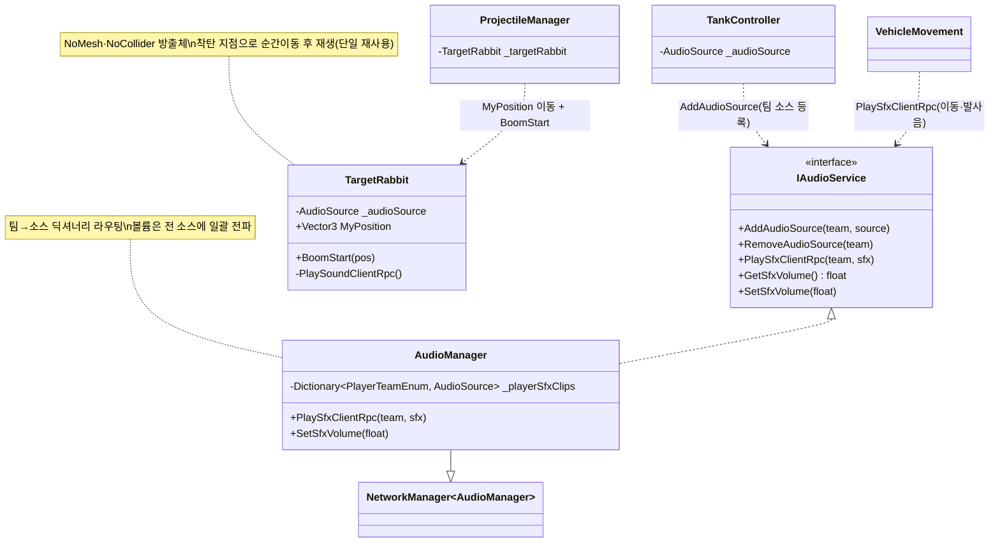

# 3D 공간 사운드 · AudioSource 관리 (Spatial Audio & AudioSource Management)

> 전장의 소리를 "어디서 났는가"에 맞춰 들리게 한다 — 이동·발사음은 각 **탱크 위치의 AudioSource**에서, 폭발음은 **착탄 지점으로 순간이동하는 AudioSource**에서 재생한다. 월드 공간에 소스를 배치해 방향·거리감 있는 3D 사운드를 만드는 것이 핵심이다.
> 소리 사건을 팀별 소스로 라우팅하고, 폭발음은 단일 방출체(`TargetRabbit`)를 명중 지점으로 옮겨 재사용하는 방식을 다룬다.
>
> 관련 문서: [`ProjectileDamage.md`](./ProjectileDamage.md) · [`NetcodeSyncPatterns.md`](./NetcodeSyncPatterns.md) · [`ManagerLifecycle.md`](./ManagerLifecycle.md) · [`ServiceLocator.md`](./ServiceLocator.md)

---

## 1. 개요

전장 사운드를 실감 나게 내려면 세 관심사를 각각 풀어야 한다.

- **배치 축 (소리가 어디서 나는가)** — 소리를 한 지점(리스너)에서 몰아 재생하지 않고, 소리를 낸 **주체의 월드 위치**에 AudioSource를 둔다. 탱크음은 그 탱크에서, 폭발음은 착탄 지점에서 난다.
- **라우팅 축 (어느 소스로 보내는가)** — 각 탱크의 소스를 팀 키로 등록해두고, 이동·발사 같은 사건을 그 팀 소스로 보낸다. "이 소리는 이 탱크 것"이 소스 선택으로 표현된다.
- **동기 축 (네트워크로 어떻게 맞추는가)** — 소리 사건은 `ServerRpc → ClientRpc`로 전 클라에 팬아웃하고, 볼륨은 전 소스에 일괄 전파한다. 모두가 같은 소리를, 각자의 리스너 기준 방향으로 듣는다.

이동·발사음(정적 탱크 소스)과 폭발음(이동형 소스)이라는 두 종류의 방출체가 `AudioManager`의 라우팅 위에서 함께 동작한다.

## 2. 설계 목표

| 목표 | 해결 방식 |
| --- | --- |
| 방향·거리감 있는 사운드 | 월드 공간에 AudioSource 배치(리스너 기준 3D 재생) |
| 탱크별 소리 분리 | 팀→소스 딕셔너리 `_playerSfxClips`로 라우팅 |
| 폭발음을 착탄 지점에서 | `TargetRabbit`을 명중 지점으로 이동 후 재생 |
| 오디오 오브젝트 재사용 | 단일 `TargetRabbit`을 순간이동(풀링 유사) |
| 소리 사건 전원 공유 | `ServerRpc → ClientRpc(Everyone)` 팬아웃 |
| 볼륨 일괄 제어 | `SetSfxVolume`이 모든 팀 소스에 전파 |
| 오디오 세부 은닉 | `IAudioService` 인터페이스 뒤로 소스·재생 격리 |

## 3. 구성 요소

| 요소 | 역할 | 성격 |
| --- | --- | --- |
| `IAudioService` | 오디오 계약(BGM/SFX/팀소스/볼륨) | interface |
| `AudioManager` | BGM·SFX 재생 + 팀 소스 딕셔너리 관리 | `NetworkManager<T>` 구현체 |
| `_playerSfxClips` | 팀→AudioSource 매핑(팀별 3D 소스) | Dictionary |
| `TankController` | 자기 `AudioSource`를 팀 소스로 등록 | `NetworkBehaviour` |
| `TargetRabbit` | 폭발 지점으로 이동하는 3D 사운드 방출체 | `NetworkBehaviour`(AudioSource 필수) |
| `ProjectileManager` | 명중 지점으로 `TargetRabbit` 이동·트리거 | `NetworkBehaviour` |

## 4. 핵심 흐름

### 4-1. 두 종류의 소스 — 정적(탱크) + 이동형(폭발)

```
[정적 소스 : 탱크마다 하나]              [이동형 소스 : 폭발용 단 하나]
 TankController.AudioSource               TargetRabbit (NoMesh·NoCollider)
   → 이동·발사음 재생                        → 착탄 지점으로 이동 후 폭발음 재생
   → 팀 키로 AudioManager에 등록             → ProjectileManager가 위치·트리거 제어
```

> 소리를 내는 주체를 두 부류로 나눈다 — 계속 존재하는 탱크는 자기 소스를 갖고, 순간적으로 아무 데서나 터지는 폭발은 이동형 소스 하나가 그 자리로 가서 낸다. 둘 다 월드 좌표에 놓여 3D로 들린다.

### 4-2. 탱크 소스 등록 — 각 탱크가 자기 소스를 팀 채널에 건다

```csharp
// TankController.Init()
ServiceLocator.Get<IAudioService>().AddAudioSource(_teamNum, _audioSource);   // 팀 키로 등록
// AudioManager
public void AddAudioSource(PlayerTeamEnum team, AudioSource audioSource) {
    audioSource.volume = _sfxSource.volume;
    _playerSfxClips[team] = audioSource;          // 팀 → 그 탱크의 소스
}
```

> 각 탱크가 스폰되면 자기 `AudioSource`를 팀 키로 매니저에 등록한다. 이후 그 팀의 소리는 이 소스, 즉 *그 탱크의 위치*에서 재생된다. 소스 선택이 곧 소리의 발생 위치.

### 4-3. 팀 사운드 라우팅 — 사건을 그 팀 소스로

```csharp
// VehicleMovement: 이동 입력 → 서버 → 그 팀 소스에서 이동음
[ServerRpc(InvokePermission = RpcInvokePermission.Everyone)]
private void MoveSoundServerRpc(bool moving) {
    var audio = ServiceLocator.Get<IAudioService>();
    if (moving) audio.PlaySfxClientRpc(_teamInfo.teamNum, SfxEnum.TankMove);
}
// AudioManager: 그 팀 소스로만 라우팅
public void PlaySfxClientRpc(PlayerTeamEnum team, SfxEnum sfxEnum) {
    if (_playerSfxClips.TryGetValue(team, out var audioSource)) { audioSource.clip = clip; audioSource.Play(); }
}
```

> 발사·이동음은 `ServerRpc → ClientRpc`로 전 클라에 퍼지되, 각 클라에서 `_playerSfxClips[team]` 소스로만 재생된다. 소리가 그 팀 탱크에서 나므로 방향이 맞고, 다른 팀 소리와 섞이지 않는다([`NetcodeSyncPatterns`](./NetcodeSyncPatterns.md)의 수신자 필터링과 짝).

### 4-4. 폭발음 — 방출체를 착탄 지점으로 옮겨 재생

```csharp
// ProjectileManager (서버 판정부)
_targetRabbit.MyPosition = point;                       // ① 착탄 지점으로 순간이동
StartCoroutine(TargetRabitBoomCoroutine(true, point));  // ② 폭발음·VFX 트리거

// TargetRabbit
public Vector3 MyPosition { set { transform.position = value; } }   // 위치 이동
[ClientRpc(InvokePermission = RpcInvokePermission.Everyone)]
private void PlaySoundClientRpc() {
    _audioSource.volume = ServiceLocator.Get<IAudioService>().GetSfxVolume();
    _audioSource.PlayOneShot(_boomSfx);                 // ③ 그 자리에서 3D 폭발음
}
```

> [`ProjectileDamage`](./ProjectileDamage.md)의 히트스캔이 잡은 명중 좌표로 `TargetRabbit`을 옮긴 뒤 폭발음을 낸다. 폭발마다 오디오 오브젝트를 새로 만들지 않고, *하나의 방출체를 각 착탄점으로 순간이동*시켜 재사용한다. 소리가 실제 터진 곳에서 나 방향·거리감이 생긴다.

## 5. 클래스 구조 (Mermaid)



## 6. 코드 하이라이트

### 6-1. 팀→소스 딕셔너리 라우팅

```csharp
private Dictionary<PlayerTeamEnum, AudioSource> _playerSfxClips = new();
public void PlaySfxClientRpc(PlayerTeamEnum team, SfxEnum sfxEnum) {
    if (FindSfxData(sfxEnum) is {} clip && _playerSfxClips.TryGetValue(team, out var src)) { src.clip = clip; src.Play(); }
}
```

> 소리를 "어느 소스에서 낼지"를 팀 키로 찾는다. 소스가 그 탱크에 붙어 있으므로, 팀을 고르는 것이 곧 소리의 3D 위치를 고르는 것이 된다.

### 6-2. 이동형 방출체 — 위치 세터 + 그 자리 재생

```csharp
public Vector3 MyPosition { set { transform.position = value; } }   // 착탄점으로 이동
[ClientRpc(InvokePermission = RpcInvokePermission.Everyone)]
private void PlaySoundClientRpc() { _audioSource.PlayOneShot(_boomSfx); }   // 그 자리서 폭발음
```

> 위치 세터로 방출체를 옮기고 그 자리에서 `PlayOneShot`을 친다. 폭발 좌표가 곧 소리 좌표가 되며, 오브젝트 하나로 매 폭발을 처리해 생성 비용이 없다.

### 6-3. 볼륨 일괄 전파

```csharp
public void SetSfxVolume(float volume) {
    _sfxSource.volume = volume;
    foreach (var ad in _playerSfxClips.Values) ad.volume = volume;   // 전 팀 소스에 반영
}
```

> 설정에서 SFX 볼륨을 바꾸면 대표 소스뿐 아니라 등록된 모든 팀 소스에 즉시 전파된다. 여러 3D 소스의 볼륨을 단일 진입점에서 일관되게 제어.

## 7. 기술 포인트

- **주체 위치 기반 3D 사운드** — 소리를 리스너에 몰지 않고 발생 주체(탱크·착탄점)의 월드 좌표에서 재생해 방향·거리감을 만든다. "누가 어디서 소리를 냈나"를 AudioSource 배치로 표현한 것이 핵심.
- **정적/이동형 소스 이원화** — 지속 존재하는 탱크는 자기 소스를, 순간적으로 아무 데서나 터지는 폭발은 이동형 소스 하나가 그 자리로 가서 낸다. 서로 다른 사운드 수명을 두 방출체 유형으로 나눴다.
- **방출체 재사용** — 폭발마다 오디오 오브젝트를 스폰하지 않고 단일 `TargetRabbit`을 순간이동시킨다. [`RespawnScore`](./RespawnScore.md)의 오브젝트 재사용과 같은 결의 비용 절감.
- **팀 라우팅 = 위치 선택** — 팀 키로 소스를 고르는 것이 곧 소리의 3D 위치를 고르는 것이다. 사운드 사건은 `ServerRpc → ClientRpc`로 동기화하되, 재생 소스는 수신 측에서 팀으로 라우팅한다([`NetcodeSyncPatterns`](./NetcodeSyncPatterns.md)).
- **오디오 은닉과 단일 볼륨 제어** — 소스·재생 API를 `IAudioService` 뒤로 숨기고, 볼륨을 한 진입점에서 전 소스에 전파해 여러 3D 소스를 일관되게 다룬다.

## 8. 확장 포인트 / 한계

- **폭발 방출체가 단 하나** — `TargetRabbit`이 하나라 거의 동시에 여러 폭발이 나면, 방출체가 마지막 지점으로 이동해 이전 폭발음이 그 자리에서 나거나 끊길 수 있다. 동시다발 폭발엔 방출체 풀이 필요하다.
- **소스 해제 누락 위험** — `TankController`에서 `RemoveAudioSource` 호출이 주석 처리돼 있어, 탱크가 파괴돼도 `_playerSfxClips`에 죽은 소스 참조가 남을 수 있다. 리스폰으로 소스가 교체되면(주석 "새로 생성되면 audiosource도 바뀌는 듯") 갱신은 되지만, 명시적 해제가 없어 수명 관리가 느슨하다.
- **3D 설정이 코드 밖에** — `spatialBlend`·롤오프·최대 거리 같은 3D 감쇠 설정이 코드에 드러나지 않고 프리팹 인스펙터에 의존한다. 3D 효과의 실제 파라미터가 문서·코드로 추적되지 않는다.
- **팀당 소스 1개 전제** — `_playerSfxClips`가 팀 키라 팀당 소스 하나를 가정한다. 한 팀에 여러 유닛·다중 사운드 채널이 필요해지면 키 구조를 확장해야 한다.
- **방출체 네이밍·잔여 코드** — `TargetRabbit`이라는 의미 불명 네이밍, `using UnityEngine.LowLevelPhysics2D` 같은 불필요 using이 남아 있어 정리 여지가 있다.
- **볼륨만 동기, 위치 지연 가능** — 폭발음은 `MyPosition` 이동 후 `ClientRpc` 재생인데, 클라별로 위치 반영과 재생 사이 미세한 타이밍차가 있으면 소리가 직전 위치에서 날 수 있다. 위치를 RPC 인자로 함께 넘겨 재생 직전 확정하면 더 안전하다.