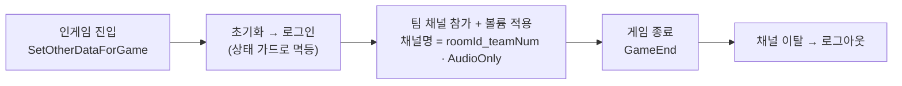
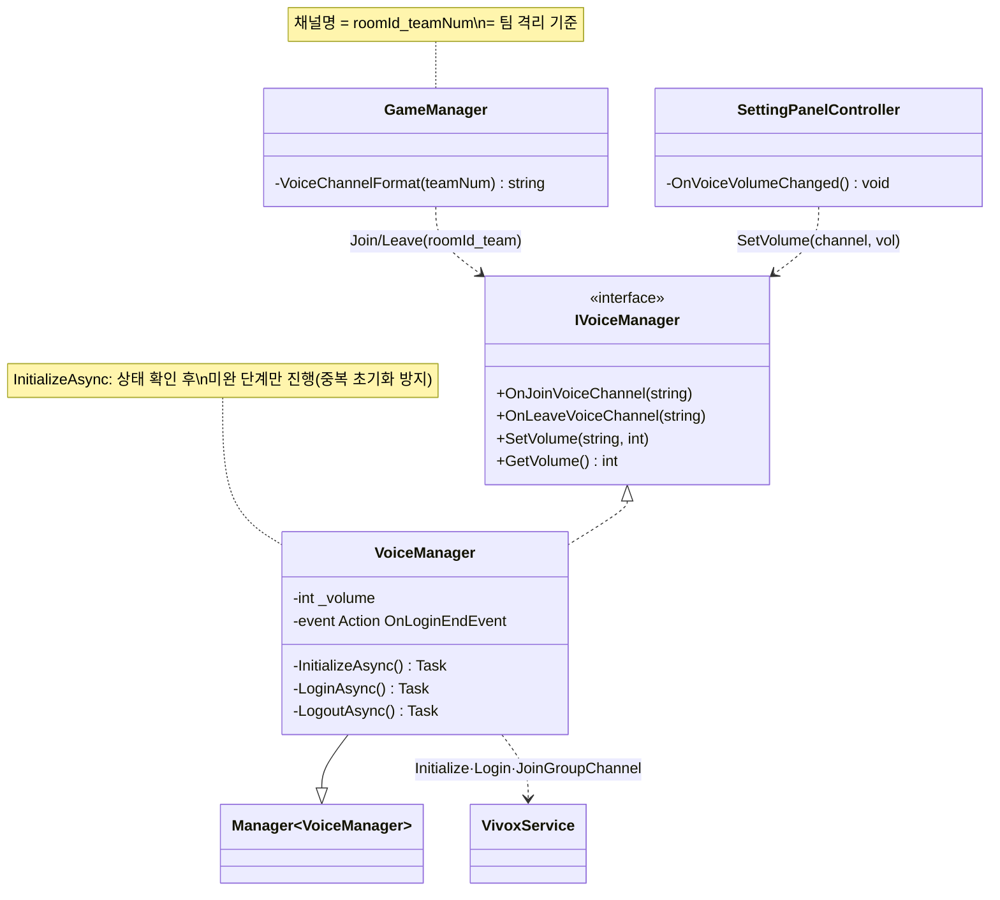

# Vivox 팀 음성 채널 (Vivox Team Voice Chat)

> 협력 탱크의 두 조종수(운전수·포수)가 서로만 듣는 **팀 격리 음성 채널**을, 채널 이름 규칙(`roomId_teamNum`) 하나로 나눈다. 중심은 Vivox 서비스를 감싼 `VoiceManager`와, 초기화→로그인→채널 참가로 이어지는 비동기 체인이다.
> "같은 팀끼리만 들리게 한다"를 별도 라우팅 없이 *채널명 조합*으로 푸는 것이 이 시스템의 요체다.
>
> 관련 문서: [`GameStateMachine.md`](./GameStateMachine.md) · [`LobbyPipeline.md`](./LobbyPipeline.md) · [`ManagerLifecycle.md`](./ManagerLifecycle.md) · [`ServiceLocator.md`](./ServiceLocator.md)

---

## 1. 개요

실시간 음성은 성격이 다른 세 문제로 나뉜다. 이 시스템은 각각을 Vivox의 다른 단계에 대응시킨다.

- **격리 축 (누구끼리 들리는가)** — 4v4 협력전에서 음성은 *팀 안에서만* 공유돼야 한다. 별도 필터링 없이, 채널 이름을 `방ID_팀번호`로 지어 같은 팀만 같은 채널에 모이게 만든다.
- **접속 축 (언제 붙고 언제 떠나는가)** — 음성 접속은 초기화·로그인·채널 참가라는 순차 비동기 단계를 거친다. 인게임 진입 시 붙고 게임 종료 시 떠나며, 그 시점은 [`GameStateMachine`](./GameStateMachine.md)이 정한다.
- **제어 축 (어떻게 조절하는가)** — 채널 볼륨은 `-50~50`(−50=음소거) 범위로, 설정 UI에서 실시간 조절된다.

`VoiceManager`가 세 축을 모두 담당하되, 채널 이름(격리 기준)은 [`GameManager`](./GameStateMachine.md)가 팀 정보로 조립해 넘긴다. 매니저는 "어느 채널에 붙어라"만 받고 Vivox 세부를 감춘다.

## 2. 설계 목표

| 목표 | 해결 방식 |
| --- | --- |
| 팀 안에서만 들리게 | 채널명 `{roomId}_{teamNum}` → 같은 팀만 같은 group 채널 |
| 음성 전용 채널 | `JoinGroupChannelAsync(..., ChatCapability.AudioOnly)` |
| 접속 준비 보장 | 참가 전 `InitializeAsync`(서비스 초기화+로그인) 체인 실행 |
| 중복 초기화 방지 | 각 단계 상태 확인(`IsLoggedIn`/`InitializationState`) 후 진입 |
| 진입·이탈 시점 일치 | 인게임 준비 시 Join, `GameEnd` 시 Leave |
| 볼륨 실시간 조절 | `SetChannelVolumeAsync(channel, volume)` (−50~50, −50=mute) |
| Vivox 세부 은닉 | `IVoiceManager` 인터페이스 뒤로 로그인·채널 API 격리 |

## 3. 구성 요소

| 요소 | 역할 | 성격 |
| --- | --- | --- |
| `IVoiceManager` | 음성 계약(Join/Leave/SetVolume/GetVolume) | interface |
| `VoiceManager` | Vivox 초기화·로그인·채널 참가/이탈·볼륨 | `Manager<T>` 구현체 |
| `VivoxService` | Unity Vivox SDK 진입점 | 외부 서비스 |
| `GameManager.VoiceChannelFormat` | `{roomId}_{teamNum}` 채널명 조립(격리 기준) | 매니저 메서드 |
| `SettingPanelController` | 볼륨 슬라이더 → `SetVolume` 연결 | MonoBehaviour(제어 UI) |

## 4. 핵심 흐름

음성 수명은 게임 수명을 따른다 — 인게임 진입에 붙고 종료에 뗀다. 접속은 초기화→로그인→팀 채널 참가로 이어지며, 채널명(`roomId_teamNum`)이 팀 격리 기준이다.



### 4-1. 채널 격리 — 이름 규칙이 곧 팀 경계

```csharp
// GameManager: 방ID + 팀번호 = 팀 전용 채널 이름
private string VoiceChannelFormat(PlayerTeamEnum teamNum) => $"{_roomId}_{teamNum}";
// ...
_voiceChannelName = VoiceChannelFormat(userInfo.teamNum);
ServiceLocator.Get<IVoiceManager>()?.OnJoinVoiceChannel(_voiceChannelName);
```

> "팀 음성"을 라우팅·권한 없이 *이름 조합*으로 푼다. 같은 방(`roomId`)의 같은 팀(`teamNum`)은 반드시 같은 채널명을 만들어 서로 만나고, 다른 팀은 이름이 달라 자연히 분리된다.

### 4-2. 접속 체인 — 초기화 → 로그인 → 채널 참가

```
OnJoinVoiceChannel(channel)
   └─ InitializeAsync()
        ├─ UnityServiceInitialize.Processing()        // UGS 공통 초기화(1회 보장)
        ├─ VivoxService.InitializeAsync()             // Uninitialized 일 때만
        └─ LoginAsync()                               // IsLoggedIn 아닐 때만 (익명)
        → OnLoginEndEvent?.Invoke()
   ├─ VivoxService.JoinGroupChannelAsync(channel, AudioOnly)
   └─ VivoxService.SetChannelVolumeAsync(channel, _volume)
```

```csharp
private async Task InitializeAsync()
{
    await UnityServiceInitialize.Processing();
    if (VivoxService.Instance != null && VivoxService.Instance.InitializationState == VivoxInitializationState.Uninitialized)
        await VivoxService.Instance.InitializeAsync();
    await LoginAsync();
    OnLoginEndEvent?.Invoke();
}
```

> 채널 참가 전에 "초기화됐나·로그인됐나"를 매번 상태로 확인하고 미완 단계만 진행한다. Join을 여러 번 불러도 초기화가 중복되지 않는다([`RelayHostLifecycle`](./RelayHostLifecycle.md)의 서비스 초기화 게이트와 같은 결).

### 4-3. 진입·이탈 시점 — 인게임에 붙고 종료에 뗀다

```
[GameStateMachine]
 SetOtherDataForGame ─► OnJoinVoiceChannel(roomId_team)   // 게임 준비 단계에 참가
        …
 GameEnd            ─► OnLeaveVoiceChannel(roomId_team)    // 종료 시 이탈 + 로그아웃
```

```csharp
// 이탈: 채널을 떠나고 Vivox 로그아웃까지
public async void OnLeaveVoiceChannel(string channelName)
{
    await VivoxService.Instance.LeaveChannelAsync(channelName);
    await LogoutAsync();
}
```

> 음성 수명을 게임 수명에 맞춰 [`GameStateMachine`](./GameStateMachine.md)이 켜고 끈다. 참가는 인게임 준비 상태에서, 이탈은 게임 종료에서 — 로비/결과 화면에선 음성이 붙지 않는다.

### 4-4. 볼륨 제어 — 설정 슬라이더 → 채널 볼륨

```csharp
// channelName = roomId_teamNum, volume: -50 ~ 50 (-50 = mute, default 0)
public async void SetVolume(string channelName, int volume)
{
    _volume = volume;
    if (!string.IsNullOrEmpty(channelName))
        await VivoxService.Instance.SetChannelVolumeAsync(channelName, _volume);
}
```

> 설정 패널의 슬라이더가 이 채널 볼륨을 실시간으로 민다. `_volume`을 매니저가 들고 있어, 다음 채널 참가 시(4-2) 초기 볼륨으로도 재사용된다.

## 5. 클래스 구조 (Mermaid)



## 6. 코드 하이라이트

### 6-1. 팀 격리를 이름으로 — 라우팅 없는 분리

```csharp
private string VoiceChannelFormat(PlayerTeamEnum teamNum) => $"{_roomId}_{teamNum}";
```

> 채널 접근 제어를 코드로 관리하지 않는다. `방ID_팀번호`라는 결정적 이름 규칙만으로, 같은 팀은 반드시 만나고 다른 팀은 절대 섞이지 않는다. 격리 정책이 문자열 한 줄에 압축돼 있다.

### 6-2. 상태 확인 기반 초기화 — 몇 번 불러도 안전

```csharp
if (VivoxService.Instance != null && !VivoxService.Instance.IsLoggedIn)
    await VivoxService.Instance.LoginAsync(_loginOptions);
```

> 로그인·초기화 각 단계 앞에 상태 가드를 둬, 이미 완료된 단계는 건너뛴다. Join 경로가 초기화를 품고 있어도 재진입 시 중복 로그인/초기화가 일어나지 않는다.

### 6-3. 음성 전용 group 채널 참가

```csharp
await VivoxService.Instance.JoinGroupChannelAsync(channelName, ChatCapability.AudioOnly);
await VivoxService.Instance.SetChannelVolumeAsync(channelName, _volume);
```

> 텍스트 없이 오디오만 쓰는 그룹 채널로 참가하고, 참가 직후 보관 중인 `_volume`을 즉시 적용한다. 접속과 볼륨 반영이 한 흐름에 놓여, 붙자마자 설정값대로 들린다.

## 7. 기술 포인트

- **이름 규칙으로 격리 구현** — 팀 음성을 접근 제어·라우팅이 아니라 `roomId_teamNum` 결정적 이름으로 나눈다. 인프라 없이 조합만으로 "같은 팀끼리"를 보장하는 실용적 설계. 협력 2인 1조([`LobbyPipeline`](./LobbyPipeline.md))가 그대로 한 음성 채널이 된다.
- **상태 기반 초기화 체인** — `Initialize→Login→Join`을 순차 `await`로 잇되, 각 단계를 상태로 가드해 멱등하게 만들었다. 어느 경로로 Join이 불려도 안전([`RelayHostLifecycle`](./RelayHostLifecycle.md)·[`ManagerLifecycle`](./ManagerLifecycle.md)와 같은 초기화 철학).
- **음성 수명 = 게임 수명** — 참가/이탈을 [`GameStateMachine`](./GameStateMachine.md)의 준비·종료 시점에 못 박아, 음성이 게임 상태를 따라 켜지고 꺼진다. 별도 수명 관리가 필요 없다.
- **Vivox 세부의 은닉** — 로그인·채널·볼륨 API를 `IVoiceManager` 뒤로 숨겨, 호출부(게임·설정 UI)는 채널명과 볼륨만 안다. [`ServiceLocator`](./ServiceLocator.md)로 주입돼 음성 백엔드 교체가 이 클래스로 국한된다.
- **볼륨 상태의 재사용** — 매니저가 `_volume`을 보관해, 설정 변경과 채널 참가 초기값에 같은 값을 쓴다. 볼륨의 단일 출처.

## 8. 확장 포인트 / 한계

- **단일 채널 전제** — `_volume` 하나·`OnLeaveVoiceChannel`의 `LogoutAsync`가 "동시에 한 채널만 참가"를 가정한다. 팀 채널 외에 전체 채널·근접 음성 등 다채널을 붙이면, 채널을 뜰 때마다 로그아웃되어 다른 채널까지 끊긴다. 채널별 상태 관리로 확장해야 한다.
- **`async void` 실패 추적 불가** — Join/Leave/SetVolume이 `async void`라 호출부가 완료·예외를 `await`할 수 없다. 마이크 권한 거부·네트워크 실패 시 조용히 넘어가므로, `Task` 반환으로 바꿔 결과를 UI에 반영할 여지가 있다.
- **죽은 필드 잔존** — `_voiceManagerImplementation`, `LoginOptions`의 랜덤 `DisplayName`(Guid) 등 실제로 쓰이지 않거나 의미 없는 값이 있다. 정리 대상.
- **초기화가 Join 경로에만** — `InitializeAsync`가 `OnJoinVoiceChannel` 안에서만 불린다. Join 전에 `SetVolume`이 호출되면 채널이 없어 볼륨만 필드에 남고 반영되지 않는다(설계상 Join 이후 조절 전제).
- **채널 정리 책임** — 비정상 종료(강제 종료·[호스트 다운](./RelayHostLifecycle.md)) 시 채널 이탈·로그아웃이 보장되지 않는다. Vivox 세션 정리가 게임 종료 경로에만 있어, 예외 경로의 잔여 세션 처리가 없다.
- **볼륨 범위의 매직 넘버** — `-50~50`, `-50=mute`가 주석으로만 존재한다. 상수화하고 UI 슬라이더 범위와 한 곳에서 묶으면 안전해진다.
