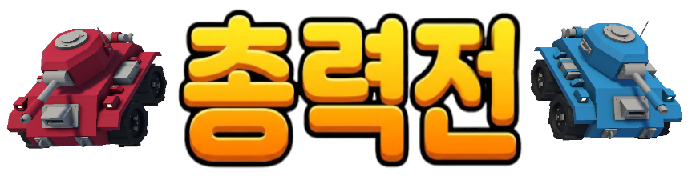
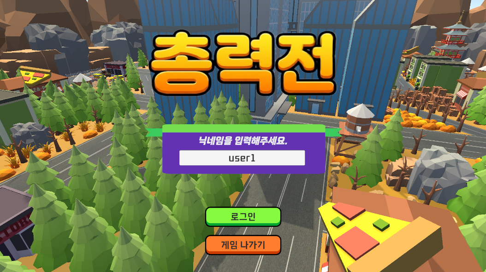
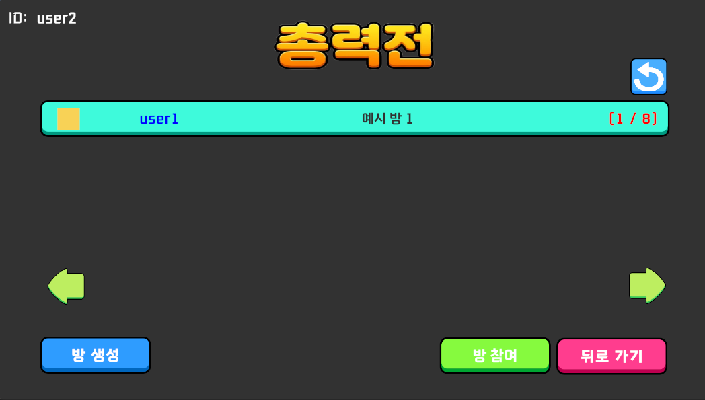
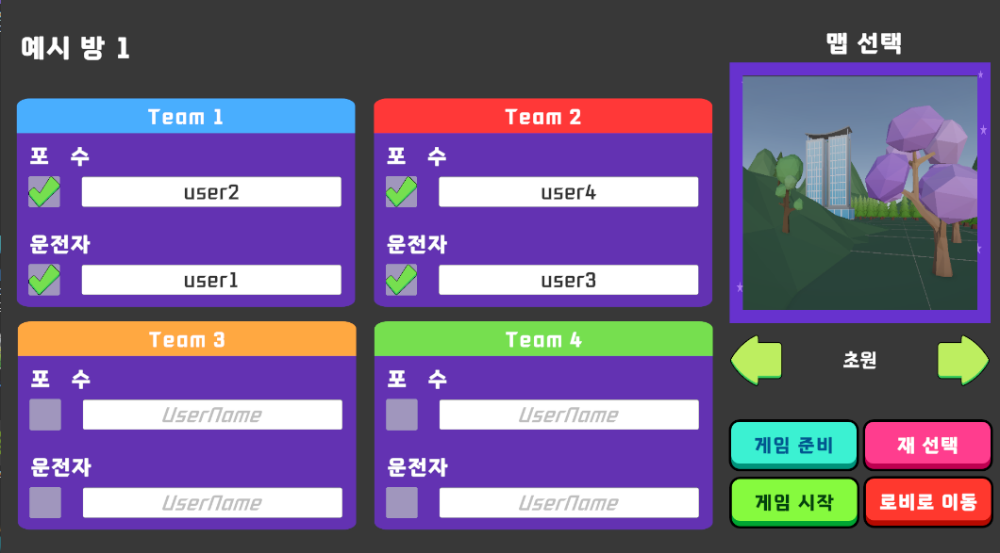
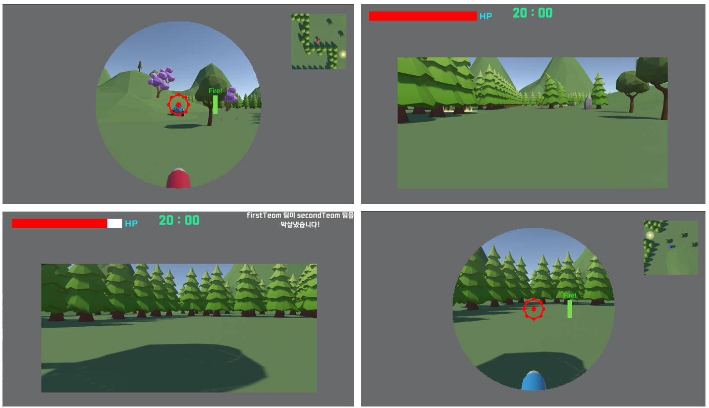
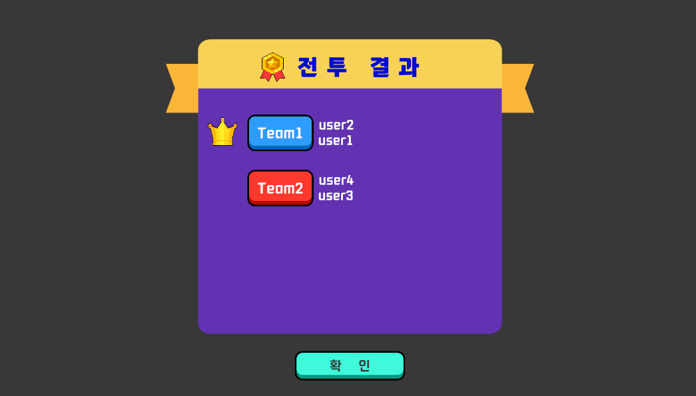

# Project CS (Co-op Shooting)
## 게임 정보

- 게임 제목: 총력전 (All-out Rumble)
- 장르: 2 협력 럼블 슈팅 
- 플레이 인원: 최소 4 인 ~ 최대 8 인

## 기술 스택

- Unity 6.x / C#
- Git
- Netcode
- Unity Lobby
- Fireabase Realtime Database
- Feature
  - Service Locator
  - State Machine
  - Observer Pattern

## 플레이 방식

- 탱크 1대를 2명(포수/운전수)이 나눠 조종하여 적을 격퇴.
- 최종 스코어가 높은 팀이 우승.

### 조작 방식

- 공통
  - Tab 키로 Score Board 확인 가능
- 운전수
  - WASD 로 이동
  - SpaceBar 로 정위치 소환 가능
- 포수
  - WASD 로 포탑 회전 및 포신 제어
  - Enter 및 마우스 왼쪽 클릭으로 발사

## 화면 구성

### 로그인

- User ID 만을 이용해 로그인 가능.

### 로비 리스트

- 열린 방에 참여
- 혹은 방을 새로 생성 가능

### 로비 방

- 최소 4인, 총 8인 구성
- 팀별 2인 최소 배치 요구

### 인 게임

- 포수/운전수는 각각 다른 UI 로 확인 가능

### 결과창

- Score 가 높은 사람이 전투 승리!

---
